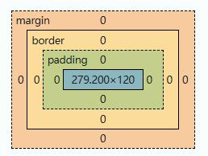
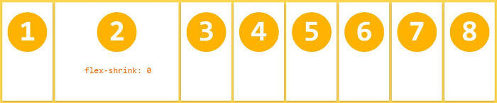
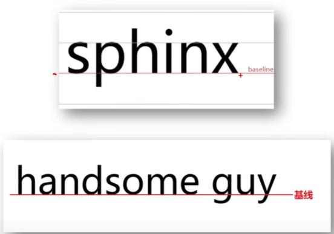
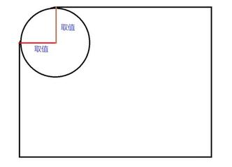
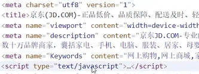
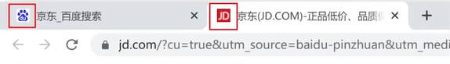

# 认识css

## css是选择器/属性/值

- (层叠性，后面的覆盖前面的)
- 选择器，就是选择(匹配)html里标签

## 选择器三种书写位置

### 行内式

- 标签内，作为标签的一个属性

  ```html{}
  <div style="color: yellow; font-size: 50px; background-color: black; width: 200px;">行内css</div>
  ```

### 内嵌式

- 网页head内，在style标签中，title标签下面

  ```html
  <style>
    p {
      color: red;
      font-size: 24px;
    }
    h1 {
      /* px 像素 */
      color: aqua;
      font-size: 24px;
      background-color: red;
      width: 48px;
      height: 48px;
    }
  </style>
  ```

### 外联式

-项目：外部引入.css文件中；用link标签在网页中引入

```html
<!-- 关系：样式表 -->
<link rel="stylesheet" href="style.css" />
```

- 注释:ctrl+?

## 选择器类型

### 类选择器

- 把标签分类--结构 .类名（css属性名:属性值;）
- 类名 数字、字母、下划线构成，不能以数字或中划线开头
- 在title标签下面，下面stlyle里面创建或者link引入都可以用，只要是一类
- 用.+分类名--快速创建

  ```html
  <head>
    <meta charset="utf-8" />
    <title></title>
    <style>
      .ys {
        color: red;
      }
    </style>
  </head>
  <body>
    <div class="ys">你好</div>
  </body>
  ```

### id选择器

- 结构：#id选择器{css属性名：属性值;}
- 是单独指定给某个元素的样式的
- 一个网页里，id是不能重复的,相当于身份证号，只能用一次

  ```html
  <head>
    <meta charset="utf-8" />
    <title></title>
    <style>
      #mu {
        background-color: aqua;
      }
    </style>
  </head>
  <body>
    <div id="mu">目录</div>
  </body>
  ```

### 通配符选择器

- 结构：\*{css属性名：属性值;}
- 选择所有标签的选择器,变成想要的样式

```html
<head>
  <meta charset="utf-8" />
  <title></title>
  <style>
    * {
      color: red;
    }
  </style>
</head>
<body>
  <div>目录</div>
  <a href="#">链接</a>
  <p>Lorem ipsum dolor sit amet consectetur adipisicing elit.</p>
  <div>测试</div>
</body>
```

### 属性选择器

```html
  <style>
    input[value] {
      color: red;
    }

    div[data-name] {
      width: 10px;
      height: 20px;
      border: 1px solid black;
    }

    div[data-name=yy] {
      background-color: yellow;
    }
  </style>
</head>

<body>
  <input type="text" value="">
  <input type="tetx">
  <div data-name="yy"></div>
  <div data-name="ww"></div>
</body>
```

## 文字和文本属性:font和text

- 内容居中：text-align:center
- 标签居中：margin：0 auto
- 字体和文本样式
  - 某个文字的样式的属性，一般以font开头
  - 一段文字整体样式，一般以text开头
- 取值 font：style weight size/line-height family;

|     说明     |     属性名      |                                取值                                |
| :----------: | :-------------: | :----------------------------------------------------------------: |
|   字体大小   |    font-size    |                         数字+px(像素)/单位                         |
|   字体粗细   |   font-weight   |                   normal正常/加粗bold或者400-700                   |
|   字体倾斜   |   font-style    |                       normal正常/倾斜italic                        |
|   字体系列   |   font-family   | 第一个是具体字体名,第二个是字体分类,第三个是衬线字体还是非衬线字体 |
|   文本缩进   |   text-indent   |   数字+px/数字+em(em是当前元素的字体尺寸或者父级元素的字体尺寸)    |
| 文本水平对齐 |   text-align    |                         left/center/right                          |
|   文本修饰   | text-decoration |   underline下划线/line-through删除线/overline上划线/none无装饰线   |
|     行高     |   line-height   |                            数字+px/倍数                            |

> 行高等于盒子高，单行文字就可以垂直方向居中行高是上间距＋子大小＋下间距

```html
<head>
  .a{ font-family: "宋体","黑体",serif; }
</head>
```

> 衬线字体：serif无衬线字体：sans-serif等宽字体：monospace

## 颜色

- rgb(r g b /0.3) 斜杠后面是透明度
- rgb表示颜色：0表示没有，255表示有100% ——eg:rgb(0,0,0)
- 十六进制颜色：00-红 00-绿 00-蓝（rgb）00表示没有，FF表示100%——eg:#00ff00
- rgba表示颜色；rgb相同，a表示透明度(0~1) ——eg:rgba(255,0,0,0.3)

## 选择器-复合,子代,并交,兄弟

### 复合选择器

- 后代选择器(儿子，孙子，重孙子......都可以选择)
  - 语法：选择器1 选择器2{css}
    > 空格后面的选择器在空格前面选择器匹配的标签**内部**去匹配

  ```html
  <head>
    <meta charset="utf-8" />
    <title></title>
    <style>
      div p {
        color: red;
      }
    </style>
  </head>
  <body>
    <p>这是</p>
    <div>
      <p>这是div的儿子p</p>
    </div>
  </body>
  ```

### 子代选择器(只选择儿子)

- 语法：选择器1>选择器2{css}

> \>后面的选择器在>前面选择器匹配的元素的**直接**子元素里匹配

### 通用兄弟选择器

- ~ 是 CSS 中的通用兄弟选择器（General Sibling Combinator）
- ~ 匹配后面所有符合条件的兄弟元素（不管中间隔了多少其他元素）；
- 它的作用是：匹配和当前元素属于同一个父元素，并且出现在当前元素之后的所有指定类型的兄弟元素。
- 区别于+（相邻兄弟选择器），~ 不要求元素紧挨着，只要在后面且同父即可。

### 并集选择器

- 语法：选择器1，选择器2{CSS}
- 同时选择多组标签，设置相同的样式

### 交集选择器

- 选择器1选择器2{css}

> 必须是p标签，并且添加了.box类p和.box

### hover伪类选择器

- 语法：选择器：:hover{css}
- 选中鼠标悬停在元素上的状态，设置样式
- 任何标签都可以添加伪类

## Emmet语法

- 简写语法，快速生成代码
- 嵌套关系：>（子元素）、+（兄弟）、^（父级兄弟）
  - `table>(tr>th{$}*6)+tr*5>td{$}*6`
- 自增数字进阶：
  - `$@0：从 0 开始自增（ul>li{项$@0}*3 → 项 0、项 1、项 2）`；
  - `$$：两位数（li.item$$*3 → item01、item02、item03）`。

|    记忆    |        示例         |
| :--------: | :-----------------: |
|   标签名   |         div         |
|  类选择器  |        .red         |
|  id选择器  |        #one         |
| 交接选择器 |      p.red#one      |
| 子代选择器 |        ul>li        |
|  内部文本  | ul>li{我是li的内容} |
|  创建多个  |      ul>li\*3       |
|    长宽    |       w30+h30       |

## 背景相关属性

> 背景图片要学:背景尺寸，背景定位，背景定位参考点，背景是否重复，背景剪裁区域

### 背景颜色

- background: linear-gradient(to right,pink,gray)
- 线性渐变（方向:45deg，粉色，灰色）

### 背景图片

- 属性名：background-image(bgi)

> 属性值：background-image：url('图片的路径')

### 背景图片大小bgz

- bgz:宽度 高度
- 设置背景图片的大小
- 方便做响应式，只写一次尺寸

|  取值   |                                                                场景                                                                 |
| :-----: | :---------------------------------------------------------------------------------------------------------------------------------: |
| 数字+px |                                                           简单方便，常用                                                            |
| 百分比  |                                                   相对于当前盒子自身的宽高百分比                                                    |
| contain | 包含，将背景图片等比例缩放，直到不会超出盒子的最大`<br>`如果图的宽或高与盒子的尺寸相同了，另一个方向停止缩放，-- 导致盒子可能有留白 |
|  cover  |            覆盖，将背景图片等比例缩放，直到刚好填满整个盒子没有空白`<br>`保证宽或高和盒子尺寸完全相同，导致图片显示不全             |

- background连写 (background:color image repeat position/size)

### 背景平铺(是否复制)

- 属性名：background-repeat(bgr)

|   取值    |          效果          |
| :-------: | :--------------------: |
|  repeat   | 默认值，水平垂直都平铺 |
| no-repeat |         不平铺         |
| repeat-x  |     沿水平x轴平铺      |
| repeat-y  |     沿垂直y轴平铺      |

### 背景位置(背景定位)

- 属性名：background-position(bgp)
- 属性值：background-position(水平，垂直)
- 水平：left，center，right/垂直：top，center，bottom
- 数字+px(像素坐标)
- 网页的坐标系是，以左上角为原点，水平向右为x轴正方向，竖直向下为y轴正方向

### 背景相关属性连写

- background:color img repeat position

## 单位

- px:像素
- 100vw就是整个窗口的宽度
- 100vh就是整个窗口的高度
- 100%

## 元素显示模式(元素类型)

## 块级元素

- 块元素就是单独一行，默认水平占满，**高度**被内容撑开的盒子
- 可以设置宽高

> div、p、h、ul、li等等

### 行内元素

- 行内元素就是可以跟其他元素共用一行，**宽度高度**都需要被内容撑开的盒子
- 不可以设置宽高，尺寸和内容大小相同
- 如果通过margin和padding改变行内标签的垂直位置,无法生效

> a、span、b、u、i

### 行内块元素

- 行内块就是两者特性共有，尽量不要用行内块
- 一行显示多个
- 可以设置宽高

> input、textarea、img

### 元素显示模式转换

- 去除行内块中间空白
  - 1.去掉两个div之间的回车
  - 2.把body的font-size设置为0；然后再把div的font-size设置为16px

|         属性         |       效果       | 使用频率 |
| :------------------: | :--------------: | :------: |
|    display:block     |  转换成块级元素  |   较多   |
| display:inline-block | 转换成行内块元素 |   较多   |
|    display:inline    |  转换成行内元素  |   极少   |

## HTML嵌套规范注意点

- 块级元素一半作为大容器，可以嵌套：文本、块级元素、行内元素、行内块元素

> 但是：p标签中不要嵌套div、p、h等块级元素

- a标签内部可以嵌套任意元素

> 但是：a标签不能嵌套a标签

## CSS特性

- CSS三大特性
  - 1.继承性
  - 2.层叠性
  - 3.优先级

### 继承性

- 子元素默认继承父元素样式的特点(文字控制属性都可以继承)

> color,font-style,text-indent,line-height

### 层叠性

- 浏览器执行css的时候，除了你写的css，浏览器还有自己的css
- 当样式冲突时，只有当选择器优先级相同时，才能通过层叠性判断结果
- 选择器越独特(专一)，越优先

### 优先级/特定性

- 优先级一样的，后面的覆盖前面的
- 越专一越优先，越靠后，越优先
- 优先级高的选择器样式会覆盖优先级低选择器样式
- 优先级，!important > 行内样式 > ID > 类/属性/伪类>元素(标签)/伪元素 > 继承
- 继承< 通配符选择器 \*<标签选择器 p，div<类选择器 class
  <id选择器 #+id<行内样式 < ！important
  - 行内式：标签内，作为标签的一个属性

    ```html{}
    <div style="color: yellow; font-size: 50px; background-color: black; width: 200px;">行内css</div>
    ```

> html标签，也叫html元素(专门在html里叫标签多，css和js里说元素多)  
> 标签更多的说的是`<div></div>` 而元素还包含属性内容等

- 特定性是针对属性矛盾的时候
- 特定性可以查看调试里面specificity(0,0,0) 三个数的大小，前面的数越大，优先级越高

> 目前可以理解为第一个是ID，第二个是类/属性/伪类，第三个是元素(标签)/伪元素

## 盒子模型

- 盒子模型就是一个html元素盒子有哪些部分构成
- 内容区域content
  - 默认就是之前学的w100px+h100px+bgc
- css3的盒子模型:整个的大小,上面的基础加上box-sizing:border-box 就行

## 内边距区域padding

- 4个值是上 右 下 左
- 三个值 上 左右 下
- 两个值 上下 左右

## 边框区域border

- 属性名,border:10px solid red(分别是粗细,样式,颜色)
- border-style : 实线solid 虚线dashed 点线dotted

## 外边距区域margin



## 合并现象

- 因为margin是不属于盒子的，margin是共用的,所以共有的margin默认会合并
- 4种情况，兄弟合并，父与首子合并，父与末子合并，空元素合并
  > 兄弟合并的解决办法就是外边距改为内边距  
  > 父子合并就给父亲加个css属性 display:flow-root  
  > 空元素合并就是注意别用空元素写外边距

## 塌陷现象

- 互相嵌套的块级元素,子元素的margin-top会作用在父元素上,导致父元素一起往下移
  - 解决方法:
    > 给父元素设置display:flow-root→块级格式化缩写BFC  
    > 给父元素设置overflow:hidden  
    > 给父亲元素设置border-top或者padding-top(分隔父子元素的margin-top)  
    > 转换成行内块元素 display:inline-block
- 最终两者最终距离为margin的最大值
- 很多标签都会有默认的margin和padding

> body p ul \*{margin:0;padding:0}  
> 标签居中：margin：0 auto;

## 前端页面设计

- 从外到内,先宽高后背景,放内容,调内容位置,文字调节

## 结构伪类选择器

- 作用: 根据元素在html中的结构位置查找元素(任何标签都可以添加伪类)

  |        选择器         |                  说明                   |
  | :-------------------: | :-------------------------------------: |
  |    E:first-child{}    |  匹配父元素中第一个子元素,并且是E元素   |
  |    E:last-child{}     | 匹配父元素中最后一个子元素,并且是E元素  |
  |   E:nth-child(n){}    |   匹配父元素中第n个子元素,并且是E元素   |
  | E:bth-last-child(n){} | 匹配父元素中倒数第n个子元素,并且是E元素 |
  |       E:hover{}       |  选中鼠标悬停在元素上的状态，设置样式   |

  > 通过n可以组成常见公式 even偶数,odd奇数

## 伪元素

- 能够使用伪元素在网页中创建内容 → 一般页面中的非主体内容可以使用伪元素
- 区别: 元素:html设置的标签|伪元素:由css模拟出的标签效果
- 伪元素就是用css给这个元素加个孩子

  |     伪元素     |                          作用                           |
  | :------------: | :-----------------------------------------------------: |
  |    ::before    |            在父元素内容的最前添加一个伪元素             |
  |    ::after     |            在父元素内容的最后添加一个伪元素             |
  | ::first-letter |                     定位到第一个字                      |
  |  ::first-line  | 定位到第一行字(所谓的第一行,是根据视图大小来说的第一行) |

  > 注意:  
  > 必须设置content属性才能生效  
  > 伪元素默认是行内元素

- 修改伪元素里面的值，让它任意
  - 让html 加一个hot标签，同时css伪元素content里面`content: attr(hot)`;

  ```html
  <span class="tu" hot="18.2w"></span>
  ```

  ```css
  &::after {
    content: attr(hot);
  }
  ```

## 布局方式

1. 标准流
2. flex
3. 定位

## 布局方式-标准流

1.块级元素独占一行 → 垂直布局2.行内元素/行内亏啊元素一行显示多个 → 水平布局

## 布局方式-flex布局

### 在父元素上

- flex是一种一维布局（安排盒子如何排列）方式，它可以通过给父元素加一些属性，而控制父元素里面的一个或多个直接子元素如何排列（子元素自身也有属性来定义本身行为）
- 第1步：变flex → 父盒子设置display: flex;

  ```html
  <style>
    .container {
      display: flex;
    }
  </style>
  ```

- flex-direction -- 决定主轴的方向

  |       值       |             效果             |
  | :------------: | :--------------------------: |
  | row（默认值）  | 主轴为水平向右，起点在左端。 |
  |  row-reverse   | 主轴为水平向左，起点在右端。 |
  |     column     | 主轴为垂直向下，起点在上沿。 |
  | column-reverse |  主轴为垂直向上，起点在下沿  |

- flex-wrap -- 确定是否换行（列）
  - nowrap（默认）：不换行/列。
  - wrap：换行/列，第一行/列在上方/左方（按交叉轴方向换行）。
  - wrap-reverse：换行/列，第一行/列在下方/右方（按交叉轴方向反向换行）。
- justify-content -- 改变盒子在主轴上的排列方式

  下面假设主轴为从左到右:在父元素上写

  |          值          |                                 效果                                 |
  | :------------------: | :------------------------------------------------------------------: |
  | flex-start（默认值） |                                左对齐                                |
  |       flex-end       |                                右对齐                                |
  |        center        |                                 居中                                 |
  |    space-between     |                    两端对齐，项目之间的间隔都相等                    |
  |     space-around     | 每个项目两侧的间隔相等。所以，项目之间的间隔比项目与边框的间隔大一倍 |
  |     space-evenly     |                   所有间距（元素间、两端）完全相等                   |

- align-items或align-content -- 交叉轴的对齐方式

  下面假设交叉轴从上到下：在父元素上写

  |        值         |                                                    效果                                                    |
  | :---------------: | :--------------------------------------------------------------------------------------------------------: |
  |    flex-start     |                                              交叉轴的起点对齐                                              |
  |     flex-end      |                                              交叉轴的终点对齐                                              |
  |      center       |                                              交叉轴的中点对齐                                              |
  |     baseline      |                                         项目的第一行文字的基线对齐                                         |
  |   space-between   |                                       两端对齐，项目之间的间隔都相等                                       |
  |   space-around    |                    每个项目两侧的间隔相等。所以，项目之间的间隔比项目与边框的间隔大一倍                    |
  |   space-evenly    |                                      所有间距（元素间、两端）完全相等                                      |
  | stretch（默认值） | 如果项目未设置高度（若主轴为纵向，此处为宽度）或设为auto，将占满整个容器的高度（若主轴为纵向，此处为宽度） |

- 在使用flex的前提下
  - 父元素写gap就是设置子元素空隙的
  - 容器

  ```html
  { gap:
  <row-gap><column-gap>; }</column-gap></row-gap>
  ```

  - 只作用于子元素之间，不会在容器的边缘（第一个子项前 / 最后一个子项后）额外加间距；

### 在子元素上

> 以下6个属性设置在项目（子元素）上。  
> order  
> flex-grow  
> flex-shrink  
> flex-basis  
> flex  
> align-self

- 在某个子元素上设置属性，单独控制某个子元素的个性排列行为
- order属性
  - order属性定义项目的排列顺序。数值越小，排列越靠前，默认为0。

  ```css
  #item3 {
    order: 1;
  }
  #item2 {
    order: 2;
  }
  #item1 {
    order: 3;
  }
  ```

- flex-grow属性
  - flex-grow属性定义项目的放大比例，默认为0，即如果存在剩余空间，也不放大。
  - 如果所有项目的flex-grow属性都为1，则它们将等分剩余空间（如果有的话）。如果一个项目的flex-grow属性为2，其他项目都为1，则前者占据的剩余空间将比其他项多一倍。

- flex-shrink属性
  - flex-shrink属性定义了项目的缩小比例，默认为1，即如果空间不足，该项目将缩小。
  - 如果所有项目的flex-shrink属性都为1，当空间不足时，都将等比例缩小。如果一个项目的flex-shrink属性为0，其他项目都为1，则空间不足时，前者不缩小。
  - 负值对该属性无效。 

- flex-basis属性
  - flex-basis属性定义了在分配多余空间之前，项目占据的主轴空间（main
    size）。浏览器根据这个属性，计算主轴是否有多余空间。它的默认值为auto，即项目的本来大小。
  - 它可以设为跟width或height属性一样的值（比如350px），则项目将占据固定空间。

- flex
  - flex属性是flex-grow, flex-shrink 和 flex-basis的简写，默认值为0 1
    auto。后两个属性可选。
  - 该属性有两个快捷值：auto (1 1 auto) 和 none (0 0 auto)。
  - 建议优先使用这个属性，而不是单独写三个分离的属性，因为浏览器会推算相关值。

- align-self属性
  - align-self属性允许单个项目有与其他项目不一样的对齐方式，可覆盖align-items属性。默认值为auto，表示继承父元素的align-items属性，如果没有父元素，则等同于stretch。
  - stretch（默认值）|如果项目未设置高度（若主轴为纵向，此处为宽度）或设为auto，将占满整个容器的高度（若主轴为纵向，此处为宽度）

## 布局方式-定位position

> 1.解决盒子与盒子之间的层叠问题2.可以让盒子始终固定在屏幕中的某个位置

### 常见属性

| 定位方式 |  属性值  | 效果                                                                                       |
| :------: | :------: | :----------------------------------------------------------------------------------------- |
| 静态定位 |  static  |                                                                                            |
| 相对定位 | relative | 1. 占有原来的位置</br>2.仍然具有标签原有的显示模式特点</br>3.改变位置参照的自己原来的位置  |
| 绝对定位 | absolute | 1.脱标，不占位</br>2.改变标签的显示模式特点：具有行内块的特点(在一行共存，宽高生效)        |
| 子绝父相 |          | 父级相对定位,子级绝对定位                                                                  |
| 固定定位 |  fixed   | 1.脱标，不占位</br>2.固定位置</br>3.具有行内块的特点(在一行共存，宽高生效)                 |
| 粘性定位 |  sticky  | 粘性定位就像 “贴膏药”—— 滚动到指定位置就粘在屏幕上，离开父元素范围就跟着走，最好用粘性定位 |

### 设置偏移量

| 方向 | +属性名 | 属性值  |      含义      |
| :--: | :-----: | :-----: | :------------: |
| 水平 |  left   | 数字+px | 距离左边的距离 |
| 水平 |  rgiht  | 数字+px | 距离右边的距离 |
| 垂直 |   top   | 数字+px | 距离上边的距离 |
| 垂直 | bottom  | 数字+px | 距离下边的距离 |

### 相对定位 - relative

- 如果left和right都有，以left为准
- 如果top和bottom都有，以top为准

```css
  <style>
    .box{
      position: relative;
      left: 200px;
      top: 500px;

      width: 200px;
      height: 300px;
      background-color: pink;
    }
  </style>
```

### 绝对定位 - absolute

1.先找已经定位的父级(可以是爷爷,以及其他祖先定位)，如果有这样的，就以这个父级作为参照物进行定位2.有父级，但父级没有定位，以浏览器窗口为参照物进行定位3.absolute相对于最近一个非static定位的祖先元素进行定位，如果找不到就相对于html根元素定位  
4.绝对定位的盒子不能使用左右margin
auto 居中

- 固定定位 - fixed
- 相对于视口进行定位移动
- 再页面中不占位置 → 已经脱标
- 需要配合方位属性实现移动
- 让盒子固定再屏幕中的某个位置

## 元素的层级问题

## 不同布局方式元素的层级关系

- 标准流 < flex < 定位

## 不同定位之间的层级关系

- 相对、绝对、固定默认层级相同
- 此时HTML中写在下面的元素层级更高,会覆盖上面的元素

## z-index

- (配合定位才能生效,position)
- css默认情况下,定位的盒子后来者居上
- z-index:整数;取值越大,显示顺序越靠上
- z-index的默认值是0
- z-index是假定有个垂直于屏幕的z轴，在这个轴线上排序

## 基线

- 浏览器文字类型元素排版中存在用于对齐的基准线(baseline)
- 

## 垂直对齐方式 - vertical-align

|  属性值  |      效果      |
| :------: | :------------: |
| baseline | 默认基准线对齐 |
|   top    |    顶部对齐    |
|  middle  |    中部对齐    |
|  bottom  |    底部对齐    |

> 当浏览器遇到行内和行内块标签 当作文字处理,默认文字是按基线对齐

- 使用:

  ```css
  box-sizing: border-box;
  vertical-align: middle;
  ```

## 装饰

### 光标类型 -- cursor

- 设置鼠标光标在元素上时显示的样式

  | 属性值  |            效果             |
  | :-----: | :-------------------------: |
  | default |      默认值,通常是箭头      |
  | pointer |  小手效果,提示用户可以点击  |
  |  text   | 工字形,提示用户可以选择文字 |
  |  move   |  十字光标,提示用户可以移动  |

### 圆角边框 -- border-radius

- 让盒子四个叫变得圆润，增加页面细节
- 常见取值：数字+px、百分比
- 圆角边框原理  
  
- 赋值规则：从左上角开始赋值，让后顺时针赋值，没有赋值的看对角

### 溢出部分显示效果 -- overflow

- 指的是盒子内容部分所超出盒子范围的区域

| 属性值  |                效果                |
| :-----: | :--------------------------------: |
| visible |        默认值，溢出部分可见        |
| hidden  |            溢出部分隐藏            |
| scroll  |     无论是否溢出，都显示滚动条     |
|  auto   | 无论是否溢出，自动显示或隐藏滚动条 |

### 元素隐藏dispaly/visibility

- 元素本身的隐藏 -- display：none(推荐)
- visibility: hidden:这是一种占位隐藏，不推荐

```css
div .nav img {
  margin-top: 10px;
  margin-left: 30px;
  display: none;
}
div .nav li a:hover img {
  display: block;
}
```

### 元素整体透明度opacity

- 让某元素整体(包括内容一起变透明，比如文字，子元素
- 属性值：0-1之间，0完全透明，1完全不透明

### 图片等比占盒子cover

- 让图片等比例占盒子：盒子可能不满

  ```less
  img {
    height: 100%;
    object-fit: cover;
  }
  ```

### 字体图标优先用i标签

```html
<div class="title">
  <!-- 标题 -->
  <h4>酷我排行榜</h4>
  <a href="">
    更多
    <i class="iconfont icon-right"></i>
  </a>
</div>
```

### 盒子阴影 -- box-shadow

- 给盒子添加阴影效果

|   参数   |            作用            |
| :------: | :------------------------: |
| h-shadow | 必须，水平偏移量，允许负值 |
| h-shadow | 必须，垂直偏移量，允许负值 |
|   blur   |        可选，模糊度        |
|  spread  |       可选，阴影扩大       |
|  color   |       可选，阴影颜色       |
|  inset   |  可选，将阴影改为内部阴影  |

```css
.box {
  width: 200px;
  height: 200px;
  background-color: pink;

  /* 水平偏移；垂直偏移；模糊度；阴影扩大；颜色 */
  box-shadow: 5px 10px 20px 10px green;
}
```

### 过渡 -- transition

- 让元素的样式慢慢变化，常配合hover使用

  |    参数    |            取值            |
  | :--------: | :------------------------: |
  | 过渡的属性 | all:所有能过渡的属性都过渡 |
  | 过渡的时长 |         数字+s(秒)         |

- 过渡需要：默认状态和hover状态样式不同，才能有过渡效果
- transition属性给需要过渡的元素本身加
- transition属性设置在不同状态中，效果不同的
- 给默认状态设置，鼠标移入移出都有过渡状态
- 给hover状态设置，鼠标移入有过渡效果，移出没有过渡效果

  ```css
  .box {
    width: 200px;
    height: 200px;
    background-color: pink;

    /* 宽度200，悬停的时候宽度600，花费2秒 */
    /* transition: width 1s, background-color 2s; */

    /* 如果变化的属性多，直接写all，表示所有 */
    transition: all 1s;
  }

  .box:hover {
    width: 600px;
    height: 600px;
    background-color: aqua;
  }
  ```

## 精灵图

- 项目中将多张小图片，合并成一张大图片，这张大图片称为精灵图
- 1.创建一个盒子，设置盒子尺寸和小图尺寸相同
- 2.将精灵图设置为盒子的背景图片--(因为只要一个小区域)
- 3.修改背景图片位置
  - 测量小图片左上角坐标，分别取负值设置给盒子的bgp：x y
- 4.background-position:right 0; -- 可以取到右面的图

  ```css
  span {
    display: inline-block;
    width: 30px;
    height: 30px;
    background-color: pink;
    background-image: url(../../项目/小兔鲜项目/img/taobao.png);

    /* 背景图位置属性：改变背景图的位置 */
    /* 水平方向的位置，垂直方向的位置 */
    /* 想要向左移动图片，位置取负数 */
    background-position: -12px -6px;
  }
  ```

## html骨架结构

- DOCTYPE文档说明
- `<!DOCTYPE html>`文档类型声明，告诉浏览器该网页的HTML版本 > 目前HTML5版本
- 网页语言
  - `<html lang="en">`标识网页使用的语言
  - 作用：搜索引擎归类+浏览器翻译
  - 常见语言：en英语/zh-CN简体中文

- 字符编码
  - `<meta charset="utf-8">`标识网页使用的字符编码
  - 作用：保存和打开的字符编码需要统一设置，否则可能会出现乱码
  - 常见字符编码：
    - 1.UTF-8：万国码，国际化的字符编码，收录了全球语言的文字
    - 2.GB2312：6000+汉字
    - 3.GBK：20000+汉字
  - 注意点：开发中 统一使用UTF-8字符编码即可

    ```html
    <!-- 规定网页的字符编码 -->
    <meta charset="UTF-8" />

    <!-- ie 兼容性差/edge -->
    <meta http-equiv="X-UA-Compatible" content="IE=edge" />

    <!-- 宽度 = 设备宽度 移动端适配 -->
    <meta name="viewport" content="width=device-width, initial-scale=1.0" />
    ```

## SEO三大标签

- SEO:搜索引擎优化
- 作用:让网站在搜索引擎上的排名靠前
- 提升SEO的常见方法:
  - 1.竞价排名
  - 2.将网页制作成html后缀
  - 3.标签语义化(eg: b 和 strong) -- 在合适的地方使用合适的标签
- SEO三大标签
  - 1.title:网页标签标题
  - 2.description:网页描述标签
  - 3.keywords:网页关键词标签  
    
- ico图标设置
  - 显示在标签页标题左侧的小图标,习惯使用ico格式的图标
  - 

  ```html
  <link rel="shortcut icon" href="ico图标路径" type="image/x-icon" />

  <!-- 浏览器标题栏图标 -->
  <link rel="shortcut icon" href="favicon.ico" type="image/x-icon" />
  ```

## 项目结构

- 文件和目录准备

- 新建项目文件夹xtx-pc-client，在VScode中打开
  - 在实际开发中，项目文件夹不建议使用中文
  - 所有项目相关文件都保存在xtx-pc-client 目录中
- 复制 favicon.ico 到 xtx-pc-client 目录
  - 一般习惯将ico图标放在项目根目录
- 复制 images 和 uploads 目录到 xtx-pc-client 目录中
  - images:存放网站 固定使用的图片素材，如：logo、样式修饰图片。。.等
  - uploads:存放网站 非固定使用的图片素材，如：商品图片、宣传图片。。...等
- 新建 index html 在根目录
- 新建 css 文件夹保存网站的样式，并新建以下CSS文件：
- base.css:基础公共样式,消除默认样式的
- common.css:该网站中多个网页相同模块的重复样式，如：头部、底部
- index.css:首页样式
