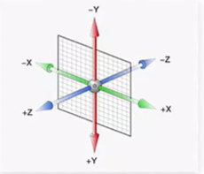
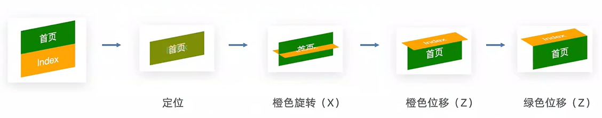
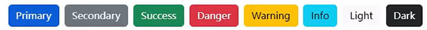
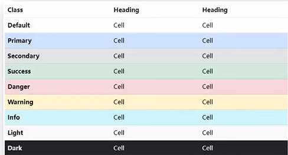

## 平面转换(2D转换)-transform  

- 如果又要居中又要缩放,这两个值放在一起
- 为元素添加动态效果,一般与过渡transition配合使用
- 改变盒子在平面内的形态(位移,旋转,缩放,倾斜)

### 平移translate

- transform:translate(x轴移动距离;y轴移动距离)
- 取值:px/百分比(参照盒子自身尺寸计算结果)/正负均可
- translate()只写一个值,表示沿着X轴移动
- 单独设置X或Y轴移动距离:translateX()或translateY()

  ```css
  <style>
    .father{
      width: 500px;
      height: 300px;
      /* background-color: black; */
      margin: 100px auto;
      border: 1px solid #000;
      
    }
    
    .son{
      width: 200px;
      height: 100px;
      background-color: pink;
      
      /* 儿子要设置transition */
      /* 画面过渡 */
      transition: all 0.5s;
    }
    
    /* 鼠标放入到父盒子,son改变位置 */
    .father:hover .son{
      /* transform: translate(200px,100px); */
      
      /* 百分比:参照盒子自身尺寸计算 */
      transform: translate(50%,100%);
    }
    
    
  </style>
  ```

### 旋转rotate

- transform:rotate(旋转角度)
- 角度单位:deg
- 取正,顺时针旋转;取负,逆时针旋转
- 改变转换原点(加在图片自身上)
  - 默认情况下,转换原点是盒子中心点
  - 属性:transform-origin:水平原点位置 垂直圆点位置;
  - 取值:方位名词(left,top,right,bottom,center)/像素单位/百分比
- 缩放 -- transform:scale(缩放倍数)/transform:scale(X轴缩放倍数,Y轴缩放倍数)
- 倾斜 -- transform:skew(倾斜角度deg)

***

## 背景图background-image

### 渐变

- 渐变是多个颜色是逐渐变化的效果,一般用于设置盒子背景
- 颜色透明:transparent

### 线性渐变l-g

- linear-gradient
- 渐变方向:to 方位名词/角度度数
- 终点位置:百分比/像素px

```html
<style>
  .box{
    margin: 100px auto;
    width: 50px;
    height: 200px;
    /* background-color: pink; */
    transition: all 1s;
    /* background-image: linear-gradient(red yellow); */
    background-image: linear-gradient(red, yellow, blue);
    
    /*  渐变方向,颜色1 终点位置,颜色2 终点位置 */
    background-image: linear-gradient(red 10px, yellow 20px, blue 30px);
  }
</style>
```

### 径向渐变r-g

- 给按钮添加高光效果
- 径向渐变 -- radial-gradient
  - 半径at 圆心,
  - 颜色1 终点位置,
  - 颜色2 终点位置

***

## 空间转换(3D转换)-transform

- 空间:z轴位置与视线方向相同  
  

### 平移translate3d

- transform:translate3d(x,y,z);
- transform:translateX();
- transform:translateY();
- transform:translateZ();

### 视距perspective

- 指定观察者与Z=0平面的距离,为元素添加透视效果
- 透视效果:近大远小,近实远虚
- 添加给直接父级(取值范围800-1200)

### 空间旋转rotate3d

- transform:rotateZ(值)
  - 和平面旋转的样子差不多
- transform:rotateX(值)
  - 沿着X轴旋转
- transform:rotateY(值)
  - 沿着Y轴旋转
- rotate3d(x,y,z,角度度数) :用来设置自定义旋转轴的位置及旋转角度  
  - x,y,z取值为0-1之间的数字
- 左手法则 -- 根据旋转方向确定取值正负
  - 左手握住旋转轴,拇指指向正值方向,其他四个手指弯曲方向为旋转正值方向
- 立体呈现 -- transform-style(给父元素设置,控制子元素)
  - 设置元素的子元素是位于3D空间还是平面中
  - 属性值:flat:子级处于平面中/preserve-3d:子级处于3D空间
  - 步骤:1.父元素添加,transform-style:preserve-3D;2.子级定位;3.调整子盒子的位置(位移或旋转)
- 案例-3D导航
  
- 缩放 -- scale
  - transform:scale3d(x,y,z)

***

## 动画animation

### 多组动画

```html
<style>
  .box{
    position: relative;
    margin: 100px auto;
    width: 140px;
    height: 140px;
    /* background-color: pink; */
    overflow: hidden;
    
    /* border: 1px solid black; */
    
    background-image: url(../../img/donghuatu.png);
    animation:
      run 1s steps(12) infinite,
      move 5s forwards
      ;
    
  }
  
  /* 当动画的开始状态样式跟盒子默认样式相同,可以省略动画开始状态 */
  @keyframes run {
    /* from{background-position: 0 0;} */
    to{background-position: -1680px 0;}
  }
  
  @keyframes move {
    /* 0%{transform: translate(0);} */
    100%{transform: translate(800px);}
  }
    
</style>
```

### animation属性

- animation:动画名称 动画时长 速度曲线 延迟时间 重复次数 动画方向 执行完毕时状态;

|属性|作用|取值|
|:---:|:---:|:---:|
|animation-name|动画名称||
|animation-duration|动画时长||
|animation-delay|延迟时间||
|animation-fill-mode|动画执行完毕时状态|forwards:最后一帧状态</br>backwards:第一帧动画|
|animation-timing-function|速度曲线|steps(数字):逐帧动画+精灵图|
|animation-iteration-count|重复次数|infinite为无限循环|
|animation-direction|动画执行方向|alternate为反向|
|animation-play-state|暂停动画|paused为暂停,通常配合:hover使用|

- 速度曲线 :linear匀速运动 /steps:分步动画  将动画分为5步  配合精灵图使用,实现精灵动画
  > 动画名称和动画时长必须赋值  
  > 取值不分延后顺序  
  > 如果有两个时间值,第一个时间表示动画时长,第二个时间表示延迟时间

```css
.box{
  width: 200px;
  height: 100px;
  background-color: pink;
  /* animation: one 1s; */
  
  /* animation:动画名称 动画时长 速度曲线 延迟时间 重复次数 动画方向 执行完毕时状态; */
  /* linear匀速运动 */
  /* animation: one 2s linear; */
  
  /* steps:分步动画  将动画分为5步  配合精灵图使用,实现精灵动画*/
  /* animation: one 5s steps(5); */
  
  /* 如果有两个时间值,第一个时间表示动画时长,第二个时间表示延迟时间 */
  /* animation: one 2s 2s; */
  
  /* 重复次数,infinite:无限循环 */
  /* animation: one 2s 3; */
  /* animation: one 2s infinite; */
  
  /* 运动方向, alternate反向*/
  /* animation: one 2s infinite alternate; */
  
  /*  执行完毕时状态; forwards结束状态;backwards开始状态(默认)*/
  /* animation: one 2s forwards; */
  
}
```

- 过渡transform:实现两个状态之间的变化过程
- 动画:实现多个状态之间变化过程,动画过程可控(重复播放,最终画面,是否暂停)
- 定义动画

  ```html
  <style>
    div{
      width: 100px;
      height: 100px;
      background-color: pink;
      
      /* 动画时间 5s ; infinite 重复 ; alternate 来来回回*/
      animation: change 5s infinite alternate;
    }
    
    /* @keyframes 动画名称*/
    /* 百分比:表示的意思是动画时长的百分比 */
    @keyframes change {
      0% {
        transform: translate(0);
      }
      
      50%{
        transform: rotate(180deg);
      }
      
      100% {
        transform: translate(600px);
      }
      
      
    }
    
  </style>
  ```

### 无缝动画原理

- 复制开头图片到结尾位置(图片累加宽度=区域宽度)
- eg:走马灯效果

---

## 适配方案

### 屏幕分辨率

- 纵横向上的像素点数,单位是px
- pc分辨率:1920*1080/1366*768
- 缩放150%:1920/150%;1080/150%
- 硬件分辨率 → 物理分辨率(出厂设置)
- 缩放调节的分辨率 → 逻辑分辨率(软件/驱动设置)
- iPhone6/7/8 物理分辨率750 * 1334;逻辑分辨率375 \* 667 比例关系2:1

### 视口

- 显示HTML网页的区域,用来约束HTML尺寸

```html
<head>
  <meta charset="UTF-8">

  <!-- 视口标签 -->
  <meta name="viewport" content="width=device-width, initial-scale=1.0">
  <title>Document</title>
</head>
```

### 二倍图

- 防止图片在高分辨率屏幕下模糊失真
- 现阶段设计稿参考iPhone6/7/8,设备宽度375px产出设计稿
- 二倍图设计稿尺寸:750px

### 宽度适配:宽度自适应

- 百分比布局
- flex布局

### 等比适配:宽高等比缩放

- rem
- vw

***

## rem单位

### rem是相对单位

- rem单位是相对于HTML标签的字号计算结果
- 1rem = 1HTML字号大小
- rem是根元素字体尺寸，em是元素自身或者父元素字体尺寸
- rem里的r是root

### rem-flexible.js

- flexible.js是手淘开发出的一个用来适配移动端的js库
- 核心原理就是根据不同的视图宽度给网页中html根节点设置不同的font-size

```html
<!DOCTYPE html>
<html lang="zh">
<head>
  <meta charset="UTF-8">
  <meta name="viewport" content="width=device-width, initial-scale=1.0">
  <title>Document</title>
  <style>
    .box {
      width: 5rem;
      height: 3rem;
      background-color: pink;
    }
  </style>
</head>
<body>
  <div class="box">

    <script src="flexible.js"></script>
  </div>
</body>
</html>
```
  
### rem:移动适配

- 计算68px是多少个rem?(设计稿适配375px视口)
- n*37.5=68
- 得到n,也就是rem单位的尺寸

```html
<!DOCTYPE html>
<html lang="zh">
<head>
  <meta charset="UTF-8">
  <meta name="viewport" content="width=device-width, initial-scale=1.0">
  <title>Document</title>
  <style>
    /* 68*29的盒子 */
    .box{
      width: 1.813rem;
      height:0.7733rem;
      background-color: pink;
    }
    
    /* 可以不用引入.js文件，直接利用vw来设置 */
    /* html{
      font-size: 10vw;
    }
      */

    
  </style>
</head>
<body>
  <div class="box">
    
    <script src="flexible.js"></script>
  </div>
</body>
</html>
```

***

## less

- 是css预处理器,less文件的后缀名是.less
- 现在不用less,原生css也可以嵌套和有变量
- 浏览器不识别less代码,目前阶段,网页要引入对应的css文件
- vscode插件: eady less,保存less文件后自动生成对应的css文件
- 注释:
  - 单行注释 → //注释内容(快捷键:ctrl+/)
  - 块注释 → /*注释内容\*/(快捷键:shift+alt+a)

### less - 运算

- 加、减、乘直接书写计算表达式
- 除法需要添加小括号

### less - 嵌套

- &表示当前选择器,代码写到谁的大括号里面就表示谁 → 不会生成后代选择器
- 应用：配合hover伪类或者nth-child结构伪类使用
- 快速生成后代选择器

  ```less
  .father{
      width: 400px;
      height: 400px;
      background: #ccc;
      .child{
          width: 200px;
          height: 200px;
          background: orange;
          a{
              color: red;
              font-size: 20px;

              // &表示当前选择器,代码写到谁的大括号里面就表示谁 → 不会生成后代选择器
              &:hover{
                  background: yellow;
              }
          }


      }
  }
  ```

### less-变量

- 概念：容器，存储数据
- 作用：存储数据，方便使用和修改
- 语法：
  - 定义变量：@变量名：数据
  - 使用变量：css属性：@变量名

```less
  //定义变量
  @mycolor：blue;

  //使用变量
  .box {
    width: 200px;
    height: 200px;
    background: @mycolor;
  }

  a{
      color: @mycolor;
  }
  ```

### less - 导入

- 导入less公共样式文件
- 语法：导入@import"文件路径";
- 提示:如果是less文件可以省略后缀

  > @import  './base.less';
  > @import './base';

### less - 导出

- 写法:在less文件的第一行添加 // out:存储URL
- 提示:文件夹后面添加

  > // out: ./index.css    导出当前文件并且取名为index.css名字
  > //out: ./css/      导出到某个文件中

### less - 禁止导出

- 写法:在less文件第一行添加 :  `//out:false`
- 就不会生成对应的css文件

### less直接导入

```html
<link rel="stylesheet/less" type="text/css" href="./less/index.less" />
<!-- href后面改成自己用的文件名 -->
  
<!-- 把less直接变为css，不需要less，变成css再导入less -->
<!-- 因为这个过程慢，而hx检测到文件改变比较快，所以需要你每次改了less，还需要刷新一下才能看到效果 -->
<script src="https://cdn.jsdelivr.net/npm/less@4.1.3/dist/less.min.js"></script>
```

***

## 单位

### px（像素）

- 绝对单位
- 定义：最基础的尺寸单位，代表屏幕上的一个「逻辑像素点」（注意：不是物理像素，Retina 屏等高清屏会用多个物理像素显示 1 个逻辑像素）。
- 核心特点：尺寸固定不变，不受屏幕大小、根元素字体等因素影响。比如设置 width: 100px，无论在手机还是电脑上，这个元素的逻辑宽度都是 100px（视觉上的大小会随屏幕分辨率变化，但数值固定）。

### vw（视口宽度单位）

- 相对单位（基于视口）
- 定义：1vw = 浏览器「可视区域（视口）宽度」的 1%。
- 核心特点：尺寸随视口宽度动态变化。比如：
- 视口宽度为 1000px 时，1vw = 10px，20vw = 200px；
- 视口宽度缩小到 500px 时，1vw = 5px，20vw = 100px。
- 补充：对应的还有 vh（视口高度单位），逻辑和 vw 一致，只是参考视口高度。

### rem（根元素 em）

- 相对单位（基于根元素）
- 定义：1rem = HTML 根元素（`<html>` 标签）的 font-size 取值。
- 核心特点：尺寸随根元素字体大小变化，默认情况下浏览器的 `<html>` 字体大小是 16px，所以默认 1rem = 16px。
- 比如你设置 html { font-size: 20px; }，那么 1rem = 20px，5rem = 100px；如果修改 html { font-size: 25px; }，5rem 就变成了 125px。

| 单位 |     参考基准     | 类型 | 转换示例（视口宽 1000px，html font-size=16px） |
| :--: | :---------------: | :--: | :--------------------------------------------: |
|  px  |   固定逻辑像素   | 绝对 |             无转换，100px = 100px             |
|  vw  |   视口宽度的 1%   | 相对 |       10vw = 1000px × 1% × 10 = 100px       |
| rem | html 的 font-size | 相对 |         6.25rem = 16px × 6.25 = 100px         |

***

## 媒体查询

- 媒体查询 有书写顺序！
- 媒体查询能够检测视口的宽度,让后编写差异化的CSS样式
- 当某个条件成立,执行对应的CSS样式
- 媒体查询相当于css的if，条件是各种媒体状态，根据各种状态适配css样式
- 媒体查询一般不写绝对尺寸, 一般写大于那个尺寸或者小于哪个尺寸

  ```html
  <head>
    <meta charset="utf-8">
    <title></title>
    <meta name="viewport" content="width=device-width,initial-scale=1,minimum-scale=1,maximum-scale=1,user-scalable=no" />
    <style>
      /* 视口宽度是375px,网页背景色是绿色 */
      /* 媒体查询一般不写绝对尺寸, 一般写大于那个尺寸或者小于哪个尺寸*/
      @media (width:375px) {
        body{
          background-color: green;
        }
      }

    </style>
  </head>
  ```

### 媒体查询完整写法

- @media 关键词 媒体类型 and (媒体类型) {CSS代码}
  - 关键词/逻辑操作符：and\only\not
  - 媒体类型:区分设备类型
  - screen 屏幕/print 打印预览/speech 阅读器/all 不区分类型(默认值,包括以上三种情况)

### 媒体特性

- max-width：最大宽度 → 小于等于max-width生效/max-height
- min-width：最小宽度 → 大于等于min-width生效/min-height
- 屏幕方向:orientation(属性) → 值:portrait(竖屏)/landscape(横屏)
- 媒体查询能够检测视口的宽度,让后编写差异化的CSS样式
- 当某个条件成立,执行对应的CSS样式
- 媒体查询相当于css的if，条件是各种媒体状态，根据各种状态适配css样式

### 外部CSS

- 完整写法:`<link rel="stylesheet" media="逻辑符 媒体类型 and (媒体特性)" href="xx.css" />`

```html
<meta charset="UTF-8">
<meta name="viewport" content="width=device-width, initial-scale=1.0">
<title>Document</title>
<!-- 视口宽度小于等于768px,网页背景是绿色 -->
<link rel="stylesheet" media="(max-width:768px)" href="./pink.css" />

<!-- 视口宽度大于等于1200px,网页背景是粉色 -->
<link rel="stylesheet" media="(min-width:1200px)" href="./green.css" />
```

***

## bootstrap

- 目前可以使用链接,不用下载:[链接](https://www.bootcdn.cn/twitter-bootstrap/);找对应需要的复制链接
- 查阅各种功能[中文文档](https://v5.bootcss.com/docs/getting-started/introduction/)
- 带min是压缩版，学习和开发的时候用非压缩的，方便查bug
- 上线的时候用压缩版，减少带宽和流量等

### 使用步骤

  1.引入Bootstrap CSS文件

  ```html
  <link href="https://cdn.bootcdn.net/ajax/libs/twitter-bootstrap/5.3.0-alpha1/css/bootstrap.min.css" rel="stylesheet">
  ```

  2.调用类名: container:响应式布局版心

   ```html
   <div class = "container"> 测试 </div>
   ```

### 栅格系统

- 栅格化是指将整个网页的宽度分成12等份,每个盒子占用对应的份数
  - 例如:一行排4个盒子,则每个盒子占3份即可(12 / 4 = 3)
  - 常用布局类:
    - col-*-*:列 (例如:col-xxl-3)
    - row:行

    ||Extra small|Small|Medium|Large|Extra large|Extra extra large|
    |:---:|:---:|:---:|:---:|:---:|:---:|:---:|
    ||xs|sm|md|lg|xl|xxl|
    ||<576px|>= 576px|>=768px|>=992px|>=1200px|>=1400px|
    |container (max-width)|None(auto)|540px|720px|960px|1140px|1320px|
    |clss preflx|col-|col-se-|col-md-|col-lg-|col-xl-|col-xxl-|

  ```html
  <body>
    <!-- 
      视口宽度大于等于1200px,一行排4个盒子 → 3
      视口宽度大于等于768px,一行排2个盒子 → 6
      视口宽度大于等于567px,一行排1个盒子 → 12
      
      -->
    <!-- 版心  → row → 子级 -->
    <div class="container">
      <div class="row">
        <div class="col-xl-3 col-md-6 col-sm-12">1</div>
        <div class="col-xl-3 col-md-6 col-sm-12">2</div>
        <div class="col-xl-3 col-md-6 col-sm-12">3</div>
        <div class="col-xl-3 col-md-6 col-sm-12">4</div>
        <div class="col-xl-3 col-md-6 col-sm-12">5</div>
      </div>
    </div>
    
  </body>
  ```

### 全局样式

#### Button类

- 需要调用多类名 叠加
- btn:默认样式
- btn-success:成功
- btn-warning:警告
- .....
- 按钮尺寸:btn-lg/btn-sm


```html
<body>
  <button>按钮正常</button>
  <button class="btn">按钮普通类</button>
  <button class=" btn btn-success btn-sm">小按钮成功</button>
  <button class=" btn btn-warning btn-lg">按钮大警告</button>
</body>
  ```
  
#### 表格类

- 需要调用多类名 叠加
- table:默认样式
- table-striped:隔行变色
- table-success:表格颜色


```html
<table class="table table-striped ">
  <tr class="table-success">
```
  
#### 组件:components

- 第一步:引入样式表[中文文档](<https://v5.bootcss.com/docs/getting-started/introduction/>)
- 第二步:引入js文件(有动态功能的需要引入)
- 第三步:复制结构,修改内容

#### 字体图标

- 只需要调用一个类名
- 下载:导航/Extend:图标库 → 安装 → 下载安装包 → [bootstrap-icons-1.x.x.zip](https://icons.getbootstrap.com/)
- 使用:
  1. 复制fonts文件夹到项目目录
  2. 网页引入bootstrap-icons.css文件
  3. 调用CSS类名(图标对应的类名)

  ```html
  <i class="bi-android2"></i>
  ```

  ```html
  <head>
    <meta charset="UTF-8">
    <meta name="viewport" content="width=device-width, initial-scale=1.0">
    <link href="https://cdn.bootcdn.net/ajax/libs/twitter-bootstrap/5.3.0-alpha1/css/bootstrap.min.css" rel="stylesheet">
    <title>Document</title>

    <link rel="stylesheet" href="./Bootstrap/font/bootstrap-icons.css" />
    
    <style>
      
      /* 图标放大  改颜色*/
      .bi-android2{
        font-size: 100px;
        color: green;
      }
      
    </style>
    
  </head>
  <body>
    <span class = "bi-android2"></span>
    
    
  </body>
  ```
  
#### Font Awesome 图标

- 和上面字体图标使用方法一样
- 要使用 Font Awesome 图标，请在 HTML 页面的 `<head>`部分中添加以下行：  
1、国内推荐 CDN：

  ```html
  <link rel="stylesheet" href="https://cdnjs.cloudflare.com/ajax/libs/font-awesome/4.7.0/css/font-awesome.min.css">
  ```

2、海外推荐 CDN:  

  ```html
  <link rel="stylesheet" href="https://cdnjs.cloudflare.com/ajax/libs/font-awesome/4.7.0/css/font-awesome.min.css">
  ```

### Bootstrap弹框

- 功能:不离开当前页面,显示单独内容,供用户操作
- [Modal弹框/模态](https://v5.bootcss.com/docs/5.3/components/modal/#how-it-works)

1. 引入css `<link href="https://cdn.jsdelivr.net/npm/bootstrap@5.2.2/dist/css/bootstrap.min.css" rel="stylesheet">`
2. 引入js `<script src="https://cdn.jsdelivr.net/npm/bootstrap@5.2.2/dist/js/bootstrap.min.js"></script>`

#### 通过属性控制

- 自定义属性,控制弹框的显示和隐藏

```html
  <button data-bs-toggle="modal" data-bs-target="css选择器">
    显示弹框
  </button>

    <button data-bs-dismiss="modal" >
    关闭弹框
  </button>
```

- 应用

```html
  <!-- 引入bootstrap.css -->
  <link href="https://cdn.jsdelivr.net/npm/bootstrap@5.2.2/dist/css/bootstrap.min.css" rel="stylesheet">
</head>
<body>
  <!-- 
    目标：使用Bootstrap弹框
    1. 引入bootstrap.css 和 bootstrap.js
    2. 准备弹框标签，确认结构
    3. 通过自定义属性，控制弹框的显示和隐藏
   -->
  <button type="button" class="btn btn-primary" data-bs-toggle="modal" data-bs-target=".my-box">
    显示弹框
  </button>
  <!-- 
    弹框标签
    bootstrap的modal弹框，添加modal类名（默认隐藏）
   -->
  <div class="modal my-box" tabindex="-1">
    <div class="modal-dialog">
      <!-- 弹框-内容 -->
      <div class="modal-content">
        <!-- 弹框-头部 -->
        <div class="modal-header">
          <h5 class="modal-title">Modal title</h5>
          <button type="button" class="btn-close" data-bs-dismiss="modal" aria-label="Close"></button>
        </div>
        <!-- 弹框-身体 -->
        <div class="modal-body">
          <p>Modal body text goes here.</p>
        </div>
        <!-- 弹框-底部 -->
        <div class="modal-footer">
          <button type="button" class="btn btn-secondary" data-bs-dismiss="modal">Close</button>
          <button type="button" class="btn btn-primary">Save changes</button>
        </div>
      </div>
    </div>
  </div>

  <!-- 引入bootstrap.js -->
  <script src="https://cdn.jsdelivr.net/npm/bootstrap@5.2.2/dist/js/bootstrap.min.js"></script>
</body>

```

#### 通过JS控制

- 语法

```js
    //创建弹框对象
    const modalDom = document.querySelector('css选择器')

    // backdrop: 'static' → 点击外部遮罩不关闭弹框
    // keyboard: false → 可选，禁用ESC键关闭弹框（如需保留ESC关闭可删除此配置）
    const modal = new bootstrap.Modal(modalDom, {
      backdrop: 'static',
      keyboard: false
    })

    //显示弹框
    modal.show()

    //隐藏弹框
    modal.hide()
```

- 应用

```html
<!-- 引入bootstrap.css -->
  <link href="https://cdn.jsdelivr.net/npm/bootstrap@5.2.2/dist/css/bootstrap.min.css" rel="stylesheet">
</head>

<body>
  <!-- 
    目标：使用JS控制弹框，显示和隐藏
    1. 创建弹框对象
    2. 调用弹框对象内置方法
      .show() 显示
      .hide() 隐藏
   -->
  <button type="button" class="btn btn-primary edit-btn">
    编辑姓名
  </button>

  <div class="modal name-box" tabindex="-1">
    <div class="modal-dialog">
      <div class="modal-content">
        <div class="modal-header">
          <h5 class="modal-title">请输入姓名</h5>
          <button type="button" class="btn-close" data-bs-dismiss="modal" aria-label="Close"></button>
        </div>
        <div class="modal-body">
          <form action="">
            <span>姓名：</span>
            <input type="text" class="username">
          </form>
        </div>
        <div class="modal-footer">
          <button type="button" class="btn btn-secondary" data-bs-dismiss="modal">取消</button>
          <button type="button" class="btn btn-primary save-btn">保存</button>
        </div>
      </div>
    </div>
  </div>


  <!-- 引入bootstrap.js -->
  <script src="https://cdn.jsdelivr.net/npm/bootstrap@5.2.2/dist/js/bootstrap.min.js"></script>


  <script>
    //创建弹框对象
    const modalDom = document.querySelector('.name-box')

    // backdrop: 'static' → 点击外部遮罩不关闭弹框
    // keyboard: false → 可选，禁用ESC键关闭弹框（如需保留ESC关闭可删除此配置）
    const modal = new bootstrap.Modal(modalDom, {
      backdrop: 'static',
      keyboard: false
    })

    //编辑姓名 -> 点击 -> 赋予默认姓名 -> 弹框显示
    document.querySelector('.edit-btn').addEventListener('click', () => {
      document.querySelector('.username').value = '默认姓名'

      //显示弹框
      modal.show()
    })

    // 保存 -> 点击 -> 获取姓名打印 -> 弹框隐藏
    document.querySelector('.save-btn').addEventListener('click', () => {

      console.log(document.querySelector('.username').value);

      //弹框隐藏
      modal.hide()
    })

  </script>
</body>
```
