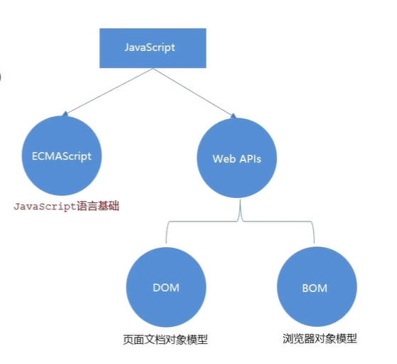
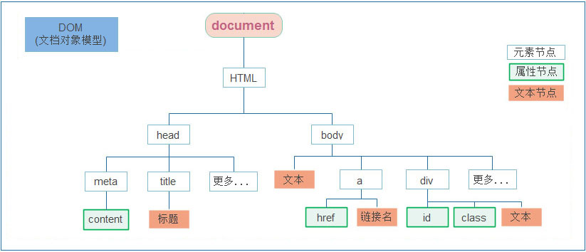
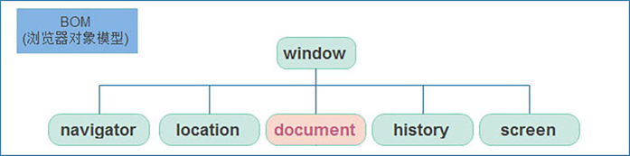
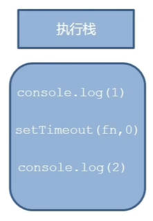
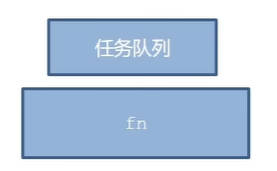
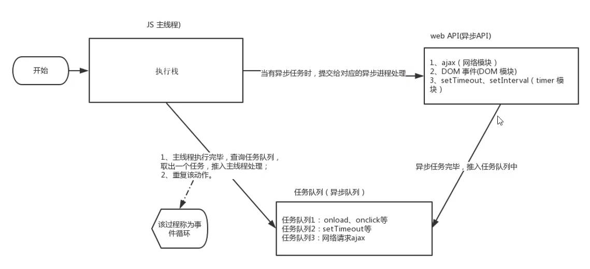

# 05APIs

## Web API基本认知

### API作用和分类

- 作用:使用js去操作html和浏览器
- 分类:DOM(文档对象模型),BOM(浏览器对象模型) 
- DOM(文档对象模型)
  - 用来操作网页内容的功能
  - 作用:开发网页内容特效和实现用户交互
  - 把网页当作对象处理

- DOM树
  - 将HTML文档以树状结构直观的表现出来,文档树或DOM树
  - 描述网页内容关系的名词
  - 作用:文档树直观的体现了标签与标签之间的关系 

- DOM对象
  - 浏览器根基html标签生成JS对象
  - 所有的标签都可以在这个对象上面找到
  - 修改这个对象的属性会自动映射到标签身上

  ```html
  <body>
    <div>123</div>
    <script>
      const div = document.querySelector('div')
      // 打印对象
      console.dir(div) //dom对象
    </script>
  </body>
  ```

  - document对象
    - 是DOM里提供的一个对象
    - 所以它提供的属性和方法都是用来访问和操作网页内容的
      > document.write()
    - 网页所有的内容都在document里面

---

## 获取DOM对象

- 根据CSS选择器来获取DOM元素

### 选择匹配第一个元素d.q

- 语法:`document.querySelector('css选择器')`
- 参数:包含一个或多个有效的CSS选择器字符串
- 返回值:CSS选择器匹配的第一个元素,一个HTML Element对象

```html
<body>
  <div class="box">123</div>
  <div class="box">abc</div>
  <script>
    const div = document.querySelector('div:nth-child(2)')
    const box = document.querySelector('.box')
    console.dir(div)
    // dir就是对象形式
  </script>
</body>
```

### 选择匹配的的多个元素d.qAll

- 语法:`document.querySelectorAll('css选择器')`
- 参数:包含一个或多个有效的CSS选择器字符串
- 返回值:CSS选择器匹配的NodeList对象集合,伪数组,需要for遍历的方式依次给里面的元素做修改
- 得到的是伪数组
  - 有长度有索引号的数组
  - 但没有pop() push()等数组方法

```txt
document.querySelectorAll('ul li')
```

### 其他获取DOM元素方d.gEle

```js
// 根据 id获取一个元素
document.getElementById('nav')
//根据 标签获取一类元素 获取页面 所有div
document.getElementsByTagName('div')
//根据 类名获取元素 获取页面 所有类名为w的
document.getElementsByClassName('w')
```

---

## 操作元素内容

### 对象.innerText属性

- 将文本内容添加/更新到任意标签位置
- 显示纯文本,不解析标签

  ```html
  <body>
    <div class="box">我是文字内容</div>
    <script>
      //1.获取元素
      const box = document.querySelector('.box')
      // 2.修改文字内容,对象.innerText属性
      console.log(box.innerText)
      box.innerText = '我是一个盒子'
      box.innerHTML = '<b>我是</b>'
    </script>
  </body>
  ```

### 对象.innerHTML属性

- 将文本内容添加/更新到任意标签位置
- 会解析标签,多标签建议使用模板字符

---

## 操作元素属性

### 操作元素常用属性

- 通过js设置/修改标签元素属性，比如通过src换照片
- 最常见的属性比如：href，title，src等
- 语法：`对象.属性 = 值`

```html
<body>
  
</body>
<script>
  //1.获取图片元素
  const img = document.querySelector('img')
  //2.修改图片对象属性
  img.src = './素材/images/2.webp'
</script>
```

### 操作元素样式属性

- 通过style属性操作CSS
  - 修改样式比较少的情况下有优势
  - 生成的是行内样式表,权重比较高

```html
<script>
  // 1,获取元素
  const box = document.querySelector('.box')
  // 2.修改样式属性,对象.style.样式属性='值',别忘了单位
  box.style.width = '500px'
  box.style.backgroundColor = 'green' //有-的,用小驼峰
</script>
```

### 操作类名(className)操作CSS

- 语法: 元素.className = 'css类名'
- 由于class是关键字，所以使用className去代替
- className是使用新值换旧值，如果需要添加一个类，需要保留之前的类名
- 多个类名操作麻烦

```html
<style>
  .box {
  width: 200px;
  height: 200px;
  background-color: pink;
  }

  .active {
  border: 5px solid red;
  }
  </style>
</head>

<body>
  <div class="box">

  </div>

  <script>
  // 1,获取元素
  const box = document.querySelector('.box')
  // 2.添加类名 class 是个关键字 我们用className
  box.className = 'box active'

  </script>
</body>
```

### 操作类名(classList)操作CSS

- 解决className容易覆盖以前的类名，我们通过classList方式追加和删除类名
  - 语法

  ```txt
  // 追加一个类
  元素.classList.add('类名')

  //删除一个类
  元素.classList.remove('类名')

  //切换一个类
  元素.classList.toggle('类名')

  //看是否包含这个类
  元素.classList.contains('类名') //返回true/false
  ```

  ```js
  <script>
    // 1.获取元素 const box = document.querySelector('.box') // 2.追加一个类名
    add()类名不加点,并且是字符串 box.classList.add('active') // 3.移除一个类名
    remove()类名不加点,并且是字符串 box.classList.remove('box') // 4.切换类名
    toggle() 有还是没有,有就移除,没有就添加 box.classList.toggle('move') //
    可以直接连写 document.querySelector('.box').classList.add('active')
  </script>
  ```

### 操作表单元素属性

- 获取:DOM对象.属性名
- 设置:DOM对象.属性名 = 新值
- 属性:(只接受布尔值的)checked,disabled

```html
<body>
  <input type="text" name="" id="" value="电脑" />

  <script>
    // 1.获取元素
    const input = document.querySelector('input')
    // 2.修改value属性
    input.value = '手机'
  </script>
</body>
```

```html
<body>
  <input type="checkbox" name="" id="" value="nihao" />
  <button>按钮</button>
  <script>
    const input = document.querySelector('input')
    input.checked = true

    const button = document.querySelector('button')
    button.disabled = false //默认是false,不禁用
  </script>
</body>
```

### 标准属性

- 标签自带的属性:class id title
- 可以直接使用点语法操作的:disable checked selected

### 自定义属性

- 在html5中:data-自定义属性
- 在标签上一律以data-开头
- 在DOM对象上一律以dataset对象方式获取
- dataset 获取全部的自定义属性,如果要里面的其中一个,就.名字
- 自定义属性

  ```html
  <body>
    <div data-id="0">你好</div>
    <script>
      const div = document.querySelector('div')
      console.log(div.dataset.id)
    </script>
  </body>
  ```

  ```html
  <body>
    <div class="box" data-id="123">盒子</div>

    <script>
      const div = document.querySelector('div')
      console.log(div.dataset.id) // 获取自定义属性的值
      div.dataset.id = '456' // 修改自定义属性的值
    </script>
  </body>
  ```

  ```html
      <style>
      input[value] {
        color: red;
      }

      div[data-name] {
        width: 10px;
        height: 20px;
        border: 1px solid black;
      }

      div[data-name=yy] {
        background-color: yellow;
      }
    </style>
  </head>

  <body>
    <input type="text" value="" data-id="0" data-name="andy">
    <input type="tetx">
    <div data-name="yy"></div>
    <div data-name="ww"></div>
    <script>
      const inp = document.querySelector('input[value]')

      //自定义属性里面所有的
      console.log(inp.dataset);  //DOMStringMap {id: '0', name: 'andy'}

      //选择某一个自定义属性,同时后面可以加=,给这个id属性赋值
      console.log(inp.dataset.id);


    </script>
  </body>
  ```

---

## 定时器-间歇函数setInterval

### 使用场景

- 网页中:需要每隔一段时间需要自动执行一段代码
- eg:网页中的倒计时

### 开启定时器

- 作用:每隔一段时间调用这个函数
- 间隔时间单位是毫秒
- 函数名不需要加括号
- 定时器返回的是一个id数字

  ```txt
  setInterval(函数,间隔时间)
  ```

  ```html
  <body>
    <script>
      // 方法一
      setInterval(function () {
        document.write('nihao<br>')
      }, 1000)

      //方法二
      function writeHello() {
        console.log('nihao')
      }
      setInterval(writeHello, 1000)
    </script>
  </body>
  ```

### 关闭定时器

```txt
  let 变量名 = setInterval(函数,间隔时间)
  clearInterval(变量名) //实际上变量名返回的是id,用唯一id来关闭
```

```js
function writeHello() {
  console.log('nihao')
}
let a = setInterval(writeHello, 1000)
// 停止间歇函数
clearInterval(a)
```

---

## 事件监听(绑定)

### 事件

- 事件在编程时系统内部发生的动作或者发生的事情
- 比如用户在网页上单击一个按钮

### 事件监听

- 让程序检测是否有事情产生,一旦有事件触发,就立即调用一个函数做出响应,也成为绑定事件或者注册事件
- 比如:鼠标经过显示下拉菜单,点击可以播放轮播图
- 语法:

```txt
元素对象.addEventListener('事件类型','要执行的函数')
```

- 事件监听三要素
  - 事件源:那个dom元素被事件触发了,要获取dom元素
  - 事件类型:用什么方式触发,比如鼠标单击click,鼠标经过mouseover等
  - 事件调用的函数:要做什么事

  ```html
  <body>
    <button>按钮</button>
    <script>
      const btn = document.querySelector('button')
      //修改元素样式

      btn.addEventListener('click', function () {
        alert('点击了')
      })
    </script>
  </body>
  ```

### 事件监听版本(L0和L2)

#### DOM L0

- L0事件监听,则只有冒泡阶段没有捕获
- 事件源.on事件=function(){}

#### DOM L2

- 事件源.addEventListener(事件,事件处理函数) -区别:on方式会被覆盖,addEventListener方式可绑定多次,拥有事件更多特性,推荐使用

```html
<body>
  <button onclick="alert('11')">按钮</button>
  //行内js
  <script>
    const btn = document.querySelector('button')
    btn.onclick = function () {
      alert('22')
    } //会覆盖
    // 这两种本质是一样的
  </script>
</body>
```

#### 两种注册事件的区别

- 传统on注册
  - 同一个对象,后面注册的事件会覆盖前面注册(同一个事件)
  - 直接使用null覆盖就可以实现事件的解绑
  - 都是冒泡阶段执行的

- 事件监听注册
  - 语法:`addEventListener(事件类型,事情处理函数,是否使用捕获)`
  - 后面注册的事件不会覆盖前面注册的事件(同一个事件)
  - 可以通过第三个参数去确定是在冒泡阶段或者捕获阶段执行
  - 必须使用 `removeEventListener(事件类型,事情处理函数,获取捕获或则冒泡阶段)`
  - 匿名函数无法被解绑

  ***

## 事件类型

### 鼠标事件

- 鼠标点击输入框，获得焦点，开始输入，输入事件，输入完毕鼠标点外面，失去焦点
- 鼠标事件:鼠标触发
  - click:鼠标点击
  - mouseenter:鼠标经过
  - mouseleave:鼠标离开
  - 鼠标经过事件的区别
    - mouseover 和 mouseout 会有冒泡效果
    - mouseenter 和 mouseleave 没有冒泡效果

  ```html
  <body>
    <div class="box"></div>
    <script>
      const div = document.querySelector('div')
      div.addEventListener('mouseenter', function () {
        console.log('nihao')
      })
    </script>
  </body>
  ```

### 表单事件:表单获得光标

- focus:获得焦点
- blur:失去焦点
- input:用户输入事件
- change:当输入框改变内容的时候触发

### 键盘事件:键盘触发

- keydown:键盘按下触发

```html
<body>
  <input type="text" name="" id="" />
  <script>
    let inp = document.querySelector('input')
    inp.addEventListener('keydown', function (e) {
      // let f = e
      console.log(e) //判断输入的是那个键
    })

    inp.addEventListener('input', function () {
      console.log(inp.value) //打印输入框中的内容
    })
  </script>
</body>
```

- keyup:键盘抬起触发

### 视频/音频事件

- ontimeupdate 事件在视频/音频(audio/video)当前的播放位置发送改变时触发 (触发频次太高了)
- onloadeddata 事件在当前帧的数据加载完成且还没有足够的数据播放视频/音频(audio/video)的下一帧时触发

  ***

## 获取事件对象e

- 使用场景:按下回车键可以发布新闻
- 语法:在事件绑定的回调函数的第一个参数就是事件对象(event,ev,e)
- 常用的部分属性
  - type:获取当前的事件类型
  - clientX/clientY:获取光标相对于浏览器可见窗口左上角位置
  - offsetX/offsetY:获取光标相对于当前DOM元素左上角的位置
  - key:用户按下的键盘键的值,现在不提倡使用keyCode

```txt
元素.addEventListener('click',function(e){
  console.log(e) // 返回按了那个键
})

```

```html
<body>
  <input type="text" />
  <script>
    const inp = document.querySelector('input')
    inp.addEventListener('keyup', function (e) {
      // console.log(e.key)
      if (e.key === 'Enter') {
        console.log('我按下了回车键')
      }
    })
  </script>
</body>
```

```js
<script>
  const str = ' ink ' console.log(str.trim()) //去除字符串左右两边的空格
</script>
```

## 事件清空/重置 reset()

- html 里面的 input属性-reset重置
- 提交:submit

```js
  <script>
    const arr = [];
    //1. 点击模块
    //1.1 表单提交事件
    const infoForm = document.querySelector(".info");
    infoForm.addEventListener("submit", function (e) {
      //阻止默认行为,不跳转
      e.preventDefault();
      //1.2 获取用户输入的数据
      const uname = this.uname.value;
      const age = this.age.value;
      const gender = this.gender.value;
      const salary = this.salary.value;
      const city = this.city.value;
      //1.3 将数据存储到数组中
      const obj = {
        stuId: arr.length + 1001,
        uname,
        age,
        gender,
        salary,
        city,
      };
      arr.push(obj); //对象追加到数组中
      console.log(arr);

      //获取页面清空
      this.reset();
    });

  </script>
```

---

## 环境对象

- 环境对象:指的是函数内部特殊的变量this,它代表着当前函数运行时所处的环境
- 谁调用,this指向谁

```html
<body>
  <button>按钮</button>
  <script>
    //每个函数里面都有this环境对象,普通函数里面this指向的时window
    function fn() {
      console.log(this)
    }
    window.fn()

    const btn = document.querySelector('button')
    btn.addEventListener('click', function () {
      console.log(this) //打印的是当前选中的button标签 :<button>按钮</button>
    })
  </script>
</body>
```

```js
const btn = document.querySelector('button')
btn.addEventListener('click', function () {
  // console.log(this)  //打印的是当前选中的button标签 :<button>按钮</button>
  // btn.style.color = 'red'
  this.style.color = 'red' //现在可以这样写
})
```

---

## 回调函数

- 如果将函数A作为参数传递给函数B时,我们称函数A为回调函数

```js
<body>
  <button>按钮</button>
  <script>
    function fn() {console.log('我是回调函数.....')}
    //fn作为参数传递给了setInterval,fn就是回调函数 setInterval(fn, 1000) const
    btn = document.querySelector('button') btn.addEventListener('click',
    function () {console.log('我也是回调函数.....')})
  </script>
</body>
```

## 复习css伪类:check

```html
  <style>
    /* 选择被勾选的复选框 */
    .ck:checked {
      width: 20px;
      height: 20px;
    }
  </style>
</head>

<body>
  <input type="checkbox" class="ck">
  <input type="checkbox" class="ck">
  <input type="checkbox" class="ck">
  <input type="checkbox" class="ck">
  <input type="checkbox" class="ck">
</body>
```

---

## 事件流

### 事件流与两个阶段说明

- 事件流:事件完整执行过程中的流动路径
- 捕获阶段是从父到子,冒泡阶段是从子到父 

### 事件捕获

- 从DOM的根元素开始去执行对应的事件(从外到里)
- addEventListener的第三个参数传入true代表捕获阶段触发,若传入false代表冒泡阶段触发,默认就是false
- 若是用L0事件(`事件源.on事件=function(){}`)监听,则只有冒泡阶段没有捕获

```js
DOM.addEventListener(事件类型, 事件处理函数, 是否使用捕获机制)
```

```html
<body>
  <div class="boxa">
    <div class="boxb"></div>
  </div>
  <script>
    const a = document.querySelector('.boxa')
    const b = document.querySelector('.boxb')

    a.addEventListener(
      'click',
      function () {
        console.log('大盒子')
      },
      true
    )
    b.addEventListener(
      'click',
      function () {
        console.log('小盒子')
      },
      true
    )
    //先出来大盒子,再出来小盒子,也就是先出父元素,再出子元素
  </script>
</body>
```

### 事件冒泡

- 概念:当一个元素的事件被触发时,同样的事件将会在该元素的所有祖先元素中依次被触发,这一过程被称为事件冒泡
- 当一个元素触发事件后,依次向上调用所有父级元素的同名事件(同名事件,就是相同的事件类型,比如全是click)
- 事件冒泡是默认存在的
- L2事件监听第三个参数是false,或则默认都是冒泡
- 从子到父
- 阻止冒泡
- 把事件限制在当前元素内，要阻止冒泡，需要拿到事情对象(eg:e,event)
- 语法:`事件对象.stopPropagation()`
- 是一种方法
- 此方法可以阻断事情流通传播,冒泡阶段和捕获阶段都有用

```js
<script>
  const a = document.querySelector('.boxa')
  const b = document.querySelector('.boxb')

  a.addEventListener('click', function () {
    console.log('大盒子');
  })
  b.addEventListener('click', function (e) {
    console.log('小盒子');
    //阻止流动传播
    e.stopPropagation() //此时点击小盒子,只会打印小盒子
  })
</script>
```

### 阻止默认行为e.pD()

```html
<body>
  <!-- form action = 是将表单提交到哪里 -->
  <form action="http://www.itcast.cn">
    <input type="submit" name="" id="" value="免费注册" />
  </form>
  <a href="http://www.baidu.com">百度</a>
  <script>
    const form = document.querySelector('form')
    form.addEventListener('submit', function (e) {
      //阻止默认行为:提交
      e.preventDefault()
    })

    const a = document.querySelector('a')
    a.addEventListener('click', function (e) {
      e.preventDefault()
    })
  </script>
</body>
```

### 解绑事件

#### on事件方式=void 0

- 直接使用null覆盖就可以实现(L0事件)

```html
<body>
  <button>按钮</button>
  <script>
    const btn = document.querySelector('button')
    btn.onclick = function () {
      alert('点击了')
    }
    btn.onclick = void 0
  </script>
</body>
```

#### aEL事件方式:rEL(事件,函数)

- addEventListener事件解绑(L2事件)

```html
<script>
  const btn = document.querySelector('button')
  function fn() {
    alert('点击了')
  }
  btn.addEventListener('click', fn)
  //解绑事件
  btn.removeEventListener('click', fn)
</script>
```

---

---

## 事件委托

- 优点:减少注册次数,可以提高程序性能
- 原理:事件委托是利用事件冒泡的特点
  - 给父元素注册事件,当我们触发子元素的时候,就会冒泡到父元素身上,从而触发父元素的事件

  ```html
  <body>
    <ul>
      <li>第1个孩子</li>
      <li>第2个孩子</li>
      <li>第3个孩子</li>
      <li>第4个孩子</li>
      <li>第5个孩子</li>
      <li>第6个孩子</li>
      <p>不要变色</p>
    </ul>
    <script>
      //点击每个小li,当前li文字变成红色
      //按照委托的方式
      //1.获取父级
      const ul = document.querySelector('ul')
      ul.addEventListener('click', function (e) {
        // alert(11) //孩子元素因为冒泡,所有点击随便一个孩子都会弹出
        // e.target//我们点击的对象
        // e.target.style.color = 'red' //此时ul里面的每一个孩子都变色

        //只要点击li才有效果
        if (e.target.tagName === 'LI') {
          e.target.style.color = 'red'
        }
      })
    </script>
  </body>
  ```

---

## 其他事件

|              属性              | 作用                                      | 说明                                                       |
| :----------------------------: | :---------------------------------------- | :--------------------------------------------------------- |
|   `scrollLeft`和 `scrollTop`   | 被卷去的头部和左侧值                      | 配合页面滚动 `scroll`来用,可读写                           |
| `clientWidth`和 `clientHeight` | 获得元素宽度和高度                        | 不包含 `border`,`margin`,滚动条用于js获取元素大小,只读属性 |
| `offsetWidth`和 `offsetHeight` | 获得元素宽度和高度                        | 包含 `border`,`margin`,滚动条用于js获取元素大小,只读属性   |
|   `offsetLeft`和 `offsetTop`   | 获取元素距离自己定位的父级元素的左,上距离 | 获取元素位置的时候使用,只读属性                            |

### 页面加载事件

- 加载外部资源(如:图片,外联css和js等),加载完毕时触发的事件
- 事件名:`load` (所谓的事件名:比如 `click`,`mouseenter`)
  - 可以给其他标签加
  - 监听页面所有资源加载完毕
  - 给window添加load事件
  - 给图片添加load事件,等待图片加载完毕,再去执行function里面的代码
- 事件名:`DOMcontentLoaded`
  - 只给document加
  - 当初始的HTML文档被完全加载和解析完成之后,`DOMcontentLoaded`事件被触发,而无需等待样式表,图片完全加载

```js
//页面加载事件
window.addEventListener('load', function () {
  //执行操作
})
```

```html
  <script>
  // 等页面资源加载完毕,就回去执行回调函数
  window.addEventListener('load', function () {

    const btn = document.querySelector('button')
    btn.addEventListener('click', function () {
      alert('11')
    })

  })

  </script>
</head>

<body>
  <button>按钮</button>
</body>
```

### 页面滚动事件scroll

- 事件名:scroll
- 监听整个页面滚动

#### 获取位置sLeft和sTop

- scrollLeft和scrollTop(属性)
- 获取被卷去的大小
- 获取元素内容往左,往上滚出去看不到的距离
- 这两个值是可读写的
- 获取页面的向下滚动高度 `document.documentElement.scrollTop`

```js
//页面加载事件
window.addEventListener('scroll', function () {
  //执行操作
})
```

```html
<body>
  <div>
    Lorem ipsum, dolor sit amet consectetur adipisicing elit. Incidunt debitis
    quas amet facilis quisquam repudiandaeex. Impedit, nemo. Saepe, adipisci
    quae? Tempora sit aliquid eveniet porro delectus sequi molestiae non?
  </div>

  <script>
    //页面滚动事件
    const div = document.querySelector('div')
    window.addEventListener('scroll', function () {
      //当滑动页面的时候，控制台就会打印(我滚了!)
      // console.log('我滚了！');
      //找body的话是document.body
      //找html的话是document.documentElement
      // console.log(document.documentElement.scrollTop); //不带单位的数字型

      //给i赋值,获取当前页面向下滚动的高度
      const i = document.documentElement.scrollTop
      //当向下滚动100px的时候,显示div
      // if (i >= 100) {
      //   div.style.display = 'block'
      // } else {
      //   div.style.display = 'none'
      // }

      //可以变成简单三元赋值
      div.style.display = i >= 100 ? 'block' : 'none'
    })

    // div.addEventListener('scroll', function () {
    //   // console.log(111);
    //   console.log(div.scrollTop);
    // })
  </script>
</body>
```

### 滚动到指定的坐标sT

```js
//页面滚动到y轴1000像素的位置
window.scrollTo(0, 1000)
```

### 页面尺寸事件

- 会在窗口尺寸改变的时候触发事件

#### 获取宽(cW+CH)不包含

- 获取元素的可见部分宽高(不包含边框,margin,滚动条等,包含padding)
- `clientWidth`,`clientHeight`

```js
window.addEventListener('resize', function () {
  //执行的代码
})
```

```js
//检测屏幕宽度:clientWidth
window.addEventListener('resize', function () {
  let w = document.documentElement.clientWidth
  concole.log(w)
})
```

```html
<body>
  <div class="tx">1234567</div>

  <script>
    const tx = document.querySelector('.tx')
    console.log(tx.clientWidth) //包含padding值,不包含boeder值

    //resize 浏览器窗口大小发生变化的时候触发的事件
    window.addEventListener('resize', function () {
      console.log(1)
    })
  </script>
</body>
```

### 元素的尺寸与位置

#### 获取宽高(ofW+ofW)包含

- 获取元素的自身宽高,包含元素自身设置的宽高:padding,border
- `offsetWidth`和 `offsetHeight`
- 获取出来的是数值,数字型
- 获取的是可视宽高,如果盒子是隐藏的,获取的结果是0

#### 获取位置(ofL和ofT)

- 获取元素距离自己定位父级元素的左,上距离(有点类似于postion的父绝子相)
- `offsetLeft`和 `offsetTop`是只读属性

```html
<body>
  <div class="box">
    <p>你好</p>
  </div>
  <script>
    const box = document.querySelector('.box')
    const p = document.querySelector('p')

    // console.log(box.offsetLeft);
    console.log(p.offsetLeft) //父级有position:relative,那么就是相对于父亲的
  </script>
</body>
```

- `element.getBoundingClientRect()`
- 返回元素的大小及其相对于视口的位置

```html
<body>
  <div class="box"></div>
  <script>
    const box = document.querySelector('.box')
    console.log(box.getBoundingClientRect())
    //     {
    //     "x": 107.98828125,
    //     "y": 100,
    //     "width": 200,
    //     "height": 200,
    //     "top": 100,
    //     "right": 307.98828125,
    //     "bottom": 300,
    //     "left": 107.98828125
    // }
  </script>
</body>
```

## 日期对象Date()

- 让网页显示时间

### 实例化new

- 在代码中发现了 `new`关键字时,一般将这个操作称为实例化

  ```html
  <body>
    <script>
      //实例化
      //1.得到当前时间
      const date = new Date()
      console.log(date) //返回值:Sat Jan 17 2026 20:13:25 GMT+0800 (中国标准时间)
      //2.指定时间
      const date1 = new Date('2022-5-1 08:30:00')
      console.log(date1) //Sun May 01 2022 08:30:00 GMT+0800 (中国标准时间)
    </script>
  </body>
  ```

### 日期对象方法

| 方法          | 作用             | 说明               |
| :------------ | :--------------- | :----------------- |
| getFullYear() | 获得年份         | 获取四位年份       |
| getMonth()    | 获得月份         | 取值0-11           |
| getDate()     | 获得月份的每一天 | 不同月份取值也不同 |
| getDay()      | 获取星期         | 取值为0-6          |
| getHours()    | 获取小时         | 取值为0-23         |
| getMinutes()  | 获取分钟         | 取值为0-59         |
| getSeconds()  | 获取秒           | 取值为0-59         |

- `date.tolocaleString() //返回2026/1/17  20:11:28`
- `date.tolocaleDateString() //返回2026/1/17`
- `date.tolocaleTimeString() //返回20:11:28`

```javascript
<script>
  //1.获取日期对象 const date = new Date() //使用里面的方法
  console.log(date.getFullYear()); //2026 console.log(date.getMonth() + 1); //1
  console.log(date.getDate()); //17 console.log(date.getDay()); //6
</script>
```

```javascript
<body>
  <div class="box"></div>
  <script>
    //将当前时间以YYYY-MM-DD HH:mm形式显示在页面
    const div = document.querySelector('div')
    function getMyDate() {

      const date = new Date()
      let year = date.getFullYear()
      let month = (date.getMonth() + 1).toString().padStart(2, '0')
      let day = (date.getDate() + 1).toString().padStart(2, '0')
      let hours = (date.getHours() + 1).toString().padStart(2, '0')
      let minutes = (date.getMinutes() + 1).toString().padStart(2, '0')
      let seconds = (date.getSeconds() + 1).toString().padStart(2, '0')
      return `今天是:${year}年-${month}月-${day}日 ${hours}:${minutes}:${seconds}`
    }

    div.innerHTML = getMyDate()

    //定时器一秒一变
    setInterval(function () {
      div.innerHTML = getMyDate()
    }, 1000)
  </script>
</body>
```

### 时间戳

- 是指从1970年01月01日00时00分00秒起至现在的毫秒数,是一种特殊的计量方式
- 1000ms 就是一分钟

#### 获取时间戳

- 使用get Time()方法
  - 可以返回指定的时间戳

```javascript
const date = new Date()
console.log(date.getTime())
```

- 简写 +new Date()
  - 可以返回指定的时间戳

```javascript
console.log(+new Date())
console.log(+new Date('2022-4-1 18:30:00')) //返回当前的时间
```

```js
<body>
  <script>
    const end = +new Date('2026-01-30 08:30:00'); // 记录结束时间

    //定时器
    // setInterval(function(){}) 的另一种直接 =>
    setInterval(() => {
      const now = +new Date();
      const duration = end - now; // 计算耗时
      const seconds = Math.floor((duration / 1000) % 60);
      const minutes = Math.floor((duration / (1000 * 60)) % 60);
      const hours = Math.floor((duration / (1000 * 60 * 60)) % 24);
      const days = Math.floor(duration / (1000 * 60 * 60 * 24));
      document.body.innerHTML = `距离2026年1月30日08:30:00还有${days}天${hours}小时${minutes}分钟${seconds}秒`;
    }, 1000);

  </script>
</body>
```

- 使用 Date.now()

```javascript
console.log(Date.now())
```

---

## 节点操作

### DOM节点

- DOM树里面每一个内容都称之为节点

#### 节点类型

- 元素节点
  - 所有的标签 比如body,div
  - html是根节点

- 属性节点
  - 所有的属性 比如href

- 文本节点
  - 所有的文本

### 查找节点

#### 父节点查找:子.parNode

- 子元素.parentNode
- 返回最近一级的父节点,找不到就返回为null

```html
<script>
  const baby = document.querySelector('.baby')
  const dad = document.querySelector('.dad')
  console.log(baby) //返回dom对象 <div class="baby">222</div>
  console.log(baby.parentNode) //返回父节点 <div class="dad">11 <div class="baby">222</div></div>
</script>
```

#### 子节点查找:父.children

- childNodes
  - 获得所有子节点,包括文本节点(空格,换行),注释节点等等
- 父元素.children
  - 仅获得所有元素节点
  - 返回的还是一个伪数组
  - 遍历

```html
<script>
  const ul = document.querySelector('ul')
  const lis = ul.children
  console.log(lis) // HTMLCollection(8) [li, li, li, li, li, li, li, li]
  console.log(ul.childNodes) // NodeList(15) [text, li, text, li, text, li, text, li, text, li, text, li, text, li, text]
</script>
```

#### 兄弟关系查找:preES/nexES

- 下一个兄弟节点:`li2.previousElementSibling`
- 上一个兄弟节点:`i2.nextElementSibling`

```html
<script>
  const li2 = document.querySelector('li:nth-child(2)')
  console.log(li2.previousElementSibling) // 上一个兄弟元素  1
  console.log(li2.nextElementSibling) // 下一个兄弟元素  3
</script>
```

### 增加节点

- 创建一个新节点
- 把创建的新的节点放入到指定的元素内部

#### 创建节点 doc.create

- `const li4 = document.createElement('li')`

#### 追加元素 appChil/inBef

- 插入到父元素的最后一个子元素
- `父元素.appendChild(要插入的元素)`
- `父元素.insertBefore(要插入的元素,在那个元素前面)`

```js
<script>
  //创建节点 const ul = document.querySelector('ul') const li4 =
  document.createElement('li') const li0 = document.createElement('li')
  //插入节点 ul.appendChild(li4) li4.innerText = '新增的节点'
  ul.insertBefore(li0, ul.children[2]) li0.innerText =
  '插入到数组第二个前面的节点'
</script>
```

#### 克隆节点 clonN

- `元素.cloneNode(布尔值)`
- 若为true,则代表克隆时会包含后代一起克隆
- 若为false,则代表克隆时不包含后代节点
- 默认false

```html
<script>
  const ul = document.querySelector('ul')
  const ul2 = ul.cloneNode(true) //带着后代一起被克隆
  console.log(ul2)
  document.body.appendChild(ul2)

  const ul3 = ul.cloneNode(false) //只克隆自身
  console.log(ul3)
  document.body.appendChild(ul3)

  ul.appendChild(ul.children[0].cloneNode(true)) // 复制第一个li节点和里面值

  ul.appendChild(ul.children[0].cloneNode(false)) // 复制第一个li节点无值
</script>
```

### 删除节点

- 在js原生DOM操作里面,要删除元素必须通过父元素删除
- 语法:`父元素.removeChild(要删除的元素)`
- 如不存在父子关系则删除不成功
- 删除节点和隐藏节点(dispaly:none/visibility:none)有区别
  - 隐藏节点还是存在的,但是删除,则从html中删除节点

```html
<script>
  const ul = document.querySelector('ul')
  ul.removeChild(ul.children[2]) // 删除第三个li节点
  console.log(ul)
</script>
```

---

## M端事件

- M端就是手机移动端

### 触屏事件(touch)

- Android和IOS都有
- touch对象代表一个触摸点,触摸点可能是一根手指,一根触摸笔
- 触屏事件可以响应用户手指(或者触控笔)对屏幕或则和触控板的操作

| 触屏touch事件 | 说明                          |
| :------------ | :---------------------------- |
| touchstart    | 手指触摸到一个DOM元素时触发   |
| touchmove     | 手指在一个DOM元素上滑动时触发 |
| touchend      | 手指从一个DOM元素上移开时触发 |

```html
<script>
  const box = document.querySelector('.box')
  //1.触摸
  box.addEventListener('touchstart', () => {
    console.log('触摸开始')
  })

  //3.移动
  box.addEventListener('touchmove', () => {
    console.log('触摸移动')
  })

  //2.离开
  box.addEventListener('touchend', () => {
    console.log('触摸结束')
  })
</script>
```

## js插件-swiper

- [官网](https://swiper.com.cn/)
- Swiper 基础演示 [在线演示](https://swiper.com.cn/demo/index.html)
- 基本使用流程 [Swiper 使用方法](https://swiper.com.cn/usage/index.html)
- 查看API文档 [配置插件](https://swiper.com.cn/api/index.html)

---

## Window对象

### BOM(浏览器对象模型)



- DOM(文档对象模型)
- window是一个全局对象,js中顶级对象
- 像document,alter(),console.log()都是window的属性,基本BOM属性和方法都是window的
- 所有通过var定义在全局作用域中的变量,函数都会变成window对象的属性和方法
- window对象下的属性和方法调用的时候可以省略window

### 定时器-延时函数-setTimeout

- js内置的一个用来让代码延迟执行的函数
- 语法 `setTimeout(回调函数,等待的毫秒数)`
- setTimeout 仅仅执行一次
- 清除延迟函数 `clearTimeout`

```html
<script>
  let timer = setTimeout(() => {
    console.log('2秒到了')
  }, 2000)

  clearTimeout(timer)
  console.log('定时器被清除')
</script>
```

```js
//消除多次使用定时器的bug
let timeID = 0

//显示函数
function show() {
  clearTimeout(timeID)
  large.style.display = 'block'
}

//隐藏函数
function hide() {
  timeID = setTimeout(function () {
    large.style.display = 'none'
  }, 200)
}
```

#### 两种定时器对比:执行次数

- 延时函数:执行一次
- 间歇函数:每隔一段时间就执行一次,除非手动清除

### JS执行机制

- js语言特点:单线程 -- 同一时间只能做一件事
- 单线程意味,所有任务需要排队,前一个任务结束,才会执行后一个任务
  - 造成问题:如果js执行的时间过长,这样就会造成页面的渲染不连贯,导致页面显然加载阻塞
- 为了解决这个问题,利用多核CPU的计算能力
- HTML5提出Web
  Worker 标准,允许js脚本创建多个线程(推到浏览器),于是js出现了同步和异步

#### 同步和异步

- 同步:前一个任务结束后再执行后一个任务,程序的执行顺序与任务的排列顺序是一致的、同步的
- 异步:在做一件事情的同时,还可以去处理其他事情
- 本质区别:在流水线上各个流程的执行顺序不同

#### 同步任务

- 主线程上执行,形成一个执行栈 

#### 异步任务

- js的异步是通过回调函数实现的
- 异步任务有以下三种类型
  1. 普通时间:如`click`、`resize`
  2. 资源加载,如`load`、`error`
  3. 定时器,包括`setInterval`、`setTimeout`
- 异步任务相关添加到任务队列中(任务队列也称为消息队列)
  

#### 事件循环

1. 先执行执行栈中的同步任务
2. 异步任务放入任务队列中
3. 一旦执行栈中的所有同步任务执行完毕,系统就会按次序读取任务队列中的异步任务,于是被读取的异步任务结束等待状态,进入执行栈,开始执行
   

- 由于主线程不断的重复获得任务,执行任务,再获取任务,再执行,所以这种机制被称为事件循环(event
  loop)

### location对象 - http相关

- `location`的数据类型是对象,拆分并保存url地址的各个组成部分

```js
<script>
  console.log(window.location); //利用js的方式跳转页面
  console.log(location.href); //获取当前页面的完整URL地址
  console.log(location.search); //获取问号后面的参数 //
  以后获取表单账户和密码的时候可以使用 location.href = "https://www.baidu.com";
</script>
```

#### 常用的属性

- href:获取当前页面的完整URL地址
- search:获取问号后面的参数
  - 以后获取表单账户和密码的时候可以使用
- hash:获取地址中的哈希值,符号`#`后面的部分
  - 经常用于不刷新页面,显示不同页面,比如网易云音乐
  - `https://music.163.com/#/friend`
- reload:刷新当前页面,传入参数true时,表示强制刷新

  ```js
  location.reload(true)
  ```

### navigator对象 - 设备信息

- 该对象记录了浏览器自身的相关信息

```html
<script>
  //检测userAgent信息
  const userAgent = navigator.userAgent
  const android = userAgent.match(/(Android);?[\s\/]+([\d.]+)?/)
  const ipad = userAgent.match(/(iPad).*OS\s([\d_]+)/)
  const iphone = !ipad && userAgent.match(/(iPhone\sOS)\s([\d_]+)/)

  //验证是否为Android设备或者pc设备
  if (android || iphone || ipad) {
    console.log('移动端设备')
  } else {
    console.log('pc端设备')
  }
</script>
```

### history对象.go() - 页面前后

- 主要管理历史记录,该对象与浏览器地址栏操作相对应,如前进,后退,历史记录

#### 常用属性和方法

- back():可以后退功能
- forward():前进功能
- go(参数):前进后退功能,参数:如果是1(前进一个页面),如果是-1(后退一个页面)

### confirm() - 确认框

- 弹出一个包含提示文本、确认按钮、取消按钮的对话框
- 核心作用是获取用户的 “确认 / 取消” 选择
- 是前端中最基础的用户交互确认方式之一

```js
// 语法：window.confirm(提示文本)，window可省略
const result = confirm(message)
```

- 参数：message（字符串），显示在弹窗中的提示文本。
- 返回值：布尔值（Boolean）
  - 用户点击「确认」→ 返回 true
  - 用户点击「取消」/ 关闭弹窗 → 返回 false

```html
<body>
  <script>
    const isDelete = confirm('你确定要删除吗？')
    if (isDelete) {
      alert('删除成功')
    } else {
      alert('取消删除')
    }
  </script>
</body>
```

## 本地存储

### 本地存储介绍

1. 数据存储在用户浏览器中
2. 设置，读取方便，页面刷新不丢失数据
3. 容量较大，sessionStorage 和 localStorage约5M左右

### 本地存储分类

- 都是和地址绑定,而且是顶层地址
- 本地存储只能存储字符串数据类型
- 关闭浏览器会关闭会话,但关闭会话不一定会关闭浏览器

#### localStorage:永久本地

- 作用:可以将数据永久存储在本地(用户的电脑),除非手动删除,否则关闭页面也会存在
- 特性:可以多窗口(页面)共享(同一浏览器可以共享)
- 以键值对的形式存储使用
- 只能存储字符串,获取也是得到字符串

- 语法存储数据:`localStorage.setltem(key,value)`
  获取数据:`localStorage.getltem(key)` 删除数据:`localStorage.removeItem(key)`

```js
<script>
  localStorage.setItem("name", "zhangsan"); // 存储姓名
  localStorage.setItem("age", "18"); // 存储年龄 // 读取数据 const name =
  localStorage.getItem("name"); const age = localStorage.getItem("age");
  console.log(`姓名: ${name}, 年龄: ${age}`); // 删除数据
  localStorage.removeItem("age"); // 删除年龄 localStorage.clear(); //
  清除所有数据
</script>
```

#### sessionStorage:会话窗口

- 特性:生命周期为关闭浏览器窗口,生命周期是关闭会话
- 在同一个窗口(页面)下数据可以共享
- 同一会话下数据可以共享
- 以键值对的形式存储使用
- 使用语法和`localStorage`一样

### 存储复杂数据类型

- 本地存储只能存储字符串类型(简单数据类型),无法存储发杂数据类型
- 将复杂数据类型转换成JSON字符串,存储到本地
- json序列化,这是JSON方法

1. 变成JSON对象语法:`localStorage.setItem("obj", JSON.stringify(obj))`

2. 转回对象语法:`JSON.parse(localStorage.getItem("obj"))`

```html
<script>
  const obj = {
    name: 'Alice',
    age: 30
  }

  localStorage.setItem('obj', JSON.stringify(obj))

  //取
  console.log(localStorage.getItem('obj')) // "{"name":"Alice","age":30}"

  // 转回对象
  const parsedObj = JSON.parse(localStorage.getItem('obj'))
  console.log(parsedObj) // {name: "Alice", age: 30}
</script>
```

#### JSON对象

- 属性和值都有引号,而且引号一定是双引号
- 变成JSON对象语法:`JSON.stringify(复杂数据类型)`
- 转回语法:`JSON.parse(JSON字符串)`

---

## 正则表达式

### 介绍

- 正则表达式是用于匹配字符串中字符组合的模式
- 在js中,正则表达式也是对象
- 通常用来查找,替换那些符合正则表达式的文本,许多语言都支持正则表达式,但是不同语言的正则略有不同
- 正则表达式在js中的使用场景(==验证表单,提取,替换==)
  - 验证浏览器自身的相关信息(比如之前的验证手机型号:navigator)
  - 验证表单:用户表单只能输入英文字母,数字或者下划线,昵称输入框中可以输入中文(匹配)
    - 用户名:`/^[a-z0-9_-]{3,16}$/`
  - 过滤页面内容中的一些敏感词(替换)
  - 从字符串中获取我们想要的特定部分(提取:`location`的数据类型是对象,拆分并保存url地址的各个组成部分)

### 语法

#### 定义正则表达式//

- 语法:`const 变量名 = /表达式/`
- 其中/ /是正则表达式字面量

#### 是否有符合的字符串test/tf

- test()方法:用来查看正则表达式与指定字符串是否匹配 -语法:`regObj.test(被检测的字符串)`
- 返回值:true / false

```js
<script>
  const str = '今天很开心,我在学习前端' const reg1 = /前端/ //
  字符串中是否包含"前端" if (reg1.test(str)) {console.log('包含前端')} else{' '}
  {console.log('不包含前端')}
</script>
```

#### 检索(查找)符合规则的字符串exec()

- exec()方法,在一个指定字符串中执行一个搜索匹配
- 如果匹配成功,exec()返回一个数组,否则返回null

```html
<script>
  const str = '今天很开心,我在学习前端'
  const reg1 = /前端/ // 字符串中是否包含"前端"
  console.log(reg1.exec(str))
  // [ '前端', index: 9, input: '今天很开心,我在学习前端', groups: undefined ]
</script>
```

### 元字符

- 普通字符:所有的字母和数字
  - 普通字符只能匹配字符串中与它们相同的字符

- 元字符(特殊字符)
  - 规定用户只能输入英文24个字母,可以换成元字符写法`[a-z]`

- 参考文档
  - [MDA文档-正则表达式](https://developer.mozilla.org/zh-CN/docs/Web/JavaScript/Reference/Regular_expressions)
  - [正则测试工具](https://tool.oschina.net/regex)

#### 边界符^/$

- 正则表达式中的边界符(位置符)用来提示字符所处的位置
- ^ 表示匹配行首的文本以谁开始
- $ 以谁结束
- /^$/表示精确匹配,表达式里面必须和字符串完全一样

```html
<script>
  const str = '哈今天很开心,我在学习前端'
  const reg2 = /前端$/ // 字符串是否以"前端"结尾
  console.log(reg2.test(str)) // true
  console.log(`是否以天开头${/^天/.test(str)}`) // false,不是以天开头
  console.log(/^哈$/.test('哈')) // true,精确匹配,里面只能有一个哈
  //只有一个'哈'是true ,否则其他的全是false
</script>
```

#### 量词

- 表示匹配次数
- 设定某个模式出现的次数

| 量词  | 说明              |
| :---: | :---------------- |
|  \*   | 重复零次或更多次  |
|   +   | 重复一次或更多次  |
|   ?   | 重复零次或者一次  |
|  {n}  | 重复n次           |
| {n,}  | 重复n次或者更多次 |
| {n,m} | 重复n到m次        |

```html
<script>
  console.log(/^哈*$/.test('哈哈哈哈'))
  // true, 哈可以出现0次或多次

  console.log(/^哈{5,9}$/.test('哈哈哈哈哈'))
  // true, 哈出现5到9次
</script>
```

#### 字符类

- []匹配类字符合集

```html
<script>
  //只要字符串中包含[]中的字符就匹配成功
  console.log(/[abc]/.test('andy')) // true, 字符串中包含a或b或c

  console.log(/^[a-z]$*/.test('opp')) // true, 字符串只包含小写字母
  // ^表示开头，$表示结尾，a-z表示小写字母，*表示前面的字符可以出现0次或多次

  console.log(/^[a-zA-Z0-9]{3,6}$/.test('opp'))
  // true, 字符串只包含大小写字母和数字，且长度在3-6之间

  //腾讯qq号，5-12位数字，且第一位不能为0,第二位-最后一位可以是0-9的数字
  console.log(/^[1-9][0-9]{4,11}$/.test('12345678901')) // true
</script>
```

- 比如\d表示(0-9)
- [a-z]表示a到z的26个英文字母都可以
- [a-zA-Z]表示大小写都可以
- [0-9]表示0-9的数字都可以
- [^] 在中括号里面加上^取反符合
  - [^a-z]匹配除了小写字母以外的字符
- 字符类.(点):表示匹配除了换行符之外的任何单个字符

##### 预定义

- 指的是常见模式的简写方式

| 预定类 | 说明                                                    |
| :----- | :------------------------------------------------------ |
| \d     | 匹配0-9之间的任一数字,相当于`[0-9]`                     |
| \D     | 匹配0-9之外的字符,相当于`[^0-9]`                        |
| \w     | 匹配任意字母,数字和下划线,相当于`[A-Za-z0-9_]`          |
| \W     | 除所有字母,数字,下划线以外的字符,相当于`[^A-Za-z0-9_]`  |
| \s     | 匹配空格(包括换行符,制表符,空格符等),相当于[\t\r\n\v\f] |
| \S     | 匹配非空的字符,相当于[\t\r\n\v\f]                       |

### 修饰符

- 修饰符约束正则执行的某些细节行为,如是否区分大小写,是否支持多行匹配
- 语法:`/表达式/修饰符`

#### i不区分大小写/g所有选取

- i是单词ignore的缩写,正则匹配时字母不区分大小写
- g是单词global的缩写,匹配所有满足正则表达式的结果

```html
<script>
  console.log(/a/.test('A'))
  // false, 区分大小写

  console.log(/a/i.test('A'))
  // true, i表示忽略大小写

  const req = /哈哈|不如|不好|差劲/gi
  // |是或者的意思，匹配其中一个即可
</script>
```

#### 替换replace

- 语法:`字符串.replace(/正则表达式/,'替换的文本')`

```js
const str = 'java是一门编程语言,学完JAVA可以开发很多东西'
const newStr = str.replace(/JAVA/gi, '前端')
console.log(newStr)
```
