## AJAX

- 使用axios库，与服务器进行数据通信
- XMLHttpRequest对象的使用，了解AJAX底层原理

### 接口文档

- 接口文档:由后端提供的==描述接口==的文章
- 接口:使用AJAX和服务器通讯时, 使用的URL,请求方法,以及参数

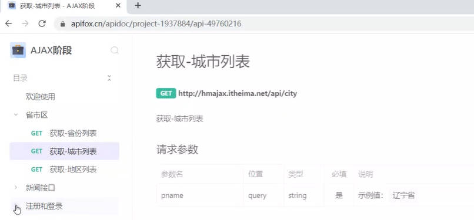

### form-serialize插件-表单

- 作用:快速收集表单元素的值

```html

<body>
  <form action="javascript:;" class="example-form">
    <!-- 
    参数1:要获得那个表单数据
    表单元素设置name属性,值会作为对象的属性名
    建议name属性的值,最好和接口文档参数名一致
    -->
    <input type="text" name="userame">
    <br>
    <input type="text" name="password">
    <br>
    <input type="button" class="btn" value="提交">
  </form>
  <!-- 
    目标：在点击提交时，使用form-serialize插件，快速收集表单元素值
  -->
  <!-- 引用插件 -->
  <script src='../lib/form-serialize.js'></script>
  <script>
    document.querySelector('.btn').addEventListener('click', () => {
      const form = document.querySelector('.example-form')
      /**
       * 参数2:配置对象
       * hash 设置获取数据的结构
       *      - true:JS对象(推荐) 一般请求体里面提交给服务器
       *      - false:查询字符串
       * empty 设置是否获取空值
       *      - true:获取空值(推荐) 数据结构和标签结构一样
       *      - false:不获取空值
      **/
      const data = serialize(form, { hash: true, empty: true })
      console.log(data); //{userame: '1111', password: '111'}

    })
  </script>
</body>
```

### FormData()-图片

```js
const fd = new FormData()
fd.append(参数名,值)
```

```html
<body>
  <!-- 文件选择元素 -->
  <input type="file" class="upload">
  

  <script src="https://cdn.jsdelivr.net/npm/axios/dist/axios.min.js"></script>
  <script>
    document.querySelector('.upload').addEventListener('change', e => {

      //获取图片文件
      console.log(e.target.files[0]);

      //使用FormData携带图片文件
      const fd = new FormData()
      fd.append('img', e.target.files[0])

      //提交到服务器,获取图片的url网址使用
      axios({
        url: 'http://hmajax.itheima.net/api/uploadimg',
        method: 'POST',
        data: fd

      }).then(result => {
        console.log(result);
        //取出图片url网址,用img标签显示
        const imgUrl = result.data.data.url
        console.log(imgUrl);
        document.querySelector('.my-img').src = imgUrl
      })
    })

  </script>
</body>
```

```js
document.querySelector('.bg-ipt').addEventListener('change', e => {
  //获取文件
  console.log(e.target.files[0]);
  const fd = new FormData()
  fd.append('img', e.target.files[0])

  axios({
    url: 'http://hmajax.itheima.net/api/uploadimg',
    method: 'POST',
    data: fd
  }).then(result => {
    // console.log(result.data.message);
    const imgUrl = result.data.data.url
    document.body.style.backgroundImage = `url(${imgUrl})`

  })
})
```

### 提示框

```html
  <div class="toast" data-bs-delay="1500">

  </div>
```

```js
  // 创建toast对象
  const toastDom = document.querySelector('css选择器')
  const toast = new bootstrap.Toast(toastDom)

  //显示提示框
  toast.show()
```

### AJAX原理 - XMLHttpRequest

- XHR对象用于与服务器交互
- axios内部采用XHR与服务器进行交互,axios是XHR的封装

#### 使用XHR

```html
<script>
    /**
     * 目标：使用XMLHttpRequest对象与服务器通信
     *  1. 创建 XMLHttpRequest 对象
     *  2. 配置请求方法和请求 url 地址
     *  3. 监听 loadend 事件，接收响应结果
     *  4. 发起请求
    */
    //1. 创建 XMLHttpRequest 对象
    const xhr = new XMLHttpRequest()

    //2. 配置请求方法和请求 url 地址
    xhr.open('GET', 'http://hmajax.itheima.net/api/province')

    //3. 监听 loadend 事件，接收响应结果
    xhr.addEventListener('loadend', () => {
      console.log(xhr.response);
      data = JSON.parse(xhr.response)
      console.log(data.list.join('<br>'));
      document.querySelector('.my-p').innerHTML = data.list.join('<br>')

    })

    //4. 发起请求
    xhr.send()

  </script>
```

#### XHR - 查询参数

- 请求地址:`http://hmajax.itheima.net/api/city?参数名1=值1&参数名2=值2`

```html
  <script>

    /**
     * 目标：使用XHR携带查询参数，展示某个省下属的城市列表
    */
    const xhr = new XMLHttpRequest()
    xhr.open('GET', 'http://hmajax.itheima.net/api/city?pname=山东省')
    xhr.addEventListener('loadend', () => {
      console.log(xhr.response);
      const data = JSON.parse(xhr.response)
      console.log(data);
      document.querySelector('p').innerHTML = data.list.join('<br>')
    })

    xhr.send()
  </script>
```

#### 创建查询参数URLSP

```js
  //创建URLSearchParams对象
  const paramsObj = new URLSearchParams({
    参数1:值1,
    参数2:值2
  })

  //生成指定格式查询参数,字符串
  const queryString = paramsObj.toString()
  //结果:参数1=值1&参数2=值2
  // 使用xhr对象,查询地区列表
  const xhr = new XMLHttpRequest()
  xhr.open('GET', `http://hmajax.itheima.net/api/area?${queryString}`)

```

#### XHR - 数据提交

```js
  const xhr = new XMLHttpRequest()

  // xhr.open('请求方法','请求url网址')
  xhr.open('post', 'http://hmajax.itheima.net/api/register')
  xhr.addEventListener('loadend', () => {
    console.log(xhr.response);
  })

  //设置请求头-告诉服务器内容类型(JOSN字符串)
  xhr.setRequestHeader('Content-Type', 'application/json')

  //准备要提交的数据,转换成JOSN字符串
  const userObj = {
    username: 'itheima066',
    password: '1234567'
  }
  const userStr = JSON.stringify(userObj)
  xhr.send(userStr)
```

## axios库

### axios使用

1. 引用axios.js:(`https://cdn.jsdelivr.net/npm/axios/dist/axios.min.js`)
`<script src="https://cdn.jsdelivr.net/npm/axios/dist/axios.min.js"></script>`
2. 使用axios函数:传入配置对象,再用.then回调函数接收结果,并做后续处理

```js
axios({
  url:'目标资源地址'
}).then((result)=>{
  //对服务器返回的数据做后续处理
})

```

- 把省份数据放在页面上

```html
<body>
  <p class='my-p'></p>
  <script src="https://cdn.jsdelivr.net/npm/axios/dist/axios.min.js"></script>
  <script>
    //使用axios函数
    axios({
      url: 'https://hmajax.itheima.net/api/province'
    }).then(result => {
      console.log(result);
      console.log(result.data.list.join(`<br>`));
      document.querySelector('.my-p').innerHTML = result.data.list.join(`<br>`)
    })
  </script>
</body>

```

### axios- 查询参数

```js
axios({
  url:'目标资源地址'
  params:{
    参数名:值
  }
}).then(result=>{
  //对服务器返回的数据做后续处理
})
  /*
    获取地区列表: http://hmajax.itheima.net/api/area
    查询参数:
      pname: 省份或直辖市名字
      cname: 城市名字
  */
```

```html
<body>
  <!-- 
    城市列表: http://hmajax.itheima.net/api/city
    参数名: pname
    值: 省份名字
  -->
  <p></p>
  <script src="https://cdn.jsdelivr.net/npm/axios/dist/axios.min.js"></script>
  <script>
    axios({
      url: 'http://hmajax.itheima.net/api/city',
      //查询参数
      params: {
        pname: '山东省'
      }
    }).then(result => {
      console.log(result.data.list);
      document.querySelector('p').innerHTML = result.data.list.join('<br>')
    })

  </script>
</body>

```

### axios- 提交数据

- url:请求的URL网址
- method:请求的方法,GET可以省略(不区分大小写)
- data:提交数据

```js
axios({
  url:'目标资源地址'
  method:'请求方法'
  params:{
    参数名:值
  }
}).then(result=>{
  //对服务器返回的数据做后续处理
})

```

```js
 axios({
        url: 'http://hmajax.itheima.net/api/register',
        method: 'post',
        //提交数据
        data: {
          username: 'itemima7898',
          password: '123456'
        }
      }).then(result => {
        console.log(result);
      })
```

### axios 错误处理catch

- 语法:在then 方法后面,通过点语法调用catch方法,传入回调函数并定义形参

```js
axios({
  //请求选项
}).then(result=>{
  //对服务器返回的数据做后续处理
}).catch(error=>{
  //处理错误
})

```

### axios公共配置

```js
// axios 公共配置
// 基地址

axios.defaults.baseURL = 'http://geek.itheima.net'
```

---

## 认识url

- 定义:统一资源定位符,定位地址.URL地址
- 网址,用于访问服务器上资源

### url组成

#### http协议

- http协议:超文本传输协议,规定浏览器和服务器之间传输数据的格式

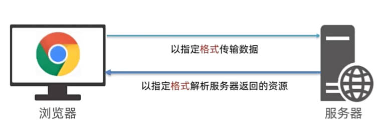

##### 请求报文

- 请求报文:浏览器按照HTTP协议要求的格式,==发给服务器内容==
- 请求报文的组成
  - 请求行:请求方法,URL,协议
  - 请求头:以键值对的格式携带的附加信息,比如`Content-Type`
  - 空行:分隔请求头,空行之后的是==发送给服务器的资源==
  - 请求体:==发送资源==

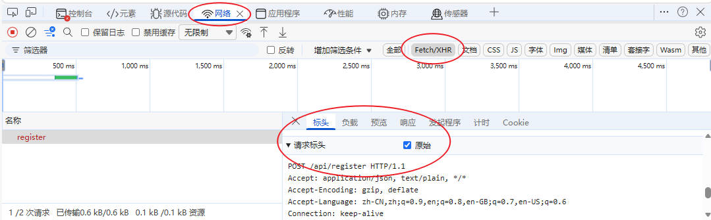

- 应用:错误排查

##### 响应报文

- 响应报文:服务器按照HTTP协议要求的格式,==返回浏览器的内容==
- 响应报文的组成
  - 响应行(状态行):协议,==HTTP响应状态码==,状态信息
  - 响应头:以键值对的格式携带的附加信息,比如`Content-Type`
  - 空行:分隔请求头,空行之后的是==服务器返回的资源==
  - 响应体:==返回的资源==
- HTTP响应状态码:用来表明请求是否成功完成

|状态码|说明|
|:---:|:---:|
|1xx|信息|
|2xx|成功|
|3xx|重定向消息|
|4xx|客户端错误|
|5xx|服务端错误|

#### 域名`hmajax.itheima.net`

- 域名:标记服务器在互联网中方位
- eg:baidu.com 百度的服务器 ; <www.taobao.com淘宝服务器>

#### 资源路径`/api/province`

- 资源路径:标记资源在服务器下的具体位置

### url查询数据

- 定义:浏览器提供给服务器的额外信息,让服务器返回浏览器想要的数据
- 语法:`http://xxxx.com/xxx/xxx?参数名1=值1&参数名2=值2`


### 常见的请求方法

- 请求方法:对服务器资源,要执行的操作

|请求方式|操作|
|:---:|:---:|
|GET|获取数据|
|POST|提交数据|
|PUT|修改数据(全部)|
|DELETE|删除数据|
|PATCH|修改数据(部分)|

## promise

### 定义

- promise对象用于表示(管理)一个异步操作的最终完成(或失败)及其结果值
- 好处:逻辑更清晰,了解axios函数内部运作机制,能解决回调函数地狱问题


### 使用

- 语法

```html
    <script>
    /**
     * 目标：使用Promise管理异步任务
    */
    //1.创建promise对象
    const p = new Promise((resolve, reject) => {
      //2.执行异步任务-并传递结果
      //成功调用:resolve(值)触发then()执行
      //失败调用:reject(值)触发catch()执行
    })
    //3.接收结果
    p.then(result => {
      //成功
    }).catch(error=>{
      //失败
    })

  </script>
```

- 应用

```html
  <script>
    /**
     * 目标：使用Promise管理异步任务
    */
    //1.创建promise对象
    const p = new Promise((resolve, reject) => {
      //Promise对象创建时,这里的代码都会执行了
      //2.执行异步代码
      setTimeout(() => {
        //resolv()=> 'fulfilled状态-已兑现' => then()
        //resolve('模拟AjAX请求-成功结果')

        //reject()=> 'rejected状态-已拒绝' => catch()
        reject('模拟AjAX请求-失败结果')

      }, 2000)

    })
    //3.接收结果
    p.then(result => {
      //成功
      console.log(result);
    }).catch(error => {
      //错误对象用console.dir详细打印
      console.dir(error);
    })

  </script>
```

### 三种状态

- 概念:一个promise对象,必然处于以下几种状态之一
- 待定(pending):初始状态,既没有被兑现,也没有被拒绝
- 已兑现(fulfilled):意味着,操作成功完成
- 已拒绝(rejected):意味着,操作失败
- 注意:Promise对象一旦被==兑现/拒绝==就是已敲定了,==状态无法再被改变==
- promise状态改变后,调用关联的处理函数

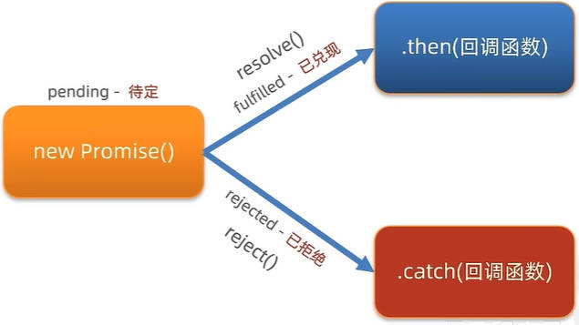

### 基于Promise + XHR封装myAxios函数

```js
function myAxios(config){
  return new Promise((resolve,reject)=>{
    //XHR请求
    //调用成功/失败的处理程序
  })
}

myAxios({
  url:'目标资源地址'
}).then(result=>{

}).catch(error=>{
  
})

```

```js
function myAxios(config) {
  return new Promise((resolve, reject) => {
    const xhr = new XMLHttpRequest()
    if (config.params) {
      const paramsObj = new URLSearchParams(config.params)
      const queryString = paramsObj.toString()
      config.url += `?${queryString}`
    }
    xhr.open(config.method || 'GET', config.url)
    xhr.addEventListener('loadend', () => {
      if (xhr.status >= 200 && xhr.status < 300) {
        resolve(JSON.parse(xhr.response))
      } else {
        reject(new Error(xhr.response))
      }
    })
    if (config.data) {
      const jsonStr = JSON.stringify(config.data)
      xhr.setRequestHeader('Content-Type', 'application/json')
      xhr.send(jsonStr)
    } else {
      xhr.send()
    }
  })
}
```

### Promise.all静态方法

- 概念：合并多个 Promise 对象，等待所有同时成功完成（或某一个失败），做后续逻辑
- 让合并后的所有promise对象同时打印出来
- 缺点: 无法找到all里面某个对象的错误,只要有一个错误就会全部返回,无法打印

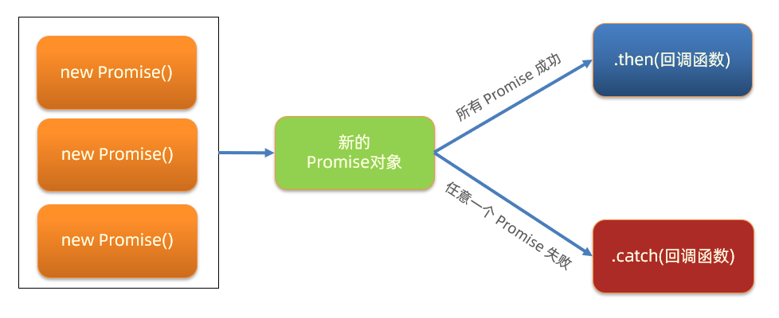

- 语法：

   ```js
   const p = Promise.all([Promise对象, Promise对象, ...])
   p.then(result => {
     // result 结果: [Promise对象成功结果, Promise对象成功结果, ...]
   }).catch(error => {
     // 第一个失败的 Promise 对象，抛出的异常对象
   })
   ```

- 应用

```html
<body>
  <ul class="my-ul"></ul>
  <script src="https://cdn.jsdelivr.net/npm/axios/dist/axios.min.js"></script>
  <script>
    /**
     * 目标：掌握Promise的all方法作用，和使用场景
     * 业务：当我需要同一时间显示多个请求的结果时，就要把多请求合并
     * 例如：默认显示"北京", "上海", "广州", "深圳"的天气在首页查看
     * code：
     * 北京-110100
     * 上海-310100
     * 广州-440100
     * 深圳-440300
    */
    const bjPromise = axios({ url: 'http://hmajax.itheima.net/api/weather', params: { city: '110100' } })
    // console.log(bjPromise);
    const shPromise = axios({ url: 'http://hmajax.itheima.net/api/weather', params: { city: '310100' } })

    const gzPromise = axios({ url: 'http://hmajax.itheima.net/api/weather', params: { city: '440100' } })

    const szPromise = axios({ url: 'http://hmajax.itheima.net/api/weather', params: { city: '440300' } })

    //使用promise.all，合并多个promise对象
    const p = Promise.all([bjPromise, shPromise, gzPromise, szPromise])
    p.then((result) => {
      console.log(result);
      const rList = result
      const htmlStr = rList.map(element => {
        const data = element.data.data
        console.log(data.area, data.dateShort, data.weather);
        return `<li>${data.area}---${data.dateShort}---${data.weather}</li>`

      }).join('');
      document.querySelector('.my-ul').innerHTML = htmlStr
    }).catch((err) => {
      console.dir(err);
    });

  </script>
</body>
```

## 同步代码和异步代码

### 同步代码

- 实际上浏览器是按照我们书写代码的顺序一行一行执行程序的,浏览器会等待代码的解析和工作,在上一行完成后才会执行下一行,是一个同步程序
- 同步代码:逐行执行,需原地等待结束后,才继续向下执行

### 异步代码

- 异步编程技术使程序可以在执行一个可能长期运行的任务的同时继续对其他事情做出反应而不必等待任务完成.同时,任务完成后显示结果
- 异步代码:调用后耗时，不阻塞代码继续执行（不必原地等待），在将来完成后触发回调函数传递结果
- setTimeout/setinterval/事件/AJAX

### 回调函数地狱

```js
  /**
   * 目标：演示回调函数地狱
   * 需求：获取默认第一个省，第一个市，第一个地区并展示在下拉菜单中
   * 概念：在回调函数中嵌套回调函数，一直嵌套下去就形成了回调函数地狱
   * 缺点：可读性差，异常无法获取，耦合性严重，牵一发动全身
  */
  axios({ url: 'http://hmajax.itheima.net/api/province' }).then(result => {
    const pname = result.data.list[0]
    document.querySelector('.province').innerHTML = pname
    // 获取第一个省份默认下属的第一个城市名字
    axios({ url: 'http://hmajax.itheima.net/api/city', params: { pname } }).then(result => {
      const cname = result.data.list[0]
      document.querySelector('.city').innerHTML = cname
      // 获取第一个城市默认下属第一个地区名字
      axios({ url: 'http://hmajax.itheima.net/api/area', params: { pname, cname } }).then(result => {
        document.querySelector('.area').innerHTML = result.data.list[0]
      })
    })
  })

```

### Promise-链式调用

1. 概念：依靠 then() 方法会返回一个新生成的 Promise 对象特性，继续串联下一环任务，直到结束
2. 细节：then() 回调函数中的返回值，会影响新生成的 Promise 对象最终状态和结果
3. 好处：通过链式调用，解决回调函数嵌套问题,回调函数地狱问题

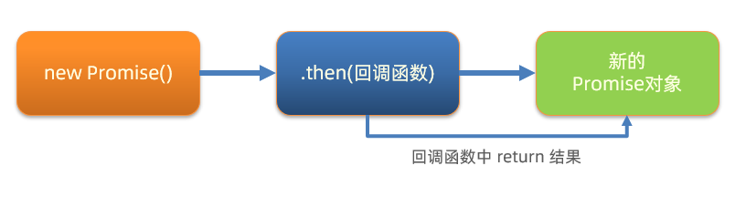

```js
  /**
   * 目标：掌握Promise的链式调用
   * 需求：把省市的嵌套结构，改成链式调用的线性结构
  */
  //创建promise对象
  const p = new Promise((resolve, reject) => {
    setTimeout(() => {
      resolve('山东省')
    }, 2000);
  });

  //获取省份名字
  const p2 = p.then(result => {
    console.log(result);

    //创建promise 对象 - 请求省份里面的城市
    //return Promise对象最终状态和结果,影响到新的Promise对象
    return new Promise((resolve, reject) => {
      setTimeout(() => {
        resolve(result + '---济南市')
      }, 2000);
    });
  })

  p2.then(result => {
    console.log(result);
  })

```

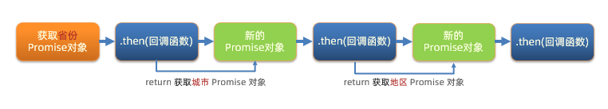

```js
/**
   * 目标：把回调函数嵌套代码，改成Promise链式调用结构
   * 需求：获取默认第一个省，第一个市，第一个地区并展示在下拉菜单中
  */
  let pname = ''
  //获取省名字
  axios({ url: 'http://hmajax.itheima.net/api/province' }).then((result) => {
    pname = result.data.list[0]
    document.querySelector('.province').innerHTML = pname

    //获取市名字
    return axios({ url: 'http://hmajax.itheima.net/api/city', params: { pname } })
  }).then((result) => {
    const cname = result.data.list[0]
    document.querySelector('.city').innerHTML = cname
    console.log(pname);

    //获得地区名字
    return axios({ url: 'http://hmajax.itheima.net/api/area', params: { pname, cname } })
  }).then((result) => {
    console.log(result);
    const aname = result.data.list[0]
    console.log(aname);
    document.querySelector('.area').innerHTML = aname

  })
```

### async函数和await

- async 类似于.then 一样获取结果,但async就是原地获得结果,.then还要调用result

```html
  <script>
    /**
     * 目标：掌握async和await语法，解决回调函数地狱
     * 概念：在async函数内，使用await关键字，获取Promise对象"成功状态"结果值
     * 注意：await必须用在async修饰的函数内（await会阻止"异步函数内"代码继续执行，原地等待结果）
    */
    async function getData() {
      const pObj = await axios({ url: 'http://hmajax.itheima.net/api/province' })
      const pname = pObj.data.list[0]

      const cObj = await axios({ url: 'http://hmajax.itheima.net/api/city', params: { pname } })
      const cname = cObj.data.list[0]

      const aObj = await axios({ url: 'http://hmajax.itheima.net/api/area', params: { pname, cname } })
      const aname = aObj.data.list[0]

      document.querySelector('.province').innerHTML = pname
      document.querySelector('.city').innerHTML = cname
      document.querySelector('.area').innerHTML = aname

    }
    getData()
  </script>

```

#### 捕获错误

- try 和 catch 的作用：语句标记要尝试的语句块，并指定一个出现异常时抛出的响应

```js
  try {
    // 要执行的代码
  } catch (error) {
    // error 接收的是，错误消息
    // try 里代码，如果有错误，直接进入这里执行
  }
```

> try 里有报错的代码，会立刻跳转到 catch 中

```js
    async function getData() {
      try {
        const pObj = await axios({ url: 'http://hmajax.itheima.net/api/province' })
        const pname = pObj.data.list[0]
        const cObj = await axios({ url: 'http://hmajax.itheima.net/api/city', params: { pname } })
        const cname = cObj.data.list[0]
        const aObj = await axios({ url: 'http://hmajax.itheima.net/api/area', params: { pname, cname } })
        const areaName = aObj.data.list[0]

        document.querySelector('.province').innerHTML = pname
        document.querySelector('.city').innerHTML = cname
        document.querySelector('.area').innerHTML = areaName
      } catch (error) {
        //如果try里某行代码报错后,try中剩余代码就不会执行了
        console.dir(error)
      }
    }
    getData()
```

## 事件循环(EventLoop)

1. 先执行执行栈中的同步任务
2. 异步任务放入任务队列中
3. 一旦执行栈中的所有同步任务执行完毕,系统就会按次序读取任务队列中的异步任务,于是被读取的异步任务结束等待状态,进入执行栈,开始执行


- 由于主线程不断的重复获得任务,执行任务,再获取任务,再执行,所以这种机制被称为事件循环(event loop)
- 作用：事件循环负责执行代码，收集和处理事件以及执行队列中的子任务
- 原因：JavaScript 单线程（某一刻只能执行一行代码），为了让耗时代码不阻塞其他代码运行，设计了事件循环模型
- 概念：执行代码和收集异步任务的模型，在调用栈空闲，反复调用任务队列里回调函数的执行机制，就叫事件循环

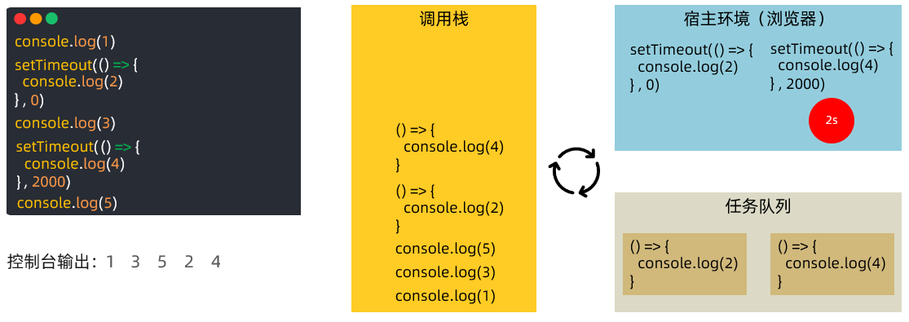

### JavaScript 内代码如何执行(简单)

- 执行同步代码，遇到异步代码交给宿主浏览器环境执行
- 异步有了结果后，把回调函数放入任务队列排队
- 当调用栈空闲后，反复调用任务队列里的回调函数

### 宏任务与微任务

1. ES6 之后引入了 Promise 对象， 让 JS 引擎也可以发起异步任务
2. 异步任务划分为了
   - 宏任务：由浏览器环境执行的异步代码
   - 微任务：由 JS 引擎环境执行的异步代码
3. 宏任务和微任务具体划分：

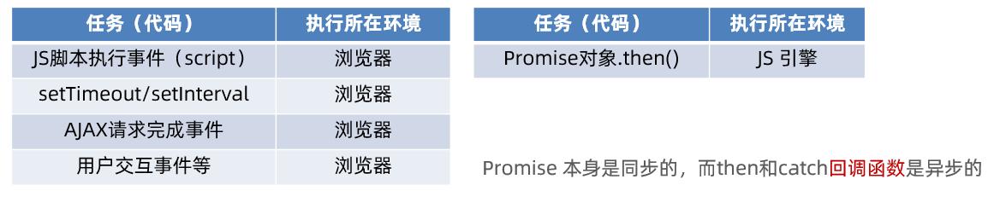
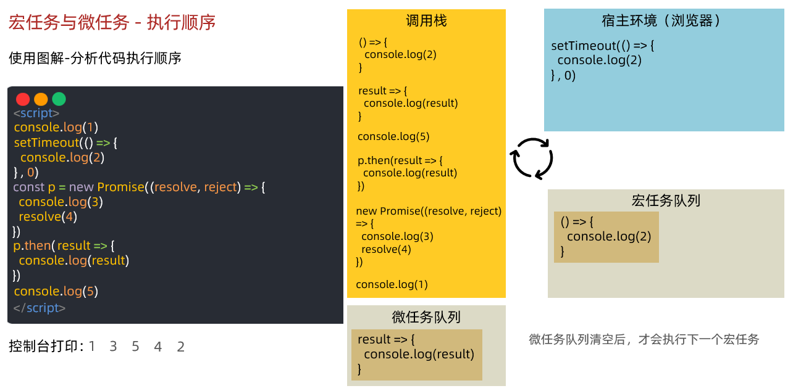

#### JavaScript 内代码如何执行

- 执行第一个 script 脚本事件宏任务，里面同步代码
- 遇到 宏任务/微任务 交给宿主环境，有结果回调函数进入对应队列
- 当执行栈空闲时，清空微任务队列，再执行下一个宏任务，从1再来

## 黑马头条-数据管理平台

### 项目介绍

- 黑马头条-数据管理平台：对IT资讯移动网站的数据，进行数据管理
- 数据管理平台-演示：配套代码在本地运行
- 移动网站-演示： [http://](http://geek.itheima.net/)[geek.itheima.net](http://geek.itheima.net/)[/](http://geek.itheima.net/)

#### 功能

1.登录和权限判断
2.查看文章内容列表（筛选，分页）
3.编辑文章（数据回显）
4.删除文章
5.发布文章（图片上传，富文本编辑器）

### 项目准备

#### 技术

- 基于 Bootstrap 搭建网站标签和样式
- 集成 wangEditor 插件实现富文本编辑器
- 使用原生 JS 完成增删改查等业务
- 基于 axios 与黑马头条线上接口交互
- 使用 axios 拦截器进行权限判断

#### 准备

- 准备配套的素材代码
- 包含：html，css，js，静态图片，第三方插件等等
- 目录管理：建议这样管理，方便查找
- assets：资源文件夹（图片，字体等）
- lib：资料文件夹（第三方插件，例如：form-serialize）
- page：页面文件夹
- utils：实用程序文件夹（工具插件）

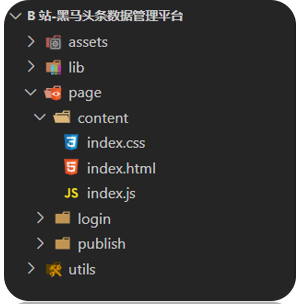

### 验证码登录

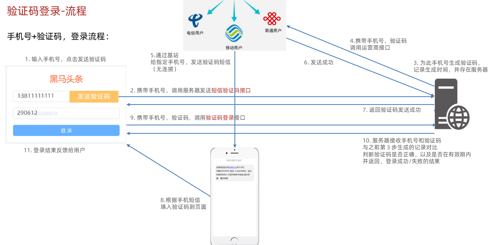

### token的使用

- 概念：访问权限的令牌，本质上是一串字符串
- 创建：正确登录后，由后端签发并返回
- 作用：判断是否有登录状态等，控制访问权限
- 注意：前端只能判断 token 有无，而后端才能判断 token 的有效性

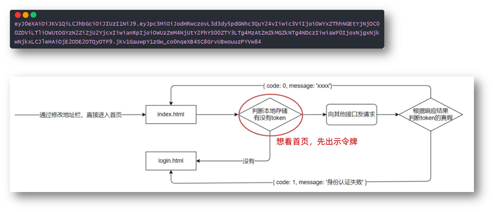

- 步骤：

1.在 utils/auth.js 中判断无 token 令牌字符串，则强制跳转到登录页（手动修改地址栏测试）
2.在登录成功后，保存 token 令牌字符串到本地，再跳转到首页（手动修改地址栏测试）

```js
const token = localStorage.getItem('token')
// 没有 token 令牌字符串，则强制跳转登录页
if (!token) {
  location.href = '../login/index.html'
}
```

---

### 个人信息设置和 axios 请求拦截器

语法：axios 可以在 headers 选项传递请求头参数

问题：很多接口，都需要携带 token 令牌字符串

解决：在[请求拦截器](https://www.axios-http.cn/docs/interceptors)统一设置公共 headers 选项

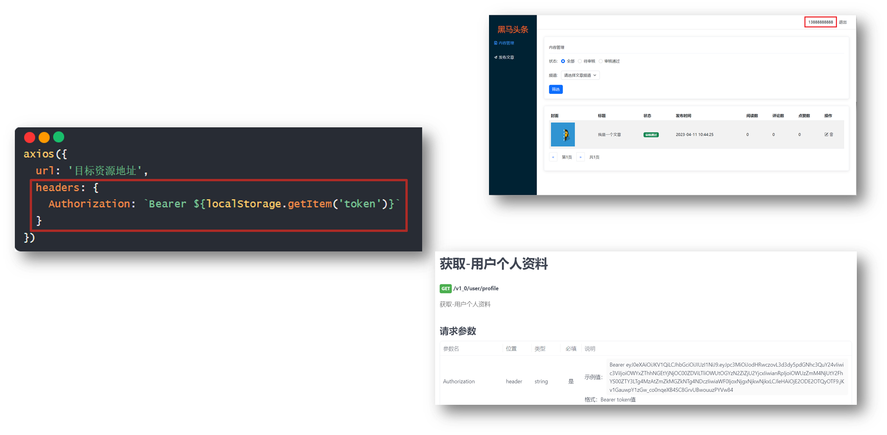
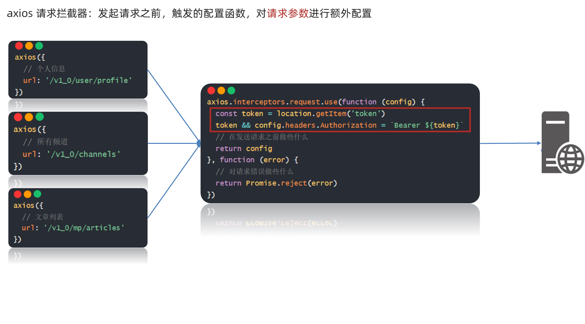

对应代码：

```js
axios({
  url: '目标资源地址',
  headers: {
    Authorization: `Bearer ${localStorage.getItem('token')}`
  }
})
```

```js
axios.interceptors.request.use(function (config) {
  // 在发送请求之前做些什么
  return config
}, function (error) {
  // 对请求错误做些什么
  return Promise.reject(error)
})
```

```js
axios({
  // 个人信息
  url: '/v1_0/user/profile'
}).then(result => {
  // result：服务器响应数据对象
}).catch(error => {
  
})
```

```js
axios.interceptors.request.use(function (config) {
  const token = location.getItem('token')  
  token && config.headers.Authorization = `Bearer ${token}`
  // 在发送请求之前做些什么
  return config
}, function (error) {
  // 对请求错误做些什么
  return Promise.reject(error)
})
```

1. 什么是 axios 请求拦截器？ => 发起请求之前，调用的一个函数，对请求参数进行设置
2. axios 请求拦截器，什么时候使用？ => 有公共配置和设置时，统一设置在请求拦截器中

---

### axios 响应拦截器和身份验证失败

axios 响应拦截器：响应回到 then/catch 之前，触发的拦截函数，对响应结果统一处理
例如：身份验证失败，统一判断并做处理

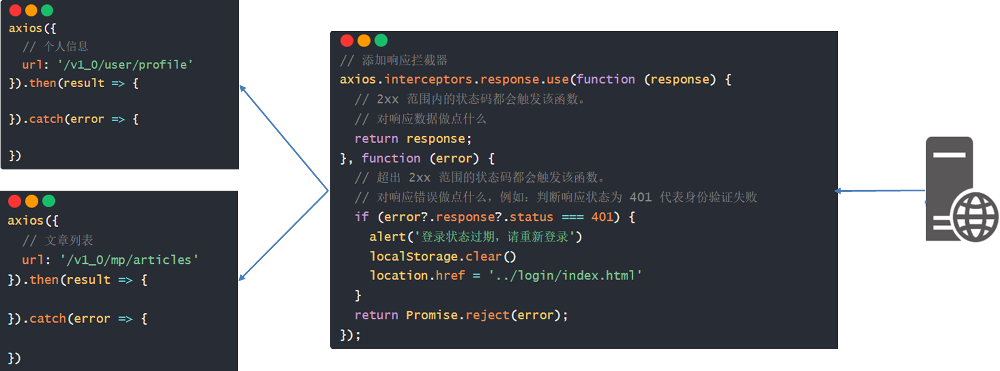

```js
axios.interceptors.response.use(function (response) {
  // 2xx 范围内的状态码都会触发该函数。

  //思路：其实就是在响应拦截器里，response.data 把后台返回的数据直接取出来统一返回给所有使用这个 axios 函数的逻辑页面位置的 then 的形参上
  //好处：可以让逻辑页面少点一层 data 就能拿到后端返回的真正数据对象
  return response.data;
}, function (error) {
  // 超出 2xx 范围的状态码都会触发该函数。
  // 对响应错误做点什么，例如：判断响应状态为 401 代表身份验证失败
  if (error?.response?.status === 401) {
    alert('登录状态过期，请重新登录')
    window.location.href = '../login/index.html'
  }
  return Promise.reject(error);
});
```

1. 什么是 axios 响应拦截器？ => 响应回到 then/catch 之前，触发的拦截函数，对响应结果统一处理
2. axios 响应拦截器，什么时候触发成功/失败的回调函数？ => 状态为 2xx 触发成功回调，其他则触发失败的回调函数

### 富文本编辑器

- 富文本：带样式，多格式的文本，在前端一般使用标签配合内联样式实现
- 富文本编辑器：用于编写富文本内容的容器

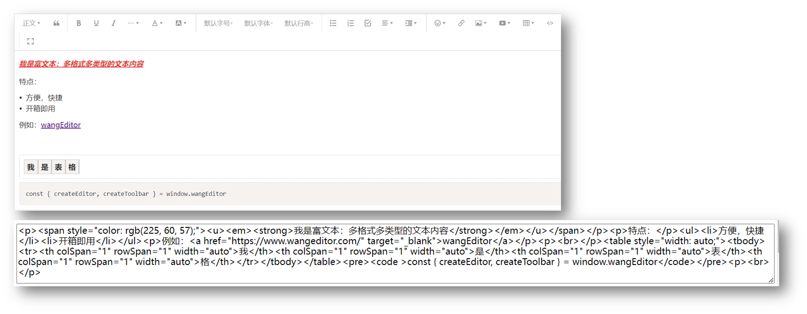

使用：wangEditor 插件

[步骤](https://www.wangeditor.com/v5/getting-started.html)：参考文档

1.引入 CSS 定义样式
2.定义 HTML 结构
3.引入 JS 创建编辑器
4.监听内容改变，保存在隐藏文本域（便于后期收集）
