# vue2(上)

## Vue2+Vue3

### 一、为什么要学习Vue

1.前端必备技能

2.岗位多，绝大互联网公司都在使用Vue

3.提高开发效率

4.高薪必备技能（Vue2+Vue3）

---

### 二、什么是Vue

概念：Vue (读音 /vjuː/，类似于 view) 是一套 **构建用户界面** 的 **渐进式**
**框架**

Vue2官网：<https://v2.cn.vuejs.org/>

#### 1.什么是构建用户界面

**基于数据**渲染出用户可以看到的**界面**

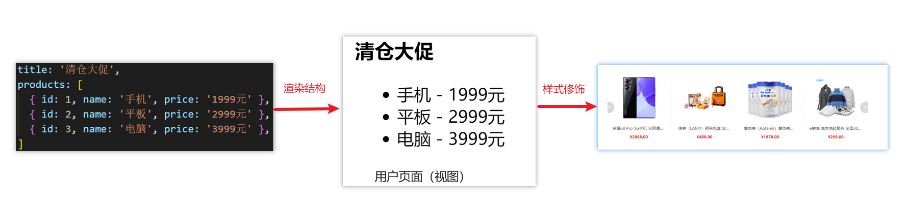

#### 2.什么是渐进式

所谓渐进式就是循序渐进，不一定非得把Vue中的所有API都学完才能开发Vue，可以学一点开发一点

##### Vue的两种开发方式

1. Vue核心包开发

   场景：局部模块改造

2. Vue核心包&Vue插件&工程化

   场景：整站开发

#### 3.什么是框架

所谓框架：就是一套完整的解决方案

==举个栗子==

如果把一个完整的项目比喻为一个装修好的房子，那么框架就是一个毛坯房。

我们只需要在“毛坯房”的基础上，增加功能代码即可。

提到框架，不得不提一下库。

- 库，类似工具箱，是一堆方法的集合，比如 axios、lodash、echarts等
- 框架，是一套完整的解决方案，实现了大部分功能，我们只需要按照一定的规则去编码即可。

下图是 库 和 框架的对比。

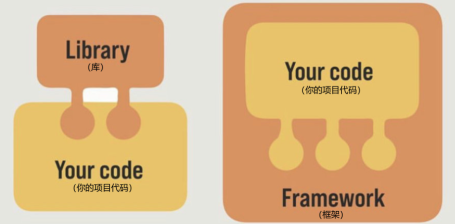

框架的特点：有一套必须让开发者遵守的**规则**或者**约束**

咱们学框架就是学习的这些规则 [官网](https://v2.cn.vuejs.org/)

---

### 三、创建Vue实例

我们已经知道了Vue框架可以 基于数据帮助我们渲染出用户界面，那应该怎么做呢？

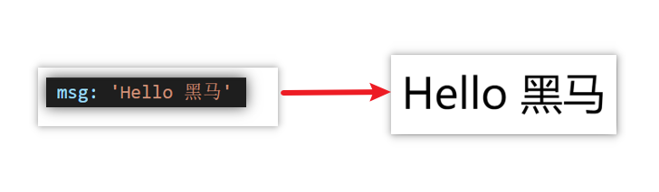

比如就上面这个数据，基于提供好的msg 怎么渲染后右侧可展示的数据呢？

**核心步骤（4步）：**

1. 准备容器
2. 引包（官网）<https://v2.cn.vuejs.org/> — 开发版本/生产版本
3. 创建Vue实例 new Vue()
4. 指定配置项，渲染数据
   1. el:指定挂载点
   2. data提供数据
5. 写vue对象的参数的时候，分清楚函数还是对象还是数组

```html
<body>
  <!-- 创建Vue实例,初始化渲染 -->
  <div id="app">
    <!-- 这里将来会编写一些用于渲染的代码逻辑 -->
    {{msg}}
  </div>

  <!-- 引入的是开发版本包--含有完整的注释和警告 -->
  <script src="https://cdn.jsdelivr.net/npm/vue@2.7.16/dist/vue.js"></script>

  <script>
    // 一旦引入Vuejs核心包,在全局环境,就有了Vue构造函数
    const app = new Vue({
      //通过el配置选择器,指定Vue管理的是哪个盒子
      el: '#app',

      //通过data提供数据
      data: {
        msg: 'hello 黑马'
      }
    })
  </script>
</body>
```

---

### 四、插值表达式 `{{}}`

插值表达式是一种`Vue`的模板语法

我们可以用插值表达式渲染出`Vue`提供的数据

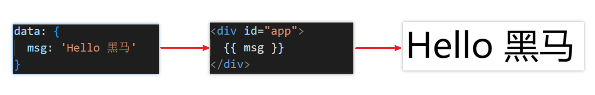

#### 1.作用：利用表达式进行插值，渲染到页面中

表达式：是可以被求值的代码，`JS`引擎会讲其计算出一个结果

以下的情况都是表达式：

```js
money + 100
money - 100
money * 10
money / 10
price >= 100 ? '真贵' : '还行'
obj.name
arr[0]
fn()
obj.fn()
```

#### 2.语法

插值表达式语法:`{{  }}`

```html
<script>
  const age = 18
</script>

<template>
  <h3>
    {{title}}
    <h3>
      <p>{{nickName.toUpperCase()}}</p>
      <p>{{age > 18 ? '成年':'未成年'}}</p>
      <p>{{obj.name}}</p>

      <p>{{fn()}}</p>
    </h3>
  </h3>
</template>
```

#### 3.错误用法

```html
<!-- 1.在插值表达式中使用的数据 必须在data中进行提供或者vue实例提供data提供的一定是Vue实例提供的 -->

<p>{{hobby}}</p>
<!-- 如果没有提供 则会报错 2.支持的是表达式，而非语句，比如：if for ... -->
<p>{{if}}</p>

<!-- 3.不能在标签属性中使用 {{ }} 插值 (插值表达式只能标签中间使用) -->
<p title="{{username}}">我是P标签</p>
```

---

### 五、响应式特性

#### 1.什么是响应式？

​ 简单理解就是==数据变==，==视图对应变==(浏览器页面变化)。

#### 2.如何访问 和 修改 data中的数据（响应式演示）

data中的数据, 最终会被添加到实例上

① 访问数据： "实例.属性名"

② 修改数据： "实例.属性名"= "值"

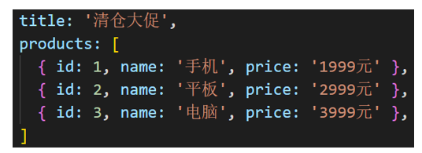

---

### 六、Vue开发者工具安装

1. 通过谷歌应用商店安装（国外网站）
2. 极简插件下载（推荐） <https://chrome.zzzmh.cn/index>

安装步骤：

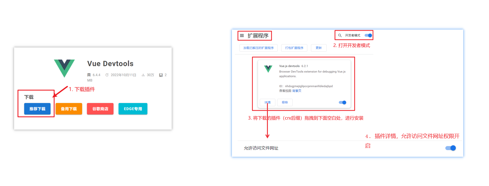

安装之后可以F12后看到多一个Vue的调试面板

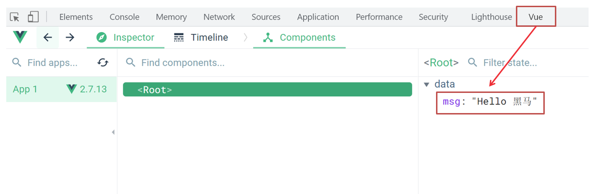

---

### 七、Vue中的常用指令

**概念：**指令（Directives）是 Vue 提供的带有 **v- 前缀** 的 特殊 标签**属性**。

官网查询详情<https://v2.cn.vuejs.org/v2/api>

为啥要学：提高程序员操作 DOM 的效率。

vue 中的指令按照不同的用途可以分为如下 6 大类：

- 内容渲染指令（v-html(类似于innerhtml)、v-text）
- 条件渲染指令（v-show、v-if、v-else、v-else-if）
- 事件绑定指令（v-on）
- 属性绑定指令 （v-bind）
- 双向绑定指令（v-model）
- 列表渲染指令（v-for）

指令是 vue 开发中最基础、最常用、最简单的知识点。

---

### 八、内容渲染指令

内容渲染指令用来辅助开发者渲染 DOM 元素的文本内容。常用的内容渲染指令有如下2 个：

- v-text（类似innerText）

- - 使用语法：`<p v-text="uname">hello</p>`，意思是将 uame 值渲染到 p 标签中
  - 类似 innerText，使用该语法，会覆盖 p 标签原有内容

- v-html（类似 innerHTML）

- - 使用语法：`<p v-html="intro">hello</p>`，意思是将 intro 值渲染到 p 标签中
  - 类似 innerHTML，使用该语法，会覆盖 p 标签原有内容
  - 类似 innerHTML，使用该语法，能够将HTML标签的样式呈现出来。

代码演示：

```js

  <div id="app">
    <h2>个人信息</h2>
  // 既然指令是vue提供的特殊的html属性，所以咱们写的时候就当成属性来用即可
    <p v-text="uname">姓名：</p>
    <p v-html="intro">简介：</p>
  </div>

<script>
        const app = new Vue({
            el:'#app',
            data:{
                uname:'张三',
                intro:'<h2>这是一个<strong>非常优秀</strong>的boy<h2>'
            }
        })
</script>
```

---

### 九、条件渲染指令

条件判断指令，用来辅助开发者按需控制 DOM 的显示与隐藏。条件渲染指令有如下两个，分别是：

1. v-show
   1. 作用： 控制元素显示隐藏
   2. 语法： v-show = "表达式" 表达式值为 true 显示， false 隐藏
   3. 原理： ==切换 display:none 控制显示隐藏==
   4. 场景：频繁切换显示隐藏的场景

   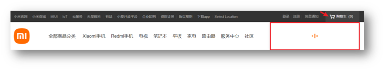

2. v-if
   1. 作用： 控制元素显示隐藏（条件渲染）
   2. 语法： v-if= "表达式" 表达式值 true显示， false 隐藏
   3. 原理： 基于条件判断，==是否创建 或 移除元素节点==
   4. 场景： 要么显示，要么隐藏，不频繁切换的场景

   

   示例代码：

   ```js
    <div id="app">
    <div class="box" v-show="flag">我是v-show控制的盒子</div>
    <div class="box" v-if="age<18?false:true">我是v-if控制的盒子</div>
    </div>

    <script src="./vue.js"></script>
    <script>
      const app = new Vue({
        el: '#app',
        data: {
          flag: false,
          age: 17

        }
      })
    </script>
   ```

3. v-else 和 v-else-if
   1. 作用：辅助v-if进行判断渲染
   2. 语法：v-else v-else-if="表达式"
   3. v-else与v-if==必须放在兄弟元素==上且紧跟在v-if后面

示例代码：

```js
  <div id="app">
    <p v-if="gender ===1">性别：♂ 男</p>
    <p v-else>性别：♀ 女</p>
    <hr>
    <p v-if="score>=90">成绩评定A：奖励电脑一台</p>
    <p v-else-if="score>=80">成绩评定B：奖励周末郊游</p>
    <p v-else-if="score>=60">成绩评定C：奖励零食礼包</p>
    <p v-else>成绩评定D：惩罚一周不能玩手机</p>
  </div>

  <script src=" ./vue.js">
  </script>
  <script>

    const app = new Vue({
      el: '#app',
      data: {
        gender: 1,
        score: 80

      }
    })
  </script>
```

---

### 十、事件绑定指令

使用Vue时，如需为DOM注册事件，及其的简单，语法如下：

```html
<button v-on:事件名="内联语句">按钮</button>
<button v-on:事件名="处理函数">按钮</button>
<button v-on:事件名="处理函数(实参)">按钮</button>
```

- `v-on:` 简写为 **@**

1. 内联语句

   ```js
   <div id="app">
       <button @click="count--">-</button>
       <span>{{ count }}</span>
       <button v-on:click="count++">+</button>
     </div>
     <script src="https://cdn.jsdelivr.net/npm/vue@2/dist/vue.js"></script>
     <script>
       const app = new Vue({
         el: '#app',
         data: {
           count: 100
         }
       })
     </script>
   ```

2. 事件处理函数

   注意：
   - 事件处理函数应该写到一个跟data同级的配置项（methods）中
   - methods中的函数内部的==this都指向Vue实例==

```html
<div id="app">
  <button @click="fn">切换显示隐藏</button>
  <h1 v-show="isShow">黑马程序员</h1>
</div>
<script src="./vue.js"></script>
<script>
  const app = new Vue({
    el: '#app',
    data: {
      isShow: true
    },
    methods: {
      fn() {
        //让提供的所有methods中的函数,this都指向当前实例
        //目前指向函数的this => app
        console.log('执行了fn', app.isShow)
        //app.isShow =!app.isShow
        this.isShow = !this.isShow
      }
    }
  })
</script>
```

3.给事件处理函数传参

- 如果不传递任何参数，则方法无需加小括号；methods方法中可以直接使用 e 当做事件对象

- 如果传递了参数，则实参 `$event` 表示事件对象，固定用法。

```html
   <style>
    .box {
      border: 3px solid #000000;
      border-radius: 10px;
      padding: 20px;
      margin: 20px;
      width: 200px;
    }

    h3 {
      margin: 10px 0 20px 0;
    }

    p {
      margin: 20px;
    }
  </style>
</head>

<body>

  <div id="app">
    <div class="box">
      <h3>小黑自动售货机</h3>
      <button @click="buy(5)" :disabled="money<5">可乐5元</button>
      <button @click="buy(10)" :disabled="money<10">咖啡10元</button>
    </div>
    <p>银行卡余额:{{money}}元</p>
  </div>

  <script src="./vue.js"></script>
  <script>
    const app = new Vue({
      el: '#app',
      data: {
        money: 100

      },
      methods: {
        buy(x) {
          if (this.money -= x > 5) {
            this.money -= x
          } else {
            alert('钱不够了')

          }

        }
      }
    })
  </script>
</body>
```

---

### 十一、属性绑定指令

1. **作用**：动态设置html的标签属性 比如：src、url、title
2. **语法**：==v-bind:属性名=“表达式”==
3. v-bind:可以简写成 冒号 **:**

比如，有一个图片，它的 `src`
属性值，是一个图片地址。这个地址在数据 data 中存储。

则可以这样设置属性值：

- ``
- `` （v-bind可以省略）

```js
  <div id="app">
    
    
  </div>
  <script src="https://cdn.jsdelivr.net/npm/vue@2/dist/vue.js"></script>
  <script>
    const app = new Vue({
      el: '#app',
      data: {
        imgUrl: './imgs/10-02.png',
        msg: 'hello 波仔'
      }
    })
  </script>
```

---

### 十二、小案例-波仔的学习之旅

需求：默认展示数组中的第一张图片，点击上一页下一页来回切换数组中的图片

实现思路：

1.数组存储图片路径 ['url1','url2','url3'，...]

2.可以准备个下标index 去数组中取图片地址。

3.通过v-bind给src绑定当前的图片地址

4.点击上一页下一页只需要修改下标的值即可

5.当展示第一张的时候，上一页按钮应该隐藏。展示最后一张的时候，下一页按钮应该隐藏

```html
<body>
  <div id="app">
    <button @click="index--" :disabled="index < 1">上一页</button>
    <div>
      
    </div>
    <button @click="index++" :disabled="index>4">下一页</button>
  </div>
  <script src="./vue.js"></script>
  <script>
    const app = new Vue({
      el: '#app',
      data: {
        index: 0,
        list: [
          './imgs/11-00.gif',
          './imgs/11-01.gif',
          './imgs/11-02.gif',
          './imgs/11-03.gif',
          './imgs/11-04.png',
          './imgs/11-05.png'
        ]
      }
    })
  </script>
</body>
```

---

### 十三、列表渲染指令

Vue 提供了 v-for 列表渲染指令，用来辅助开发者基于一个数组来循环渲染一个列表结构。

v-for 指令需要使用 `(item, index) in arr` 形式的特殊语法，其中：

- item 是数组中的每一项
- index 是每一项的索引，不需要可以省略
- arr 是被遍历的数组

此语法也可以遍历**对象和数字**

```js
//遍历对象
<div v-for="(value, key, index) in object">{{value}}</div>
value:对象中的值
key:对象中的键
index:遍历索引从0开始

//遍历数字
<p v-for="item in 10">{{item}}</p>
item从1 开始
```

```html
<body>
  <div id="app">
    <h3>小黑水果店</h3>
    <ul>
      <li v-for="(item,index) in list">水果{{index+1}} - {{item}}</li>
    </ul>
  </div>

  <script src="./vue.js"></script>
  <script>
    const app = new Vue({
      el: '#app',
      data: {
        list: ['西瓜', '苹果', '鸭梨']
      }
    })
  </script>
</body>
```

---

### 十四、小案例-小黑的书架

需求：

1.根据左侧数据渲染出右侧列表（v-for）

2.点击删除按钮时，应该把当前行从列表中删除（获取当前行的id，利用filter进行过滤）

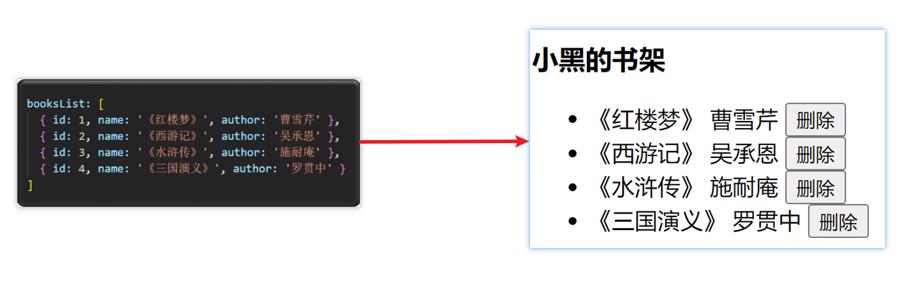

准备代码：

```html
<body>
  <div id="app">
    <h3>小黑的书架</h3>
    <ul>
      <!-- vue2里,这个key是必须的 -->
      <li v-for="(item,index) in booksList" :key="item.id">
        <span>{{item.name}}</span>
        <span>{{item.author}}</span>
        <button @click="del(item.id)">删除</button>
      </li>
    </ul>
  </div>
  <script src="./vue.js"></script>
  <script>
    const app = new Vue({
      el: '#app',
      data: {
        booksList: [
          { id: 1, name: '《红楼梦》', author: '曹雪芹' },
          { id: 2, name: '《西游记》', author: '吴承恩' },
          { id: 3, name: '《水浒传》', author: '施耐庵' },
          { id: 4, name: '《三国演义》', author: '罗贯中' }
        ]
      },
      methods: {
        del(id) {
          // this.booksList.splice(index, 1)
          this.booksList = this.booksList.filter(item => item.id !== id)
        }
      }
    })
  </script>
</body>
```

---

### 十五、v-for中的key

**语法：** key="唯一值"

**作用：** 给列表项添加的**唯一标识**。便于Vue进行列表项的**正确排序复用**。

**为什么加key:** Vue的默认行为会尝试原地修改元素（**就地复用**）

如果不加key:vue会觉得第一项变了，第二项变了，第三项变了，最后一项删了可以尝试在标签上加背景色看

实例代码：

```js
<ul>
  <li v-for="(item, index) in booksList" :key="item.id">
    <span>{{ item.name }}</span>
    <span>{{ item.author }}</span>
    <button @click="del(item.id)">删除</button>
  </li>
</ul>
```

注意：

1. key 的值只能是字符串 或 数字类型
2. key 的值必须具有唯一性
3. 推荐使用 id 作为 key（唯一），不推荐使用 index 作为 key（会变化，不对应）

---

### 十六、双向绑定指令v-model

所谓双向绑定就是：

1. 数据改变后，呈现的页面结果会更新
2. 页面结果更新后，数据也会随之而变

**作用：** 给**表单元素**（input、radio、select）使用，双向绑定数据，可以快速
**获取** 或 **设置** 表单元素内容

**语法：** v-model="变量"

**需求：** 使用双向绑定实现以下需求

1. 点击登录按钮获取表单中的内容
2. 点击重置按钮清空表单中的内容

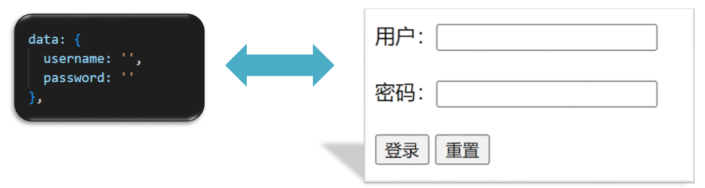

```js
<body>
  <div id="app">
    账户：<input v-model="username" type="text"> <br><br>
    密码：<input v-model="passworld" type="password"> <br><br>
    <button @click="login">登录</button>
    <button @click="reset">重置</button>
  </div>
  <script src="./vue.js"></script>
  <script>
    const app = new Vue({
      el: '#app',
      data: {
        username: '',
        passworld: ''

      },
      methods: {
        login() {
          console.log(this.username, this.passworld);
        },
        reset() {
          this.username = ''
          this.passworld = ''
        }
      }
    })
  </script>
</body>
```

---

## day02

### 一、今日学习目标

#### 1.指令补充

1. 指令修饰符
2. v-bind对样式增强的操作
3. v-model应用于其他表单元素

#### 2.computed计算属性

1. 基础语法
2. 计算属性vs方法
3. 计算属性的完整写法
4. 成绩案例

#### 3.watch侦听器

1. 基础写法
2. 完整写法

#### 4.综合案例 （演示）

1. 渲染 / 删除 / 修改数量 / 全选 / 反选 / 统计总价 / 持久化

---

### 二、指令修饰符

#### 1.什么是指令修饰符？

​ 所谓指令修饰符就是通过“.”指明一些指令**后缀**
不同的**后缀**封装了不同的处理操作 —> 简化代码

#### 2.按键修饰符@keyup.enter

- @keyup.enter —>当点击enter键的时候才触发
- 类似于事件监听event,获得e

代码演示：

```js
<body>
  <div id="app">
    <h3>@keyup.enter → 监听键盘回车事件</h3>
    <input @keyup="fn" v-model="username" type="text">
  </div>
  <script src="./vue.js"></script>
  <script>
    const app = new Vue({
      el: '#app',
      data: {
        username: ''
      },
      methods: {
        fn(e) {
          // console.log(e);
          if (e.key == "Enter") {
            console.log("键盘回车的时候触发", this.username);
          }
        }
      }
    })
  </script>
</body>
```

#### 3.v-model修饰符

- v-model.lazy ->事件改变的时候触发
- v-model.trim —>去除首位空格
- v-model.number —>转数字

#### 4.事件修饰符

- @事件名.stop —> 阻止冒泡
- @事件名.prevent —>阻止默认行为
- @事件名.stop.prevent —>可以连用 即阻止事件冒泡也阻止默认行为

```html
  <style>
    .father {
      width: 200px;
      height: 200px;
      background-color: pink;
      margin-top: 20px;
    }

    .son {
      width: 100px;
      height: 100px;
      background-color: skyblue;
    }
  </style>
</head>

<body>
  <div id="app">
    <h3>v-model修饰符 .trim .number</h3>
    姓名：<input @keyup.enter="fn('user')" v-model.trim="username" type="text"><br>
    年纪：<input @keyup.enter="fn('age')" v-model.number="age" type="text"><br>
    性别：<input @keyup.enter="fn('gender')" v-model.lazy="gender" type="text"><br>


    <h3>@事件名.stop → 阻止冒泡</h3>
    <div @click="fatherFn" class="father">
    <div @click.stop="sonFn" class="son">儿子</div>
    </div>

    <h3>@事件名.prevent → 阻止默认行为</h3>
    <a @click.prevent href="http://www.baidu.com">阻止默认行为</a>
  </div>
  <script src="./vue.js"></script>
  <script>
    const app = new Vue({
      el: '#app',
      data: {
        username: '',
        age: '',
        gender: ''
      },
      methods: {
        fatherFn() {
          alert('老父亲被点击了')
        },
        sonFn() {
          alert('儿子被点击了')
        },
        fn(a) {
          if (a === 'user') {
            console.log(this.username);
          } else if (a === 'age') {
            console.log(this.age);
          } else if (a === "gender") {
            console.log(this.gender);
          }
        }
      }
    })
  </script>
</body>
```

---

### 三、v-bind对样式控制的增强-操作class

为了方便开发者进行样式控制， Vue 扩展了 v-bind 的语法，可以针对 **class 类名**
和 **style 行内样式** 进行控制 。

#### 1.语法

```html
<div>:class = "对象/数组">这是一个div</div>
```

#### 2.对象语法

当class动态绑定的是**对象**时，**键就是类名，值就是布尔值**，如果值是**true**，就有这个类，否则没有这个类

```html
<div class="box" :class="{ 类名1: 布尔值, 类名2: 布尔值 }"></div>
```

​适用场景：一个类名，来回切换

#### 3.数组语法

当class动态绑定的是**数组**时 → 数组中所有的类，都会添加到盒子上，本质就是一个 class 列表

```html
<div class="box" :class="[ 类名1, 类名2, 类名3 ]"></div>
```

使用场景:批量添加或删除类

#### 4.代码练习

```html
  <style>
    .box {
      width: 200px;
      height: 200px;
      border: 3px solid #000;
      font-size: 30px;
      margin-top: 10px;
    }

    .pink {
      background-color: pink;
    }

    .big {
      width: 300px;
      height: 300px;
    }
  </style>
</head>

<body>

  <div id="app">
    <div :class="{'pink':true,'box':true,'big':true}">黑马程序员</div>
    <div :class="["pink","big"]">黑马程序员</div>
  </div>
  <script src="./vue.js"></script>
  <script>
    const app = new Vue({
      el: '#app',
      data: {

      }
    })
  </script>
</body>
```

---

### 四、京东秒杀-tab栏切换导航高亮

#### 1.需求

​ 当我们点击哪个tab页签时，哪个tab页签就高亮

#### 2.准备代码

```html
  <style>
    * {
      margin: 0;
      padding: 0;
    }

    ul {
      display: flex;
      border-bottom: 2px solid #e01222;
      padding: 0 10px;
    }

    li {
      width: 100px;
      height: 50px;
      line-height: 50px;
      list-style: none;
      text-align: center;
    }

    li a {
      display: block;
      text-decoration: none;
      font-weight: bold;
      color: #333333;
    }

    li a.active {
      background-color: #e01222;
      color: #fff;
    }
  </style>
</head>

<body>

  <div id="app">
    <ul>
      <li v-for="(item,index) in list" :key="item.id" @click="activeIndex=index">
        <a :class="{active: index===activeIndex }" href="#">{{item.name}}</a>
      </li>

    </ul>
  </div>
  <script src="./vue.js"></script>
  <script>
    const app = new Vue({
      el: '#app',
      data: {

        activeIndex: 0, //记录高亮

        list: [
          { id: 1, name: '京东秒杀' },
          { id: 2, name: '每日特价' },
          { id: 3, name: '品类秒杀' }
        ]

      }
    })
  </script>
</body>
```

#### 3.思路

1.基于数据，动态渲染tab（v-for）

2.准备一个下标 记录高亮的是哪一个 tab

3.基于下标动态切换class的类名

---

### 五、v-bind对有样式控制的增强-操作style

#### 1.语法

```html
<div
  class="box"
  :style="{ CSS属性名1: CSS属性值, CSS属性名2: CSS属性值 }"
></div>
```

#### 2.代码练习

```html
  <style>
    .box {
      width: 200px;
      height: 200px;
      background-color: rgb(187, 150, 156);
    }
  </style>
</head>

<body>
  <div id="app">
    <div class="box" :style="{width:'400px','background-color':'green'}"></div>
  </div>
  <script src="./vue.js"></script>
  <script>
    const app = new Vue({
      el: '#app',
      data: {

      }
    })
  </script>
</body>
```

#### 3.进度条案例

```html
  <style>
    .progress {
      height: 25px;
      width: 400px;
      border-radius: 15px;
      background-color: #272425;
      border: 3px solid #272425;
      box-sizing: border-box;
      margin-bottom: 30px;
    }

    .inner {
      width: 50%;
      height: 20px;
      border-radius: 10px;
      text-align: right;
      position: relative;
      background-color: #409eff;
      background-size: 20px 20px;
      box-sizing: border-box;
      transition: all 1s;
    }

    .inner span {
      position: absolute;
      right: -20px;
      bottom: -25px;
    }
  </style>
</head>

<body>
  <div id="app">
    <!-- 外层盒子--黑色 -->
    <div class="progress">

      <!-- 内层盒子--蓝色 -->
      <div class="inner" :style="{width:percent+'%'}">
        <span>{{percent}}%</span>
      </div>
    </div>
    <button @click="percent=25">设置25%</button>
    <button @click="percent=50">设置50%</button>
    <button @click="percent=75">设置75%</button>
    <button @click="percent=100">设置100%</button>
  </div>
  <script src="./vue.js"></script>
  <script>
    const app = new Vue({
      el: '#app',
      data: {
        percent: 20
      }
    })
  </script>
</body>
```

---

### 六、v-model在其他表单元素的使用

#### 1.讲解内容

常见的表单元素都可以用 v-model 绑定关联 → 快速 **获取** 或 **设置** 表单元素的值

它会根据 **控件类型** 自动选取 **正确的方法** 来更新元素

```js
输入框  input:text   ——> value
文本域  textarea  ——> value
复选框  input:checkbox  ——> checked
单选框  input:radio   ——> checked
下拉菜单 select    ——> value
...
```

#### 2.代码准备

```html
  <style>
    textarea {
      display: block;
      width: 240px;
      height: 100px;
      margin: 10px 0;
    }
  </style>
</head>

<body>

  <div id="app">
    <h3>小黑学习网</h3>

    姓名：
    <input type="text" v-model="userName">
    <br><br>

    是否单身：
    <input type="checkbox" v-model="isSingle">
    <br><br>

    <!--
      前置理解：
        1. name:  给单选框加上 name 属性 可以分组 → 同一组互相会互斥
        2. value: 给单选框加上 value 属性，用于提交给后台的数据
      结合 Vue 使用 → v-model
    -->
    性别:
    <input v-model="gender" type="radio" name="gender" value="1">男
    <input v-model="gender" type="radio" name="gender" value="2">女
    <br><br>

    <!--
      前置理解：
        1. option 需要设置 value 值，提交给后台
        2. select 的 value 值，关联了选中的 option 的 value 值
      结合 Vue 使用 → v-model
    -->
    所在城市:
    <select v-model="cityId">
      <option value="101">北京</option>
      <option value="102">上海</option>
      <option value="103">成都</option>
      <option value="104">南京</option>
    </select>
    <br><br>

    自我描述：
    <textarea v-model="desc"></textarea>

    <button @click="fn">立即注册</button>
  </div>
  <script src="./vue.js"></script>
  <script>
    const app = new Vue({
      el: '#app',
      data: {
        userName: '',
        isSingle: false,
        gender: '2',
        cityId: '103',
        desc: ''
      },

      methods: {
        fn() {
          console.log(app.userName, app.isSingle, app.gender, app.cityId, app.desc);
        }
      }
    })
  </script>
</body>
```

---

### 七、computed计算属性

#### 1.概念

基于**现有的数据**，计算出来的**新属性**。
**依赖**的数据变化，**自动**重新计算。

#### 2.computed语法

1. 声明在 **computed 配置项**中，一个计算属性对应一个函数
2. 使用起来和普通属性一样使用

   ```html
   <p>{{ 计算属性名}}</p>
   ```

#### 3.注意

1. computed配置项和data配置项是**同级**的
2. computed中的计算属性**虽然是函数的写法**，但他**依然是个属性**
3. computed中的计算属性**不能**和data中的属性**同名**
4. 使用computed中的计算属性和使用data中的属性是一样的用法
5. computed中计算属性内部的**this**依然**指向的是Vue实例**

#### 4.案例

比如我们可以使用计算属性实现下面这个业务场景


#### 5.代码准备

```html
  <style>
    table {
      border: 1px solid #000;
      text-align: center;
      width: 240px;
    }
    th,
    td {
      border: 1px solid #000;
    }
    h3 {
      position: relative;
    }
  </style>
</head>

<body>

  <div id="app">
    <h3>小黑的礼物清单</h3>
    <table>
      <tr>
        <th>名字</th>
        <th>数量</th>
      </tr>
      <tr v-for="(item, index) in list" :key="item.id">
        <td>{{ item.name }}</td>
        <td>{{ item.num }}个</td>
      </tr>
    </table>

    <!-- 目标：统计求和，求得礼物总数 -->
    <p>礼物总数：{{totalCount}} 个</p>
  </div>
  <script src="./vue.js"></script>
  <script>
    const app = new Vue({
      el: '#app',
      data: {
        // 现有的数据

        list: [
          { id: 1, name: '篮球', num: 2 },
          { id: 2, name: '玩具', num: 2 },
          { id: 3, name: '铅笔', num: 5 },
        ]
      },
      computed: {
        totalCount() {
          //console.log(this.list);
          return this.list.reduce((sum, item) => {
            return sum + item.num
          }, 0)

        }
      }
    })
  </script>
</body>
```

### 八、`computed`计算属性 VS `methods`方法

#### 1.`computed`计算属性

作用：封装了一段对于**数据**的处理，求得一个**结果**

语法：

1. 写在`computed`配置项中
2. 作为属性，直接使用
   - js中使用计算属性： this.计算属性
   - 模板中使用计算属性:

   ```html
   <p>{{计算属性}}</p>
   ```

#### 2.methods计算属性

作用：给Vue实例提供一个**方法**，调用以**处理业务逻辑**。

语法：

1. 写在methods配置项中
2. 作为方法调用
   - js中调用：`this.方法名()`
   - 模板中调用

   ```html
   <p>{{方法名()}}</p>
   ```

   - 或者`@事件名=“方法名”`

#### 3.计算属性computed的优势

1. 缓存特性（提升性能）

   计算属性会对计算出来的结果缓存，再次使用直接读取缓存，

   依赖项变化了，会自动重新计算 → 并再次缓存

2. methods没有缓存特性

#### 4.总结

1.computed**有缓存特性**，methods**没有缓存**

2.当一个结果依赖其他多个值时，推荐使用计算属性

3.当处理业务逻辑时，推荐使用methods方法，比如事件的处理函数

---

### 九、计算属性的完整写法

**既然计算属性也是属性，能访问，应该也能修改了？**

1. 计算属性默认的简写，只能读取访问，不能 "修改"
2. 如果要 "修改" → 需要写计算属性的完整写法


完整写法代码演示

```html
<body>
  <div id="app">
    姓：
    <input type="text" v-model="firstName" />
    + 名：
    <input type="text" v-model="lastName" />
    =
    <span>{{fullName}}</span>
    <br />
    <br />

    <input type="text" placeholder="要改的名字" v-model="changeName" />
    <button @click="chanName">改名卡</button>
  </div>
  <script src="https://cdn.jsdelivr.net/npm/vue@2/dist/vue.js"></script>
  <script>
    const app = new Vue({
      el: '#app',
      data: {
        firstName: '刘',
        lastName: '备',
        changeName: ''
      },
      computed: {
        //简写 → 获取,没有配置设置的逻辑
        // fullName(){
        //     return this.firstName+this.lastName
        // }

        //完整写法 → 获取 + 设置
        fullName: {
          //当fullName计算属性,被获取求值时,执行get(有缓存,先读缓存)
          //会将返回值作为求值的结果
          get() {
            return this.firstName + this.lastName
          },
          set(value) {
            console.log(value)
            this.firstName = value.slice(0, 1)
            this.lastName = value.slice(1)
          }
        }
      },
      methods: {
        chanName() {
          this.fullName = this.changeName
        }
      }
    })
  </script>
</body>
```

---

### 十、综合案例-成绩案例

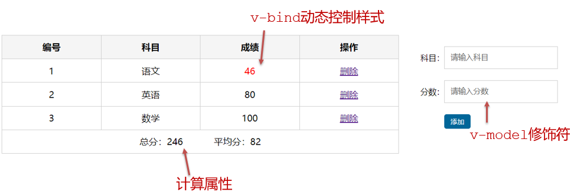

功能描述：

1.渲染功能

2.删除功能

3.添加功能

4.统计总分，求平均分

思路分析：

1.渲染功能 v-for :key v-bind:动态绑定class的样式

2.删除功能 v-on绑定事件， 阻止a标签的默认行为

3.v-model的修饰符 .trim、 .number、 判断数据是否为空后 再添加、添加后清空文本框的数据

4.使用计算属性computed 计算总分和平均分的值,获取小数，用parseFloat().toFixed(2)

---

### 十一、watch侦听器（监视器）

#### 1.作用

​ **监视数据变化**，执行一些业务逻辑或异步操作

#### 2.watch语法

1. watch同样声明在跟data同级的配置项中

2. 简单写法： 简单类型数据直接监视

3. 完整写法：添加额外配置项

   ```js
   data: {
     words: '苹果',
     obj: {
       words: '苹果'
     }
   },

   watch: {
     // 该方法会在数据变化时，触发执行
     数据属性名 (newValue, oldValue) {
       一些业务逻辑 或 异步操作。
     },
     '对象.属性名' (newValue, oldValue) {
       一些业务逻辑 或 异步操作。
     }
   }
   ```

   ```js
    watch: {
      // 监听words属性的变化
      words(newvalue, oldvalue) {
        console.log('变化了',newvalue,"=>",oldvalue);
      },
    },

    'obj.words'(newvalue, oldvalue) {
      console.log('变化了',newvalue,"=>",oldvalue);
    },

   ```

### 十二、翻译案例-代码实现

```html
<script>
  // 接口地址：https://applet-base-api-t.itheima.net/api/translate
  // 请求方式：get
  // 请求参数：
  // （1）words：需要被翻译的文本（必传）
  // （2）lang： 需要被翻译成的语言（可选）默认值-意大利
  // -----------------------------------------------

  const app = new Vue({
    el: '#app',
    data: {
      //words: ''
      obj: {
        words: ''
      },
      result: '' // 翻译结果
      // timer: null // 延时器id
    },
    // 具体讲解：(1) watch语法 (2) 具体业务实现
    watch: {
      // 该方法会在数据变化时调用执行
      // newValue新值, oldValue老值（一般不用）
      // words (newValue) {
      //   console.log('变化了', newValue)
      // }

      'obj.words'(newValue) {
        // console.log('变化了', newValue)
        // 防抖: 延迟执行 → 干啥事先等一等，延迟一会，一段时间内没有再次触发，才执行
        clearTimeout(this.timer)
        this.timer = setTimeout(async () => {
          const res = await axios({
            url: 'https://applet-base-api-t.itheima.net/api/translate',
            params: {
              words: newValue
            }
          })
          this.result = res.data.data
          console.log(res.data.data)
        }, 300)
      }
    }
  })
</script>
```

---

### 十三、watch侦听器

#### 1.watch完整语法

完整写法 —>添加额外的配置项

1. deep:true 对复杂类型进行深度监听
2. immdiate:true 初始化 立刻执行一次

```js
data: {
  obj: {
    words: '苹果',
    lang: 'italy'
  },
},

watch: {// watch 完整写法
  对象: {
    deep: true, // 深度监视
    immdiate:true,//立即执行handler函数
    handler (newValue) {
      console.log(newValue)
    }
  }
}

```

#### 2.需求

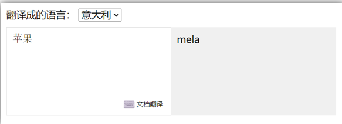

- 当文本框输入的时候 右侧翻译内容要时时变化
- 当下拉框中的语言发生变化的时候 右侧翻译的内容依然要时时变化
- 如果文本框中有默认值的话要立即翻译

#### 3.代码实现

```html
<script>
  const app = new Vue({
    el: '#app',
    data: {
      obj: {
        words: '苹果',
        lang: 'italy'
      },
      timer: null, //延时器的id,防抖定时器（移出obj，避免触发obj监听）
      result: '' //翻译结果
    },
    // 具体讲解：(1) watch语法 (2) 具体业务实现
    watch: {
      // 监听words属性的变化
      obj: {
        deep: true, //深度监听,对对象里面的事件进行监听
        immediate: true, //立即执行
        handler(newvalue, oldvalue) {
          console.log('对象被修改', newvalue)
          this.timer && clearTimeout(this.timer)
          this.timer = setTimeout(async () => {
            const res = await axios({
              url: 'https://applet-base-api-t.itheima.net/api/translate',
              method: 'get',
              params: {
                words: newvalue.words,
                lang: newvalue.lang
              }
            })
            console.log(res)
            this.result = res.data.data
          }, 500)
        }
      }
    }
  })
</script>
```

#### 4.watch总结

watch侦听器的写法有几种？

1.简单写法

```js
watch: {
  数据属性名 (newValue, oldValue) {
    一些业务逻辑 或 异步操作。
  },
  '对象.属性名' (newValue, oldValue) {
    一些业务逻辑 或 异步操作。
  }
}
```

2.完整写法(要注意那些不能放入监听中,比如定时器名,结果)

```js
watch: {// watch 完整写法
  数据属性名: {
    deep: true, // 深度监视(针对复杂类型)
    immediate: true, // 是否立刻执行一次handler
    handler (newValue) {
      console.log(newValue)
    }
  }
}
```

---

### 十四、综合案例

购物车案例

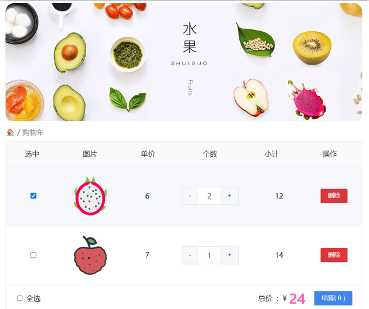

需求说明：

1. 渲染功能
2. 删除功能
3. 修改个数
4. 全选反选
5. 统计 选中的 总价 和 总数量
6. 持久化到本地

实现思路：

1.基本渲染： v-for遍历、:class动态绑定样式

2.删除功能 ： v-on 绑定事件，获取当前行的id

3.修改个数 ： v-on绑定事件，获取当前行的id，进行筛选出对应的项然后增加或减少

4.全选反选

1. 必须所有的小选框都选中，全选按钮才选中 → every
2. 如果全选按钮选中，则所有小选框都选中
3. 如果全选取消，则所有小选框都取消选中

声明计算属性，判断数组中的每一个checked属性的值，看是否需要全部选

5.统计 选中的 总价 和 总数量 ：通过计算属性来计算**选中的**总价和总数量

6.持久化到本地： 在数据变化时都要更新下本地存储 watch

---

## day03

### 一、今日目标

#### 1.生命周期

1. 生命周期介绍
2. 生命周期的四个阶段
3. 生命周期钩子
4. 声明周期案例

#### 2.综合案例-小黑记账清单

1. 列表渲染
2. 添加/删除
3. 饼图渲染

#### 3.工程化开发入门

1. 工程化开发和脚手架
2. 项目运行流程
3. 组件化
4. 组件注册

#### 4.综合案例-小兔仙首页

1. 拆分模块-局部注册
2. 结构样式完善
3. 拆分组件 – 全局注册

---

### 二、Vue生命周期

思考：什么时候可以发送初始化渲染请求？（越早越好）什么时候可以开始操作dom？（至少dom得渲染出来）

Vue生命周期：就是一个Vue实例从创建 到 销毁 的整个过程。

生命周期四个阶段：① 创建 ② 挂载 ③ 更新 ④ 销毁

1.创建阶段：创建响应式数据 => 发送初始化渲染请求

2.挂载阶段：渲染模板 => 操作dom

3.更新阶段：修改数据，更新视图

4.销毁阶段：销毁Vue实例

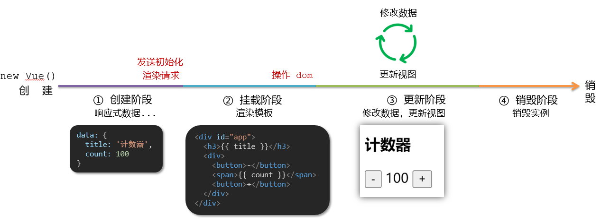

---

### 三、Vue生命周期钩子

Vue生命周期过程中，会**自动运行一些函数**，被称为【**生命周期钩子**】→ 让开发者可以在【**特定阶段**】运行**自己的代码**

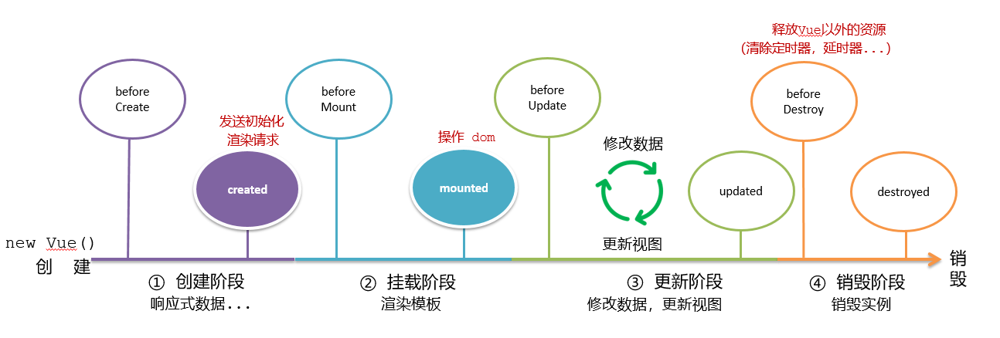

```html
<body>
  <div id="app">
    <h3>{{ title }}</h3>
    <div>
      <button @click="count--">-</button>
      <span>{{ count }}</span>
      <button @click="count++">+</button>
    </div>
  </div>
  <script src="./vue.js"></script>
  <script>
    const app = new Vue({
      el: '#app',
      data: {
        count: 100,
        title: '计数器'
      },

      //1.创建阶段
      beforeCreate() {
        console.log(
          'beforeCreat 响应式数据未初始化,el和数据对象还未初始化',
          this.count
        )
        //undefined
      },
      created() {
        console.log('created 响应式数据已初始化,el还未初始化', this.count)
        //100
        //this.数据名=请求回来的数据
        //可以开始发送初始化的渲染请求
      },

      //2.挂载阶段(渲染模板)
      beforeMount() {
        console.log(
          'beforeMount el还未初始化,模板还未编译',
          document.querySelector('h3').innerHTML
        )
        //{{ title }}
      },
      mounted() {
        console.log(
          'mounted el已初始化,模板已编译',
          document.querySelector('h3').innerHTML
        )
        //计数器
        //可以操作dom了
      },

      //3.更新阶段(修改数据 → 更新视图)
      beforeUpdate() {
        console.log(
          'beforeUpdate 数据更新前,模板还未更新',
          document.querySelector('span').innerHTML
        )
        //100
      },
      updated() {
        console.log(
          'updated 数据更新后,模板已更新',
          document.querySelector('span').innerHTML
        )
        //101
      },

      //app.$destroy()销毁实例,在页面尝试
      //4.销毁阶段
      beforeDestroy() {
        console.log('beforeDestroy 实例销毁前,实例仍然完全可用', this.count)
        //101
      },
      destroyed() {
        console.log(
          'destroyed 实例销毁后,所有的事件监听器会被移除,所有的子实例也会被销毁',
          this.count
        )
        //101
      }
    })
  </script>
</body>
```

---

### 四、生命周期钩子小案例

#### 1.在created中发送数据

```html
  <style>
    * {
      margin: 0;
      padding: 0;
      list-style: none;
    }
    .news {
      display: flex;
      height: 120px;
      width: 600px;
      margin: 0 auto;
      padding: 20px 0;
      cursor: pointer;
    }
    .news .left {
      flex: 1;
      display: flex;
      flex-direction: column;
      justify-content: space-between;
      padding-right: 10px;
    }
    .news .left .title {
      font-size: 20px;
    }
    .news .left .info {
      color: #999999;
    }
    .news .left .info span {
      margin-right: 20px;
    }
    .news .right {
      width: 160px;
      height: 120px;
    }
    .news .right img {
      width: 100%;
      height: 100%;
      object-fit: cover;
    }
  </style>
</head>
<body>

  <div id="app">
    <ul>
      <li class="news" v-for="(item,index) in list" :key="item.id" >
        <div class="left">
          <div class="title">{{item.title}}</div>
          <div class="info">
            <span>{{item.source}}</span>
            <span>{{item.time}}</span>
          </div>
        </div>
        <div class="right">
          
        </div>
      </li>

    </ul>
  </div>
  <script src="./vue.js"></script>
  <script src="./axios.js"></script>
  <script>
    // 接口地址：http://hmajax.itheima.net/api/news
    // 请求方式：get
    const app = new Vue({
      el: '#app',
      data: {
        list:[]

      },
      async created() {
        const res = await axios.get('http://hmajax.itheima.net/api/news')
        console.log(res.data.data);
        this.list = res.data.data
      },

    })
  </script>
</body>
```

#### 2.在mounted中获取焦点

```html
<body>
  <div class="container" id="app">
    <div class="search-container">
      
      <div class="search-box">
        <input type="text" v-model="words" id="inp" />
        <button>搜索一下</button>
      </div>
    </div>
  </div>

  <script src="./vue.js"></script>
  <script>
    const app = new Vue({
      el: '#app',
      data: {
        words: ''
      },

      //一进页面就获取焦点,在mounted中
      mounted() {
        document.querySelector('#inp').focus()
      }
    })
  </script>
</body>
```

### 五、案例-小黑记账清单

#### 1.需求图示

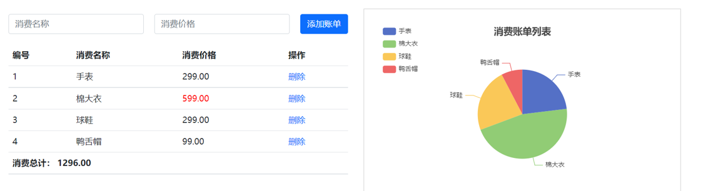

#### 2.需求分析

1.基本渲染2.添加功能3.删除功能4.饼图渲染

#### 3.思路分析

1.基本渲染

- 立刻发送请求获取数据 created
- 拿到数据，存到data的响应式数据中
- 结合数据，进行渲染 v-for
- 消费统计 —> 计算属性

  2.添加功能

- 收集表单数据 v-model，使用指令修饰符处理数据
- 给添加按钮注册点击事件，对输入的内容做非空判断，发送请求
- 请求成功后，对文本框内容进行清空
- 重新渲染列表

  3.删除功能

- 注册点击事件，获取当前行的id
- 根据id发送删除请求
- 需要重新渲染

  4.饼图渲染

- 初始化一个饼图 echarts.init(dom) mounted钩子中渲染
- 根据数据试试更新饼图 echarts.setOptions({...})
- echarts <https://echarts.apache.org/zh/index.html>

#### 4.小黑记账总结

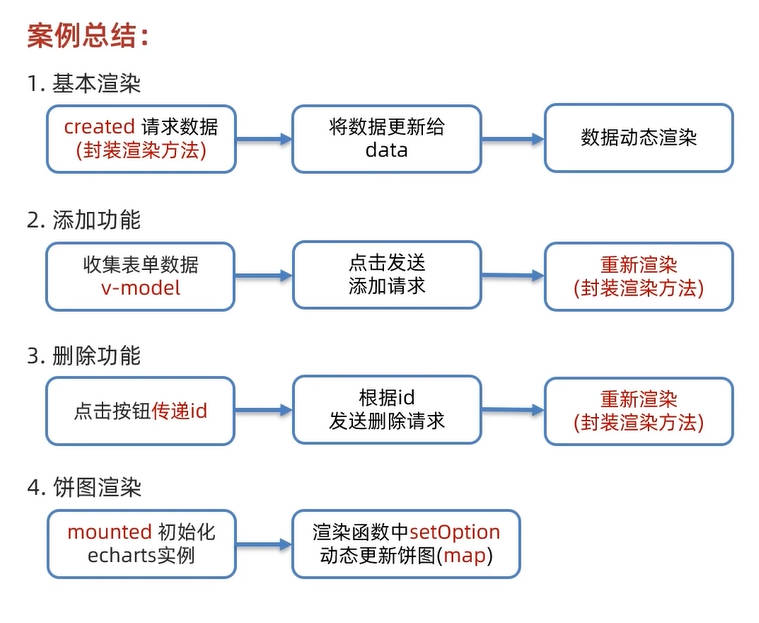

---

### 六、工程化开发和脚手架

#### 1.开发Vue的两种方式

- 核心包传统开发模式：基于html / css / js 文件，直接引入核心包，开发 Vue。
- **工程化开发模式：基于构建工具（例如：webpack）的环境中开发Vue。**


工程化开发模式优点：

提高编码效率，比如使用JS新语法、Less/Sass、Typescript等通过webpack都可以编译成浏览器识别的ES3/ES5/CSS等

工程化开发模式问题：

- webpack配置**不简单**
- **雷同**的基础配置
- 缺乏**统一的标准**

为了解决以上问题，所以我们需要一个工具，生成标准化的配置

#### 2.脚手架Vue CLI

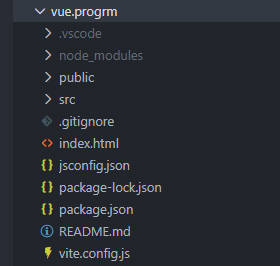

##### 基本介绍

Vue CLI 是Vue官方提供的一个**全局命令工具**

可以帮助我们**快速创建**一个开发Vue项目的**标准化基础架子**。【集成了webpack配置】

##### 好处

1. 开箱即用，零配置
2. 内置babel等工具
3. 标准化的webpack配置

##### 使用步骤

1. 全局安装（只需安装一次即可）
   `yarn global add @vue/cli 或者 npm i @vue/cli -g`
2. 查看vue/cli版本： `vue --version`
3. 创建项目架子：`vue create project-name`(项目名不能使用中文) 用`vue ui`新建项目，然后配置个自己的模板
4. 启动项目：`yarn serve` 或者 `npm run serve`(命令不固定，找package.json)

### 七、项目目录介绍和运行流程

#### 1.项目目录介绍


虽然脚手架中的文件有很多，目前咱们只需人事三个文件即可

1. main.js 入口文件
2. App.vue App根组件
3. index.html 模板文件
4. 根目录下.eslintrc.js文件(和.gitignore一个位置)
   - 这个就是代码校验的，强制校验,为何一个团队里的代码质量和风格统一,比如可以配置不能用箭头函数，那么你如果用了箭头函数，就会报错,你下次用vue
     ui新建项目，然后配置个自己的模板

   ```js
   module.exports = {
     root: true,
     env: {
       node: true
     },
     extends: ['plugin:vue/essential', 'eslint:recommended'],
     parserOptions: {
       parser: '@babel/eslint-parser',
       // 全局禁用 Babel 配置文件检查（彻底解决所有文件的该报错）
       requireConfigFile: false,
       sourceType: 'module'
     },
     // 关键：让 ESLint 忽略 babel.config.js，避免循环检查
     ignorePatterns: ['babel.config.js'],
     rules: {
       'no-console': process.env.NODE_ENV === 'production' ? 'warn' : 'off',
       'no-debugger': process.env.NODE_ENV === 'production' ? 'warn' : 'off'
     }
   }
   ```

#### 2.运行流程


---

### 八、组件化开发

组件化：一个页面可以拆分成一个个组件，每个组件有着自己独立的结构、样式、行为。

好处：便于维护，利于复用 → 提升开发效率。

组件分类：普通组件、根组件。

比如：下面这个页面，可以把所有的代码都写在一个页面中，但是这样显得代码比较混乱，难易维护。咱们可以按模块进行组件划分


---

### 九、根组件 App.vue

#### 1.根组件介绍

整个应用最上层的组件，包裹所有普通小组件


#### 2.组件是由三部分构成

- 语法高亮插件


- 三部分构成
  - template：结构 （有且只能一个根元素）
  - script: js逻辑
  - style： 样式 (可支持less，需要装包)

- 让组件支持less

  （1） style标签，lang="less" 开启less功能

  （2） 装包: yarn add less less-loader -D 或者npm i less less-loader
  -D（vue2要下载对应的版本）

  ```bash
  ## Vue2 专用：安装兼容版本的 less-loader
  npm install less@4.1.3 less-loader@7.3.0 --save-dev
  ```

```html
<template>
  <div class="app">
    <div class="box" @click="fn">我是盒子</div>
  </div>
</template>

<script>
  //import HelloWorld from './components/HelloWorld.vue'

  //导出的是当前组件的配置项
  //里面可以提供 data(特殊),methods,computed,watch,生命周期八大钩子
  export default {
    methods: {
      fn() {
        alert('你好')
      }
    }
  }
</script>

<style lang="less">
  /* 让style支持less
  1.给style加上lang="less"
  2.安装依赖包 less less-loader
    yarn add less less-loader -D (开发依赖)
 */
  .app {
    width: 400px;
    height: 400px;
    background-color: pink;
    .box {
      width: 200px;
      height: 200px;
      background-color: blue;
      color: #fff;
      text-align: center;
    }
  }
</style>
```

### 十、普通组件的注册使用-局部注册

1.特点 :只能在注册的组件内使用

2.步骤 - 创建.vue文件（三个组成部分）- 在使用的组件内先导入再注册，最后使用3.使用方式:当成html标签使用即可
`<组件名></组件名>` 4.组件名规范 —> 大驼峰命名法， 如 HmHeader 5.语法

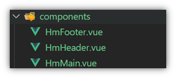

```js
// 导入需要注册的组件
import 组件对象 from '.vue文件路径'
import HmHeader from './components/HmHeader'

export default {
  // 局部注册
  components: {
    组件名: 组件对象,
    HmHeader: HmHeaer,
    HmHeader
  }
}
```

- 练习在App组件中，完成以下练习。在App.vue中使用组件的方式完成下面布局
  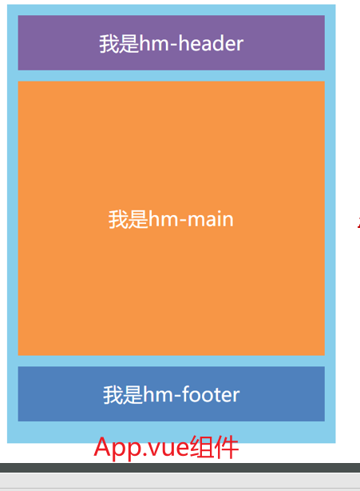

```html
<template>
  <div class="hm-header">我是hm-header</div>
</template>

<script></script>

<style>
  .hm-header {
    width: 100%;
    height: 100px;
    text-align: center;
    line-height: 100px;
    font-size: 30px;
    background-color: #8064a2;
    color: white;
    margin: 0 auto;
  }
</style>
```

---

### 十一、普通组件的注册使用-全局注册

1.特点 :全局注册的组件，在项目的**任何组件**中都能使用2.步骤 - 创建.vue组件（三个组成部分）-
**main.js**中进行全局注册3.使用方式:当成HTML标签直接使用

> <组件名></组件名> 4.注意

组件名规范 —> 大驼峰命名法， 如 HmHeader

5.语法: `Vue.component('组件名', 组件对象)`

例：在main.js中导入

```js
// 导入需要全局注册的组件
import HmButton from './components/HmButton'
Vue.component('HmButton', HmButton)
```

- 练习

在以下3个局部组件中是展示一个通用按钮

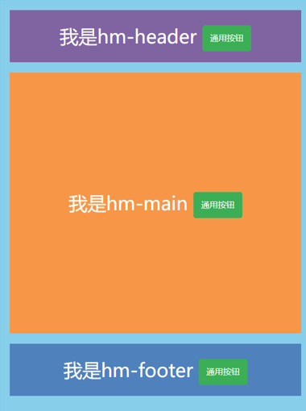

```html
<template>
  <button class="hm-button">通用按钮</button>
</template>

<script>
  export default {}
</script>

<style>
  .hm-button {
    height: 50px;
    line-height: 50px;
    padding: 0 20px;
    background-color: #3bae56;
    border-radius: 5px;
    color: white;
    border: none;
    vertical-align: middle;
    cursor: pointer;
  }
</style>
```

---

### 十二、综合案例

#### 1.小兔仙首页启动项目演示

#### 2.小兔仙组件拆分示意图

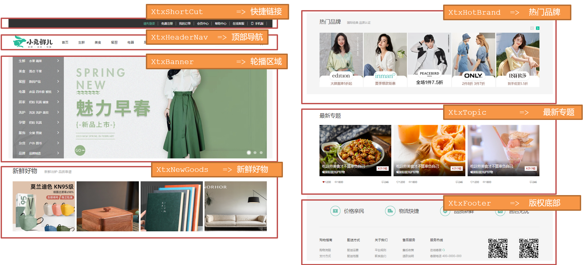

#### 3.开发思路

1. 分析页面，按模块拆分组件，搭架子 (局部或全局注册)

2. 根据设计图，编写组件 html 结构 css 样式 (已准备好)

3. 拆分封装通用小组件 (局部或全局注册)

   将来 → 通过 js 动态渲染，实现功能模块划分,一个一个小组件

   ```html
   <div class="bd">
     <ul>
       <BaseGoodsItem v-for="item in 4" :key="item"></BaseGoodsItem>
       <!-- <BaseGoodsItem></BaseGoodsItem>
      <BaseGoodsItem></BaseGoodsItem>
      <BaseGoodsItem></BaseGoodsItem> -->
     </ul>
   </div>
   ```

#### 快捷键

- 所有都折叠 ctrl k + ctrl 0
- 所有都展开 ctrl k + ctrl j

---

## day04

### 一、学习目标

#### 1.组件的三大组成部分（结构/样式/逻辑）

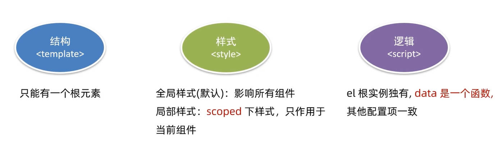

scoped解决样式冲突/data是一个函数

#### 2.组件通信

1. 组件通信语法
2. 父传子
3. 子传父
4. 非父子通信（扩展）

#### 3.综合案例：小黑记事本（组件版）

1. 拆分组件
2. 列表渲染
3. 数据添加
4. 数据删除
5. 列表统计
6. 清空
7. 持久化

#### 4.进阶语法

1. v-model原理
2. v-model应用于组件
3. sync修饰符
4. ref和$refs
5. $nextTick

---

### 二、scoped解决样式冲突

#### 1.默认情况

写在组件中的样式会 **全局生效** → 因此很容易造成多个组件之间的样式冲突问题。

1. **全局样式**: 默认组件中的样式会作用到全局，任何一个组件中都会受到此样式的影响
2. **局部样式**: 可以给组件加上**scoped** 属性,可以**让样式只作用于当前组件**

#### 2.代码演示

BaseOne.vue

```html
<template>
  <div class="base-one">BaseOne</div>
</template>

<script>
  export default {}
</script>
<style scoped></style>
```

BaseTwo.vue

```html
<template>
  <div class="base-one">BaseTwo</div>
</template>

<script>
  export default {}
</script>

<style scoped></style>
```

App.vue

```html
<template>
  <div id="app">
    <BaseOne></BaseOne>
    <BaseTwo></BaseTwo>
  </div>
</template>

<script>
  import BaseOne from './components/BaseOne'
  import BaseTwo from './components/BaseTwo'
  export default {
    name: 'App',
    components: {
      BaseOne,
      BaseTwo
    }
  }
</script>
```

#### 3.scoped原理

1. 当前组件内标签都被添加**data-v-hash值** 的属性
2. css选择器都被添加 [**data-v-hash值**] 的属性选择器

最终效果: **必须是当前组件的元素**, 才会有这个自定义属性, 才会被这个样式作用到

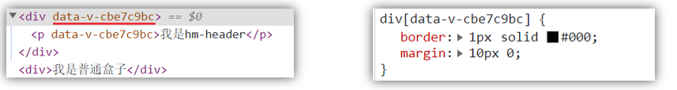

---

### 三、data必须是一个函数

#### 1、data为什么要写成函数

一个组件的 **data**
选项必须**是一个函数**。目的是为了：保证每个组件实例，维护**独立**的一份**数据**对象。

每次创建新的组件实例，都会新**执行一次data 函数**，得到一个新对象。


#### 2.data代码演示

BaseCount.vue

```html
<template>
  <div>
    <button @click="count--">-</button>
    <span>{{ count}}</span>
    <button @click="count++">+</button>
  </div>
</template>

<script>
  export default {
    // data必须是一个函数 => 保证每个组件实例,维护独立的一个数据对象
    data() {
      return {
        count: 999
      }
    }
  }
</script>

<style lang="scss" scoped></style>
```

App.vue

```html
<template>
  <div class="app">
    <BaseCount></BaseCount>
  </div>
</template>

<script>
  import BaseCount from './components/BaseCount'
  export default {
    components: {
      BaseCount
    }
  }
</script>

<style></style>
```

---

### 四、组件通信

#### 1.什么是组件通信？

组件通信，就是指**组件与组件**之间的**数据传递**

- 组件的数据是独立的，无法直接访问其他组件的数据。
- 想使用其他组件的数据，就需要组件通信

#### 2.组件之间如何通信

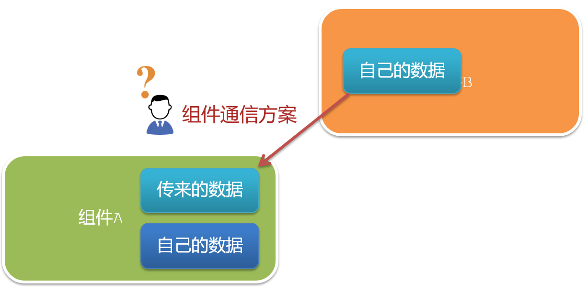

#### 3.组件关系分类

1. 父子关系
2. 非父子关系


#### 4.通信解决方案

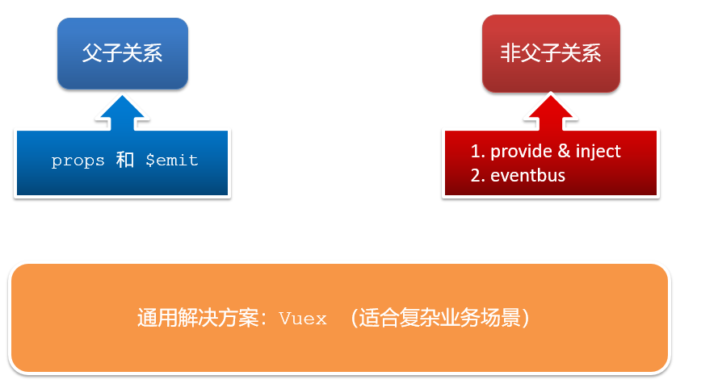

#### 5.父子通信流程

1. 父组件通过 **props** 将数据传递给子组件
2. 子组件利用 **$emit** 通知父组件修改更新


#### 6.父向子通信代码示例

父组件通过**props**将数据传递给子组件

父组件App.vue

```html
<template>
  <div class="app" style="border: 3px solid #000; margin: 10px">
    我是APP组件
    <Son></Son>
  </div>
</template>

<script>
  import Son from './components/Son.vue'
  export default {
    name: 'App',
    data() {
      return {
        myTitle: '学前端，就来黑马程序员'
      }
    },
    components: {
      Son
    }
  }
</script>

<style></style>
```

子组件Son.vue

```html
<template>
  <div style="border: 3px solid #000; margin: 10px">我是son组件{{title}}</div>
</template>

<script>
  export default {
    //通过props进行接收
    props: ['title']
  }
</script>

<style scoped></style>
```

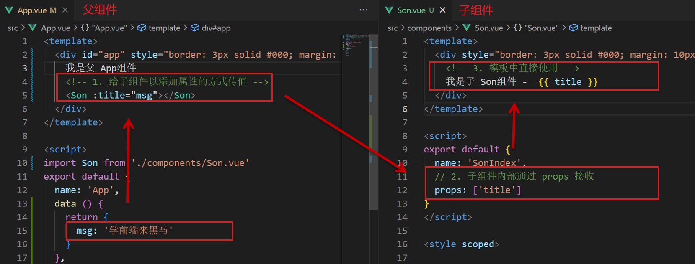

父向子传值步骤

1. 给子组件以添加属性的方式传值
2. 子组件内部通过props接收
3. 模板中直接使用 props接收的值

#### 7.子向父通信代码示例

子组件利用 **$emit** 通知父组件，进行修改更新

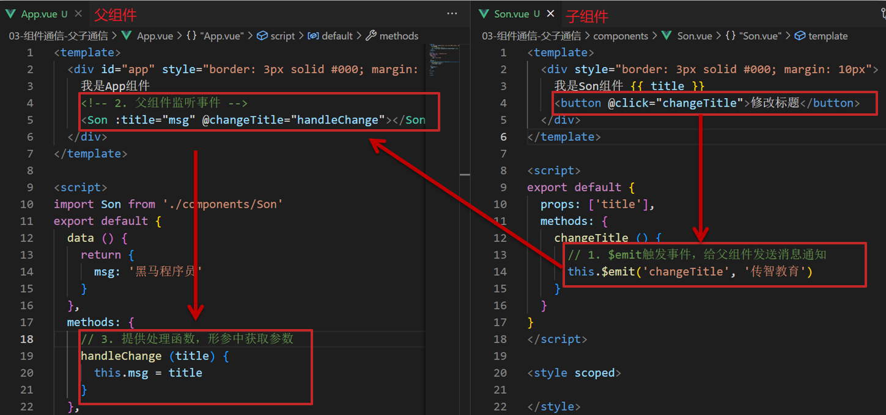

子向父传值步骤

1. $emit触发事件，给父组件发送消息通知
2. 父组件监听$emit触发的事件
3. 提供处理函数，在函数的性参中获取传过来的参数

---

### 五、什么是props

#### 1.Props 定义

组件上 注册的一些 自定义属性

#### 2.Props 作用

向子组件传递数据

#### 3.特点

1. 可以 传递 **任意数量** 的prop
2. 可以 传递 **任意类型** 的prop


#### 4.代码演示

父组件App.vue

```html
<template>
  <div class="app">
    <UserInfo
      :username="username"
      :age="age"
      :isSingle="isSingle"
      :car="car"
      :hobby="hobby"
    ></UserInfo>
  </div>
</template>

<script>
  import UserInfo from './components/UserInfo.vue'
  export default {
    data() {
      return {
        username: '小帅',
        age: 28,
        isSingle: true,
        car: {
          brand: '宝马'
        },
        hobby: ['篮球', '足球', '羽毛球']
      }
    },
    components: {
      UserInfo
    }
  }
</script>

<style></style>
```

子组件UserInfo.vue

```html
<template>
  <div class="userinfo">
    <h3>我是个人信息组件</h3>
    <div>姓名：{{ username }}</div>
    <div>年龄：{{ age }}</div>
    <div>是否单身：{{ isSingle?'是':'否' }}</div>
    <div>座驾：{{car.brand}}</div>
    <div>兴趣爱好：{{hobby.join('、')}}</div>
  </div>
</template>

<script>
  export default {
    props: ['username', 'age', 'isSingle', 'car', 'hobby']
  }
</script>

<style scoped>
  .userinfo {
    width: 300px;
    border: 3px solid #000;
    padding: 20px;
  }
  .userinfo > div {
    margin: 20px 10px;
  }
</style>
```

---

### 六、props校验

#### 1.思考

组件的props可以乱传吗

#### 2.作用

为组件的 prop 指定**验证要求**，不符合要求，控制台就会有**错误提示**
=> 帮助开发者，快速发现错误

#### 3.语法

- **类型校验**
- 非空校验
- 默认值
- 自定义校验

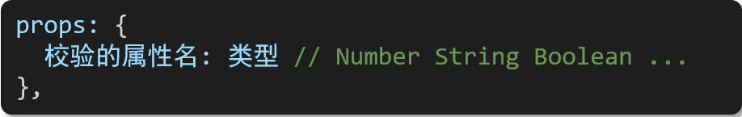

#### 4.props代码演示

App.vue

```html
<template>
  <div class="app">
    <BaseProgress :w="width"></BaseProgress>
  </div>
</template>

<script>
  import BaseProgress from './components/BaseProgress.vue'
  export default {
    data() {
      return {
        width: 30
      }
    },
    components: {
      BaseProgress
    }
  }
</script>

<style></style>
```

BaseProgress.vue

```html
<template>
  <div class="base-progress">
    <div class="inner" :style="{ width: w + '%' }">
      <span>{{ w }}%</span>
    </div>
  </div>
</template>

<script>
  export default {
    // props: ['w'],
    props: {
      // 传入的类型校验
      w: Number //Number,String,Boolean,Array,Object,Function
    }
  }
</script>

<style scoped>
  .base-progress {
    height: 26px;
    width: 400px;
    border-radius: 15px;
    background-color: #272425;
    border: 3px solid #272425;
    box-sizing: border-box;
    margin-bottom: 30px;
  }
  .inner {
    position: relative;
    background: #379bff;
    border-radius: 15px;
    height: 25px;
    box-sizing: border-box;
    left: -3px;
    top: -2px;
  }
  .inner span {
    position: absolute;
    right: 0;
    top: 26px;
  }
</style>
```

---

### 七、props校验完整写法

#### 1.props校验语法

```js
props: {
  校验的属性名: {
    type: 类型,  // Number String Boolean ...
    required: true, // 是否必填
    default: 默认值, // 默认值
    validator (value) {
      // 自定义校验逻辑
      return 是否通过校验
    }
  }
},
```

#### 2.代码实例

```html
<script>
  export default {
    // 完整写法（类型、默认值、非空、自定义校验）
    props: {
      w: {
        type: Number,
        //required: true,
        default: 0,
        validator(val) {
          // console.log(val)
          if (val >= 100 || val <= 0) {
            console.error('传入的范围必须是0-100之间')
            return false
          } else {
            return true
          }
        }
      }
    }
  }
</script>
```

#### 3.props注意

1.default和required一般不同时写（因为当时必填项时，肯定是有值的）2.default后面如果是简单类型的值，可以直接写默认。如果是复杂类型的值，则需要以函数的形式return一个默认值

---

### 八、props&data、单向数据流

#### 1.共同点

都可以给组件提供数据

#### 2.区别

- data 的数据是**自己**的 → 随便改
- prop 的数据是**外部**的 → 不能直接改，要遵循 **单向数据流**

#### 3.单向数据流

父级props 的数据更新，会向下流动，影响子组件。这个数据流动是单向的

#### 4.单选数据流代码演示

点击计数按钮,儿子的元素由父亲传过来,想要修改儿子的元素,就需要$emit传给父亲,由父亲修改

App.vue

```html
<template>
  <div id="app">
    <BaseCount :count="count" @changeCount="handleCount"></BaseCount>
  </div>
</template>

<script>
  import BaseCount from './components/BaseCount.vue'
  export default {
    name: 'App',
    components: {
      BaseCount
    },
    data() {
      return {
        count: 100
      }
    },
    methods: {
      //提供处理函数,提供逻辑
      handleCount(newCount) {
        console.log(newCount)
        this.count = newCount
      }
    }
  }
</script>

<style></style>
```

BaseCount.vue

```html
<template>
  <div>
    <button @click="handleSub">-</button>
    <span>{{ count}}</span>
    <button @click="handleAdd">+</button>
  </div>
</template>

<script>
  export default {
    // data必须是一个函数 => 保证每个组件实例,维护独立的一个数据对象
    // data(){
    //   return {
    //     count:999
    //   }
    // }

    //props传过来的数据(外部数据)
    //不能直接修改
    props: {
      count: Number
    },
    methods: {
      handleAdd() {
        //子传父.$emit,让父亲进行修改,谁的数据谁负责
        this.$emit('changeCount', this.count + 1)
      },
      handleSub() {
        this.$emit('changeCount', this.count - 1)
      }
    }
  }
</script>

<style lang="scss" scoped></style>
```


#### 5.口诀

==谁的数据谁负责==

### 九、综合案例-组件拆分

#### 1.需求说明

- 拆分基础组件
- 渲染待办任务
- 添加任务
- 删除任务
- 底部合计 和 清空功能
- 持久化存储

#### 2.拆分基础组件

咱们可以把小黑记事本原有的结构拆成三部分内容：头部（TodoHeader）、列表(TodoMain)、底部(TodoFooter)

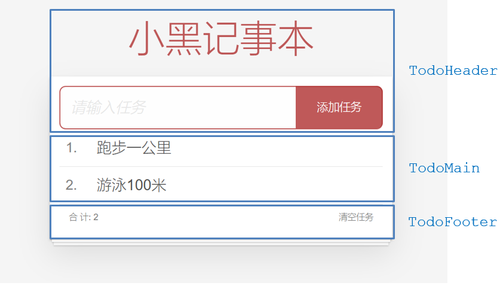

### 十、综合案例-列表渲染

思路分析：

1. 提供数据：提供在公共的父组件 App.vue
2. 通过父传子，将数据传递给TodoMain
3. 利用v-for进行渲染

### 十一、综合案例-添加功能

思路分析：

1. 收集表单数据 v-model
2. 监听时间 （回车+点击 都要进行添加）
3. 子传父，将任务名称传递给父组件App.vue
4. 父组件接受到数据后 进行添加 **unshift**(自己的数据自己负责)

### 十二、综合案例-删除功能

思路分析：

1. 监听时间（监听删除的点击）携带id
2. 子传父，将删除的id传递给父组件App.vue
3. 进行删除 **filter** (自己的数据自己负责)

### 十三、综合案例-底部功能及持久化存储

思路分析：

1. 底部合计：父组件传递list到底部组件 —>展示合计
2. 清空功能：监听事件 —> **子组件**通知父组件 —>父组件清空
3. 持久化存储：watch监听数据变化，持久化到本地

### 十四、非父子通信-event bus 事件总线

#### 1.event bus作用

非父子组件之间，进行简易消息传递。(==复杂场景→ Vuex==)

#### 2.步骤

1. 创建一个都能访问的事件总线 （空Vue实例）

   ```js
   import Vue from 'vue'
   const Bus = new Vue()
   export default Bus
   ```

2. A组件（接受方），监听Bus的 $on事件

   ```js
   created () {
     Bus.$on('sendMsg', (msg) => {
       this.msg = msg
     })
   }
   ```

3. B组件（发送方），触发Bus的$emit事件

   ```js
   Bus.$emit('sendMsg', '这是一个消息')
   ```

   

#### 3.代码示例

EventBus.js(这是是事件总线,可一发,多收)

```js
import Vue from 'vue'
const Bus = new Vue()
export default Bus
```

BaseA.vue(接受方)

```html
<template>
  <div class="base-a">
    我是A组件(接收方)
    <p>{{msg}}</p>
  </div>
</template>

<script>
  import Bus from '../utils/EventBus'
  export default {
    created() {
      //在A组件(接收方)中进行监听Bus的事件(订阅消息)
      Bus.$on('sendMsg', msg => {
        console.log(msg)
        this.msg = msg
      })
    },
    data() {
      return {
        msg: ''
      }
    }
  }
</script>

<style scoped>
  .base-a {
    width: 200px;
    height: 200px;
    border: 3px solid #000;
    border-radius: 3px;
    margin: 10px;
  }
  p {
    color: #0ff;
  }
</style>
```

BaseB.vue(发送方)

```html
<template>
  <div class="base-b">
    <div>我是B组件(发布方)</div>
    <button @click="clickSend">发送消息</button>
  </div>
</template>

<script>
  import Bus from '../utils/EventBus'
  export default {
    methods: {
      clickSend() {
        //B组件(发送方),触发事件的方式传递参数(发布消息)
        Bus.$emit('sendMsg', '这是一个消息')
      }
    }
  }
</script>

<style scoped>
  .base-b {
    width: 200px;
    height: 200px;
    border: 3px solid #000;
    border-radius: 3px;
    margin: 10px;
  }
</style>
```

App.vue

```html
<template>
  <div class="app">
    <BaseA></BaseA>
    <BaseB></BaseB>
  </div>
</template>

<script>
  import BaseA from './components/BaseA.vue'
  import BaseB from './components/BaseB.vue'
  export default {
    components: {
      BaseA,
      BaseB
    }
  }
</script>

<style></style>
```

---

### 十五、非父子通信-provide&inject

#### 1.provide&inject作用

跨层级共享数据,祖先给后代传递数据

#### 2.场景


#### 3.provide&inject语法

1. 父组件 provide提供数据

```js
export default {
  provide() {
    return {
      // 普通类型【非响应式-数据变,页面不改变】
      color: this.color,

      // 复杂类型【响应式-数据变,页面会改变】
      //userInfo: this.userInfo,
      userInfo: {
        name: 'zs',
        age: 18
      }
    }
  }
}
```

2.子/孙组件 inject获取数据

```js
export default {
  inject: ['color', 'userInfo'],
  created() {
    console.log(this.color, this.userInfo.name)
  }
}
```

#### 4.注意

- provide提供的简单类型的数据不是响应式的，复杂类型数据是响应式。（推荐提供复杂类型数据）
- 子/孙组件通过inject获取的数据，不能在自身组件内修改

---

### 十六、v-model原理

#### 1.v-model原理

v-model本质上是一个语法糖。例如: 应用在输入框上，就是value属性 和 input事件 的合写; 在复选框,就是checked属性 和 change事件的合写

```html
<template>
   
  <div id="app">
       
    <input v-model="msg" type="text" />

       
    <input :value="msg" @input="msg = $event.target.value" type="text" />
     
  </div>
</template>
```

#### 2.v-model作用

提供数据的双向绑定

- 数据变，视图跟着变 :value
- 视图变，数据跟着变 @input

#### 3.$event注意

**$event** 用于在模板中，获取事件的形参

#### 4.代码示例

```html
<template>
  <div>
    <div id="app">
      <input v-model="msg1" type="text" />
      <br />
      <input :value="msg2" @input="msg = $event.target.value" type="text" />
    </div>
  </div>
</template>

<script>
  export default {
    data() {
      return {
        msg1: '123',
        msg2: '456'
      }
    }
  }
</script>

<style lang="scss" scoped></style>
```

#### 5.v-model使用在其他表单元素上的原理

不同的表单元素， v-model在底层的处理机制是不一样的。比如给checkbox使用v-model

底层处理的是 checked属性和change事件。

==只需要掌握应用在文本框上的原理即可==

---

### 十七、表单类组件封装

#### 1.需求目标

实现子组件和父组件数据的双向绑定 （实现App.vue中的selectId和子组件选中的数据进行双向绑定）

#### 2.表单双向绑定代码演示

App.vue

```html
<template>
  <div class="app">
    <!-- 用$event 监听事件发生改变,获取最新的值 -->
    <BaseSelect :cityId="selectId" @changeId="selectId = $event"></BaseSelect>
  </div>
</template>

<script>
  import BaseSelect from './components/BaseSelect.vue'
  export default {
    data() {
      return {
        selectId: '102'
      }
    },
    components: {
      BaseSelect
    }
  }
</script>

<style></style>
```

BaseSelect.vue

```html
<template>
  <div>
    <select>
      <option value="101">北京</option>
      <option value="102">上海</option>
      <option value="103">武汉</option>
      <option value="104">广州</option>
      <option value="105">深圳</option>
    </select>
  </div>
</template>
<template>
  <div>
    <select :value="cityId" @change="handleSelect">
      <!-- 实现双向绑定,注意props数据,不能被子组件修改,所以不能使用v-model进行双向绑定,只能拆分成原本的value+change -->
      <option value="101">北京</option>
      <option value="102">上海</option>
      <option value="103">武汉</option>
      <option value="104">广州</option>
      <option value="105">深圳</option>
    </select>
  </div>
</template>

<script>
  export default {
    //获取来自父组件的数据
    props: {
      cityId: String
    },
    methods: {
      handleSelect(e) {
        console.log(e.target.value)

        // 将修改后的数据传递给父组件
        this.$emit('changeId', e.target.value)
      }
    }
  }
</script>

<style></style>
```

---

### 十八、v-model简化代码

#### 1.目标

父组件通过v-model **简化代码**，实现子组件和父组件数据 **双向绑定**

#### 2.如何简化

v-model其实就是 :value和@input事件的简写

- 子组件：props通过value接收数据，事件触发 input
- 父组件：v-model直接绑定数据(:value + @input)

#### 3.简化代码示例

子组件

```html
<template>
  <div>
    <!-- <select :value="cityId" @change="handleSelect"> -->

    <!-- 用v-model进行简化 -->
    <select :value="value" @change="handleSelect">
      <!-- 实现双向绑定,注意props数据,不能被子组件修改,所以不能使用v-model进行双向绑定,只能拆分成原本的value+change -->
      <option value="101">北京</option>
      <option value="102">上海</option>
      <option value="103">武汉</option>
      <option value="104">广州</option>
      <option value="105">深圳</option>
    </select>
  </div>
</template>

<script>
  export default {
    //获取来自父组件的数据
    props: {
      // cityId:String

      //用v-model进行简化
      value: String
    },
    methods: {
      handleSelect(e) {
        console.log(e.target.value)

        // 将修改后的数据传递给父组件
        // this.$emit('changeId',e.target.value)

        //用v-model进行简化
        this.$emit('input', e.target.value)
      }
    }
  }
</script>

<style></style>
```

父组件

```html
<template>
  <div class="app">
    <!-- 用$event 监听事件发生改变,获取最新的值 -->
    <!-- <BaseSelect :cityId="selectId" @changeId="selectId = $event"></BaseSelect> -->

    <!-- 用v-model进行简化 v-model的本质就是 :value + @input -->
    <BaseSelect v-model="selectId"></BaseSelect>
  </div>
</template>

<script>
  import BaseSelect from './components/BaseSelect.vue'
  export default {
    data() {
      return {
        selectId: '102'
      }
    },
    components: {
      BaseSelect
    }
  }
</script>

<style></style>
```

---

### 十九、.sync修饰符

#### 1.sync作用

可以实现 **子组件** 与 **父组件数据** 的 **双向绑定**，简化代码

简单理解：**子组件可以修改父组件传过来的props值**

#### 2.sync场景

封装弹框类的基础组件， visible属性 true显示 false隐藏

#### 3.本质

.sync修饰符 就是 **:属性名** 和 **@update:属性名** 合写

#### 4.语法

父组件

```html
//.sync写法
<BaseDialog :visible.sync="isShow" />
-------------------------------------- //完整写法
<BaseDialog :visible="isShow" @update:visible="isShow = $event" />
```

子组件

```js
props: {
  visible: Boolean
},

this.$emit('update:visible', false)
```

#### 5.代码示例

App.vue

```html
<template>
  <div class="app">
    <button class="logout" @click="openDialog">退出按钮</button>

    //利用.sync进行双向绑定
    <BaseDialog :visible.sync="isShow"></BaseDialog>
  </div>
</template>

<script>
  import BaseDialog from './components/BaseDialog.vue'
  export default {
    data() {
      return {
        isShow: false
      }
    },
    components: {
      BaseDialog
    }
  }
</script>

<style></style>
```

BaseDialog.vue

```html
<template>
  <div class="base-dialog-wrap" v-show="visible">
    <div class="base-dialog">
      <div class="title">
        <h3>温馨提示：</h3>
        <button class="close" @click="close">x</button>
      </div>
      <div class="content">
        <p>你确认要退出本系统么？</p>
      </div>
      <div class="footer">
        <button @click="close">确认</button>
        <button @click="close">取消</button>
      </div>
    </div>
  </div>
</template>

<script>
  export default {
    props: {
      visible: Boolean
    },
    methods: {
      //这里子组件进行双向绑定
      close() {
        this.$emit('update:visible', false)
      }
    }
  }
</script>

<style scoped>
  .base-dialog-wrap {
    width: 300px;
    height: 200px;
    box-shadow: 2px 2px 2px 2px #ccc;
    position: fixed;
    left: 50%;
    top: 50%;
    transform: translate(-50%, -50%);
    padding: 0 10px;
  }
  .base-dialog .title {
    display: flex;
    justify-content: space-between;
    align-items: center;
    border-bottom: 2px solid #000;
  }
  .base-dialog .content {
    margin-top: 38px;
  }
  .base-dialog .title .close {
    width: 20px;
    height: 20px;
    cursor: pointer;
    line-height: 10px;
  }
  .footer {
    display: flex;
    justify-content: flex-end;
    margin-top: 26px;
  }
  .footer button {
    width: 80px;
    height: 40px;
  }
  .footer button:nth-child(1) {
    margin-right: 10px;
    cursor: pointer;
  }
</style>
```

---

### 二十、ref和$refs

#### 1.ref和作用

利用ref 和 $refs 可以用于 获取 dom 元素 或 组件实例

#### 2.特点

查找范围 → 当前组件内(更精确稳定) 之前只用document.querySelect('.box') 获取的是整个页面中的盒子ref当前组件里面

#### 3.ref语法

1.给要获取的盒子添加ref属性

```html
<div ref="chartRef">我是渲染图表的容器</div>
```

2.获取时通过 $refs获取 this.\$refs.chartRef 获取

```js
mounted () {
  console.log(this.$refs.chartRef)
}
```

#### 5.ref代码示例

App.vue

```html
<template>
  <div class="app">
    <BaseChart></BaseChart>
  </div>
</template>

<script>
  import BaseChart from './components/BaseChart.vue'
  export default {
    components: {
      BaseChart
    }
  }
</script>

<style></style>
```

BaseChart.vue

```vue
<template>
  <div class="base-chart-box" ref="baseChartBox">子组件</div>
</template>

<script>
  //装包引入需要的echarts
  import * as echarts from 'echarts'

  export default {
    mounted() {
      // 基于准备好的dom，初始化echarts实例
      // document.querySelector 会查找项目中所有的元素
      // $refs只会在当前组件查找盒子
      // var myChart = echarts.init(document.querySelector('.base-chart-box'))
      const myChart = echarts.init(this.$refs.baseChartBox)
      // 绘制图表
      myChart.setOption({
        title: {
          text: 'ECharts 入门示例'
        },
        tooltip: {},
        xAxis: {
          data: ['衬衫', '羊毛衫', '雪纺衫', '裤子', '高跟鞋', '袜子']
        },
        yAxis: {},
        series: [
          {
            name: '销量',
            type: 'bar',
            data: [5, 20, 36, 10, 10, 20]
          }
        ]
      })
    }
  }
</script>

<style scoped>
  .base-chart-box {
    width: 400px;
    height: 300px;
    border: 3px solid #000;
    border-radius: 6px;
  }
</style>
```

#### 6.利用ref获取对应的表单数据

BaseForm.vue

```html
<template>
  <div class="app">
    <div>
      账号:
      <input v-model="username" type="text" />
    </div>
    <div>
      密码:
      <input v-model="password" type="text" />
    </div>
    <!-- <div>
      <button @click="getFormData">获取数据</button>
      <button @click="resetFormData">重置数据</button>
    </div> -->
  </div>
</template>

<script>
  export default {
    data() {
      return {
        username: 'admin',
        password: '123456'
      }
    },
    methods: {
      //这些方法在父级进行方法中调用使用
      //APP.vue
      // handelGet(){
      //   console.log(this.$refs.baseForm.getValue());

      // },
      // handelReset(){
      //   this.$refs.baseForm.resetValue()

      // }

      //方法一:收集表单数据,返回一个对象
      getValue() {
        //console.log('获取表单数据', this.username, this.password);
        return {
          account: this.account,
          passwprd: this.password
        }
      },

      //方法二,重置表单
      resetValue() {
        this.username = ''
        this.password = ''
        console.log('重置表单数据成功')
      }
    }
  }
</script>

<style scoped>
  .app {
    border: 2px solid #ccc;
    padding: 10px;
  }
  .app div {
    margin: 10px 0;
  }
  .app div button {
    margin-right: 8px;
  }
</style>
```

---

### 二十一、异步更新 & $nextTick

#### 1.$nextTick需求

编辑标题, 编辑框自动聚焦

1. 点击编辑，显示编辑框
2. 让编辑框，立刻获取焦点

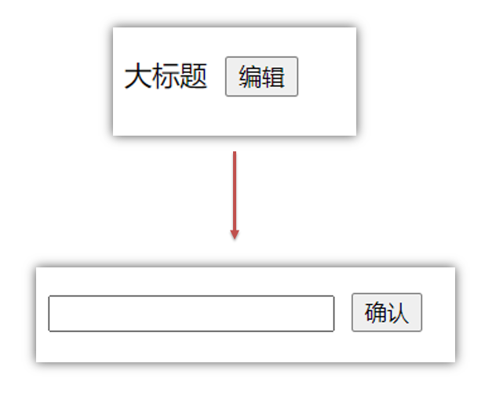

#### 2.代码实现

```html
<template>
  <div class="app">
    <div v-if="isShowEdit">
      <input type="text" v-model="editValue" ref="inp" />
      <button>确认</button>
    </div>

    <!-- 默认状态 -->
    <div v-else>
      <span>{{ title }}</span>
      <button @click="handleEdit">编辑</button>
    </div>
  </div>
</template>

<script>
  export default {
    data() {
      return {
        title: '大标题',
        isShowEdit: false,
        editValue: ''
      }
    },
    methods: {
      handleEdit() {
        // 显示输入框(异步dom)
        this.isShowEdit = true
        // 获取焦点（$nextTick等dom更新完,立刻执行准备的函数体）
        this.$nextTick(() => {
          this.$refs.inp.focus()
        })
      }
    }
  }
</script>
```

#### 3.问题

"显示之后"，立刻获取焦点是不能成功的！

原因：Vue 是异步更新DOM (提升性能)

#### 4.解决方案

$nextTick：**等 DOM更新后**,才会触发执行此方法里的函数体

**语法:** this.$nextTick(函数体)

```js
this.$nextTick(() => {
  this.$refs.inp.focus()
})
```

**注意：**$nextTick 内的函数体 一定是**箭头函数**，这样才能让函数内部的this指向Vue实例

---
