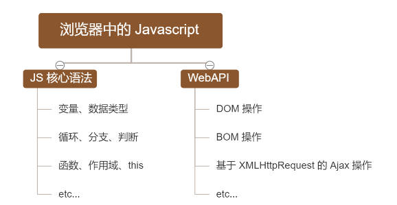
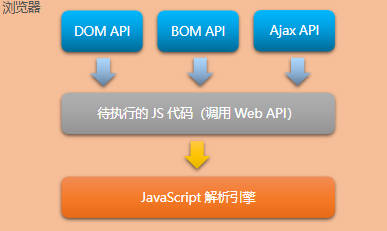
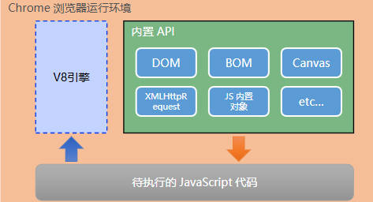
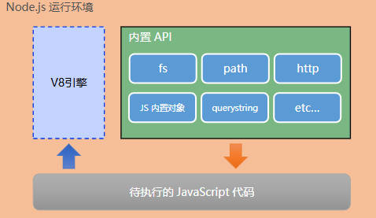
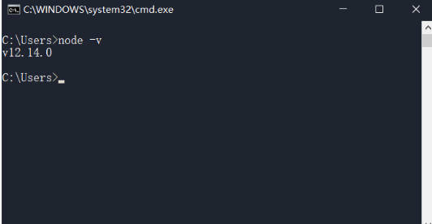
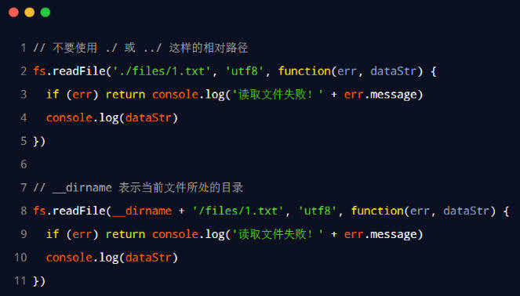

# node.js 进阶

## JavaScript 的组成部分



不同的浏览器使用不同的 JavaScript 解析引擎：

- Chrome 浏览器 => V8
- Firefox 浏览器 => OdinMonkey（奥丁猴）
- Safri 浏览器 => JSCore
- IE 浏览器 => Chakra（查克拉）
- etc...

其中，Chrome 浏览器的 V8 解析引擎性能最好


- 每个浏览器都内置了 DOM、BOM 这样的 API 函数，因此，浏览器中的 JavaScript 才可以调用它们。

## 浏览器中的 JavaScript 运行环境

- 运行环境是指代码正常运行所需的必要环境



总结：①
V8 引擎负责解析和执行 JavaScript 代码。② 内置 API 是由运行环境提供的特殊接口，只能在所属的运行环境中被调用。

# 初识 Node.js

- Node.js® is a JavaScript runtime built on Chrome's V8 JavaScript engine.
- Node.js 是一个基于 Chrome V8 引擎的 JavaScript 运行环境。
- Node.js 的官网地址： <https://nodejs.org/zh-cn/>

## Node.js 中的 JavaScript 运行环境



注意：① 浏览器是 JavaScript 的前端运行环境。②
Node.js 是 JavaScript 的后端运行环境。③
Node.js 中无法调用 DOM 和 BOM 等浏览器内置 API。

## Node.js 可以做什么

Node.js 作为一个 JavaScript 的运行环境，仅仅提供了基础的功能和 API。然而，基于 Node.js 提供的这些基础能，很多强大的工具和框架如雨后春笋，层出不穷，所以学会了 Node.js ，可以让前端程序员胜任更多的工作和岗位：① 基于 Express 框架<http://www.expressjs.com.cn/>，可以快速构建 Web 应用 ② 基于 Electron 框架<https://electronjs.org/>，可以构建跨平台的桌面应用 ③ 基于 restify 框架<http://restify.com/>，可以快速构建 API 接口项目 ④ 读写和操作数据库、创建实用的命令行工具辅助前端开发、etc...

## Node.js 怎么学

- 浏览器中的 JavaScript 学习路径：
  - JavaScript 基础语法 + 浏览器内置 API（DOM +
    BOM） + 第三方库（jQuery、art-template 等）
- Node.js 的学习路径：
  - JavaScript 基础语法 +
    Node.js 内置 API 模块（fs、path、http等）+ 第三方 API 模块（express、mysql 等）

## Node.js 环境的安装

1. 区分 LTS 版本和 Current 版本的不同
   - LTS 为长期稳定版，对于追求稳定性的企业级项目来说，推荐安装 LTS 版本的 Node.js。
   - Current 为新特性尝鲜版，对热衷于尝试新特性的用户来说，推荐安装 Current 版本的 Node.js。但是，Current 版本中可能存在隐藏的 Bug 或安全性漏洞，因此不推荐在企业级项目中使用 Current 版本的 Node.js。

2. 查看已安装的 Node.js 的版本号
   - 打开终端，在终端输入命令 node
     –v 后，按下回车键，即可查看已安装的 Node.js 的版本号。
   - Windows 系统快速打开终端的方式：使用快捷键（Windows徽标键 +
     R）打开运行面板，输入 cmd 后直接回车，即可打开终端。

终端（英文：Terminal）是专门为开发人员设计的，用于实现人机交互的一种方式


## 在 Node.js 环境中执行 JavaScript 代码

① 打开终端② 输入 node 要执行的js文件的路径③ 在当前文件中,空白处长按shift+右键选中powershell

### 终端中的快捷键

在 Windows 的 powershell 或 cmd 终端中，我们可以通过如下快捷键，来提高终端的操作效率：① 使用 ↑ 键，可以快速定位到上一次执行的命令 ② 使用 tab 键，能够快速补全路径 ③ 使用 esc 键，能够快速清空当前已输入的命令 ④ 输入 cls 命令，可以清空终端

---

# fs 文件系统模块

fs 模块是 Node.js 官方提供的、用来操作文件的模块。它提供了一系列的方法和属性，用来满足用户对文件的操作需求。例如：

- fs.readFile() 方法，用来读取指定文件中的内容
- fs.writeFile() 方法，用来向指定的文件中写入内容

如果要在 JavaScript 代码中，使用 fs 模块来操作文件，则需要使用如下的方式先导入它：

```js
const fs = require('fs')
```

## 读取指定文件中的内容

- fs.readFile() 的语法格式

```js
fs.readFile(path[, options],callback)
```

参数解读：

- 参数1：必选参数，字符串，表示文件的路径。
- 参数2：可选参数，表示以什么编码格式来读取文件。
- 参数3：必选参数，文件读取完成后，通过回调函数拿到读取的结果。

### fs.readFile代码示例

```js
const fs = require('fs')
fs.readFile('./2.txt', 'utf8', function (err, datastr) {
  console.log(err)
  console.log('---')
  console.log(datastr)
})
```

## 向指定的文件中写入内容

- fs.writeFile() 的语法格式

```js
fs.writeFile(file,data[,options],callback)
```

参数解读：

- 参数1：必选参数，需要指定一个文件路径的字符串，表示文件的存放路径。
- 参数2：必选参数，表示要写入的内容。
- 参数3：可选参数，表示以什么格式写入文件内容，默认值是 utf8。
- 参数4：必选参数，文件写入完成后的回调函数。

### fs.writeFile代码示例

```js
const fs = require('fs')
fs.writeFile('./3.txt', '这是2026年的小年,2月11日', function (err) {
  if (err) {
    console.log('写入失败')
  } else {
    console.log('写入成功,写入内容是:')
    fs.readFile('./3.txt', 'utf8', function (err, result) {
      console.log(result)
    })
  }
})
```

## fs 模块 - 路径动态拼接的问题

- 在使用 fs 模块操作文件时，如果提供的操作路径是以 ./ 或 ../ 开头的相对路径时，很容易出现路径动态拼接错误的问题。
- 原因：代码在运行的时候，会以执行 node 命令时所处的目录，动态拼接出被操作文件的完整路径。
- 解决方案：在使用 fs 模块操作文件时，直接提供完整的路径(`__dirname`)



---

# path路径模块

path 模块是 Node.js 官方提供的、用来处理路径的模块。它提供了一系列的方法和属性，用来满足用户对路径的处理需求。例如：

- path.join() 方法，用来将多个路径片段拼接成一个完整的路径字符串
- path.basename() 方法，用来从路径字符串中，将文件名解析出来如果要在 JavaScript 代码中，使用 path 模块来处理路径，则需要使用如下的方式先导入它：

```js
const path = require('path')
```

## path 路径模块
