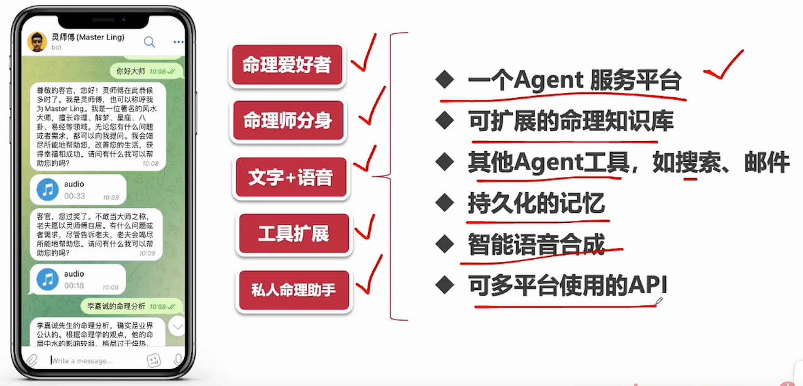
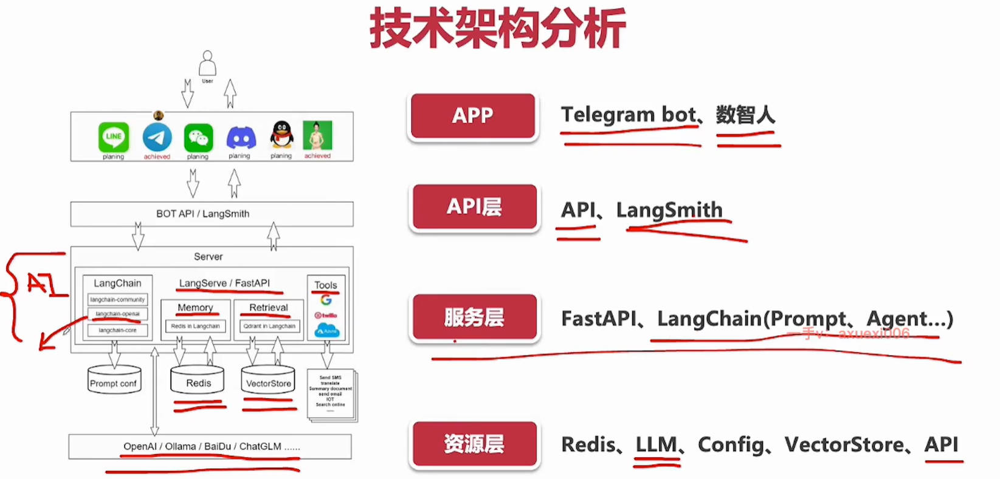

# 12个Agent实战项目

## Agent是什么

- 无需编写代码，即可实现复杂任务
- 使用日常语言与用户交互

AIAgents是基于LLM的能够自主理解、自主规划决策、执行复杂任务的智能体，Agents不是chatGPT的升级版，它不仅告诉你“如何做”，更会帮你去做，如果各种Copilot是副驾驶，那么Agents就是主驾驶。
Ageents=LLM+规划技能+记忆+工具使用

## 从0到1搭建Agent开发环境

虚拟项目产品需求分析
(SWOT是很常见的战略/产品分析框架，用来分析优势（Strengths）、劣势（Weaknesses）、机会（Opportunities）、威胁（Threats）)

- S-自然语言交互;人性化，可变身;易于扩展;个性化
- W-开发难度高口;成本略高(token贵,线上托管贵);响应速度慢
- T-传统命理交互繁琐;不够人性化;具有一定的用户基础;娱乐性+专业性
- 0-专业小模型应用;更多的行业数据;隐私与监管(闭源模型,默认是把自己的数据上传,安全存在问题)

## 项目资源准备

### LLM资源

- OPENAI官网
- OPENAI代理站
- 使用AUTODL自建
- OpenAI开发者平台<https://platform.openai.com/>

|平台|是否能免费起步|便宜/适合入门的接口|价格（输入）|价格（输出）|OpenAI兼容|适合你学什么|
|-----------|----------|------|---------:|-------:|-----------|-----------|
|**GeminiDeveloperAPI**|**可以**。官方写明有Free层，含免费input/outputtokens和AIStudio。|`Gemini2.5FlashLite`|**$0.10/1Mtokens**|**$0.40/1Mtokens**|不主打OpenAI兼容|先学APIkey、基础请求、流式输出、多轮对话|
|**Groq**|通常可低成本上手，且主打超低价和高速度。|`llama-3.1-8b-instant`|**$0.05/1M**|**$0.08/1M**|**是**，官方有OpenAI风格文档入口。|学最常见的chat/completions风格调用，成本很低|
|**DeepSeekAPI**|不是长期免费，但价格很低。|`deepseek-chat`/`deepseek-reasoner`（DeepSeek-V3.2）|**¥0.2/1M（缓存命中）**；**¥2/1M（未命中）**|**¥3/1M**|**是**，官方明确写了兼容OpenAI格式。|很适合中文场景，学OpenAISDK改`base_url`的玩法|
|**OpenRouter**|**有免费模型可试**，但免费用户有限额。|取决于你选的底层模型|**按底层模型原价**|**按底层模型原价**|**基本兼容OpenAI用法**|想用一个接口切很多家模型|
|**OpenAI官方API**|你这个账号当前**没有免费额度**；正常要充值。官方价格里便宜档可看`GPT-5mini`。|`GPT-5mini`|**$0.25/1M**|**$2.00/1M**|官方原生|以后如果你主要想学OpenAI自家生态，最顺手|

## 工具资源

- 开通Azure服务<https://azure.microsoft.com/zh-cn/>
- 开通serpApi服务<https://serpapi.com/>
