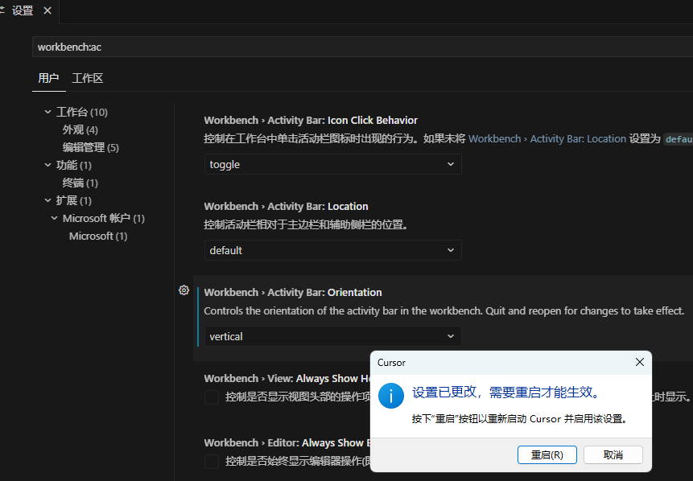

# cursor从基础到实战

## 对比

ChatGPT:需要人工复制粘贴代码;只生成一个文件或代码片段;对于无编程经验的新手不友好
Cursor:直接生成代码文件;按编程项目生成多个文件;生成后会总结代码内容，对新手非常友好

## cursor的agent能力

Agent - 在一次请求中可以完成：代码生成、安装组件库、运行代码

## 配置

- 和vscode一样,git,插件 => 水平

